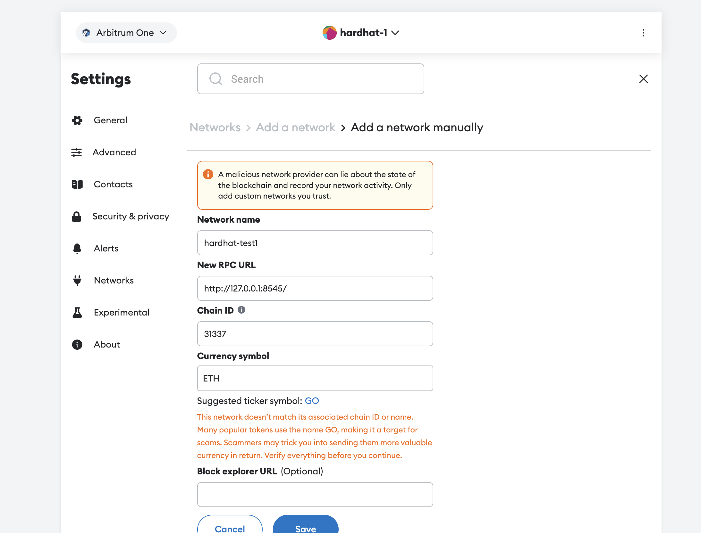

## 工具
[main](https://hardhat.org/)

[get start:](https://hardhat.org/hardhat-runner/docs/getting-started#overview)

[metamask-issue](https://hardhat.org/hardhat-network/docs/metamask-issue)

其他工具
```
https://wagmi.sh/

https://web3modal.com/
https://docs.walletconnect.com/web3modal/nextjs/about
```

## command
```bash
npx hardhat init
```

```
https://hardhat.org/hardhat-runner/docs/getting-started#quick-start

https://github.com/NomicFoundation/hardhat
```

## 部署test-node


## 2-1.修改合约部署
contracts/Counter.sol
```solidity
// SPDX-License-Identifier: UNLICENSED
pragma solidity ^0.8.9;

// Uncomment this line to use console.log
// import "hardhat/console.sol";

contract Counter {
    uint public count;

    // Function to get the current count
    function get() public view returns (uint) {
        return count;
    }

    // Function to increment count by 1
    function inc() public {
        count += 1;
    }

    // Function to decrement count by 1
    function dec() public {
        // This function will fail if count = 0
        count -= 1;
    }
}
```

### 2-2.修改script
scripts/deploy.ts
```js
import { ethers } from "hardhat";

async function main() {
  const currentTimestampInSeconds = Math.round(Date.now() / 1000);
  const unlockTime = currentTimestampInSeconds + 60;

  const lockedAmount = ethers.parseEther("0.001");

  // const lock = await ethers.deployContract("Counter", [unlockTime], {
  //   value: lockedAmount,
  // });

  const lock = await ethers.deployContract("Counter", [], {});

  await lock.waitForDeployment();

  console.log(
    `Lock with ${ethers.formatEther(
      lockedAmount
    )}ETH and unlock timestamp ${unlockTime} deployed to ${lock.target}`
  );
}

// We recommend this pattern to be able to use async/await everywhere
// and properly handle errors.
main().catch((error) => {
  console.error(error);
  process.exitCode = 1;
});
```

## 3-,部署：
```bash
# 第一步
npx hardhat node

# 第二步
$ npx hardhat run scripts/deploy.ts

Lock with 0.001ETH deployed to: 0x5FbDB2315678afecb367f032d93F642f64180aa3
```
