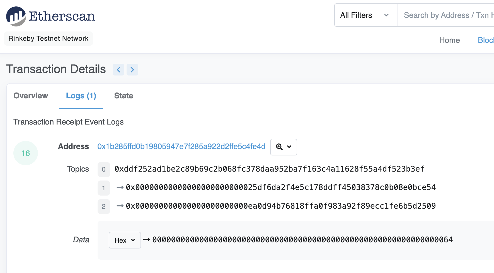

## event 具有两个特点：
介绍使用和查询solidity中的事件。很多链上分析工具包括Nansen和Dune Analysis都是基于事件工作的。

* 响应：应用程序（ethers.js）可以通过RPC接口订阅和监听这些事件，并在前端做响应。
* 经济：事件是EVM上比较经济的存储数据的方式，每个大概消耗2,000 gas；相比之下，链上存储一个新变量至少需要20,000 gas。

### Events允许登录以太坊区块链
事件的一些用例是：
* 监听事件并更新用户界面
* 一种廉价的存储形式
```js
// SPDX-License-Identifier: MIT
pragma solidity ^0.8.20;

contract Event {
    // Event declaration
    // Up to 3 parameters can be indexed.
    // Indexed parameters helps you filter the logs by the indexed parameter
    event Log(address indexed sender, string message);
    event AnotherLog();

    function test() public {
        emit Log(msg.sender, "Hello World!");
        emit Log(msg.sender, "Hello EVM!");
        emit AnotherLog();
    }
}
```

### 1-1.声明事件
事件的声明由event关键字开头，接着是事件名称，括号里面写好事件需要记录的变量类型和变量名。以ERC20代币合约的Transfer事件为例：
```js
event Transfer(address indexed from, address indexed to, uint256 value);
```
Transfer事件共记录了3个变量from，to和value，分别对应代币的转账地址，接收地址和转账数量，其中from和to前面带有indexed关键字，他们会保存在以太坊虚拟机日志的topics中，方便之后检索。

### 1-2.释放事件
我们可以在函数里释放事件。在下面的例子中，每次用_transfer()函数进行转账操作的时候，都会释放Transfer事件，并记录相应的变量。
```js
// 定义_transfer函数，执行转账逻辑
function _transfer(
    address from,
    address to,
    uint256 amount
) external {

    _balances[from] = 10000000; // 给转账地址一些初始代币

    _balances[from] -=  amount; // from地址减去转账数量
    _balances[to] += amount; // to地址加上转账数量

    // 释放事件
    emit Transfer(from, to, amount);
}
```

### 例子
```js
// SPDX-License-Identifier: MIT
pragma solidity ^0.8.4;
contract Events {
    // 定义_balances映射变量，记录每个地址的持币数量
    mapping(address => uint256) public _balances;

    // 定义Transfer event，记录transfer交易的转账地址，接收地址和转账数量
    event Transfer(address indexed from, address indexed to, uint256 value);


    // 定义_transfer函数，执行转账逻辑
    function _transfer(
        address from,
        address to,
        uint256 amount
    ) external {

        _balances[from] = 10000000; // 给转账地址一些初始代币

        _balances[from] -=  amount; // from地址减去转账数量
        _balances[to] += amount; // to地址加上转账数量

        // 释放事件
        emit Transfer(from, to, amount);
    }
}
```

## 1.EVM日志
以太坊虚拟机（EVM）用日志Log来存储Solidity事件，每条日志记录都包含主题topics和数据data两部分。

### 1-1.主题
日志的第一部分是主题数组，用于描述事件，长度不能超过4。它的第一个元素是事件的签名（哈希）。对于上面的Transfer事件，它的签名就是：
```js
keccak256("Transfer(addrses,address,uint256)")

//0xddf252ad1be2c89b69c2b068fc378daa952ba7f163c4a11628f55a4df523b3ef
```

除了事件签名，主题还可以包含至多3个indexed参数，也就是Transfer事件中的from和to。

indexed标记的参数可以理解为检索事件的索引“键”，方便之后搜索。每个 indexed 参数的大小为固定的256比特，如果参数太大了（比如字符串），就会自动计算哈希存储在主题中。

### 1-2.数据
事件中不带 indexed的参数会被存储在 data 部分中，可以理解为事件的“值”。data 部分的变量不能被直接检索，但可以存储任意大小的数据。因此一般 data 部分可以用来存储复杂的数据结构，例如数组和字符串等等，因为这些数据超过了256比特，即使存储在事件的 topic 部分中，也是以哈希的方式存储。另外，data 部分的变量在存储上消耗的gas相比于 topic 更少。

## 在etherscan上查询事件

Topics里面有三个元素，[0]是这个事件的哈希，[1]和[2]是我们定义的两个indexed变量的信息，即转账的转出地址和接收地址。

Data里面是剩下的不带indexed的变量，也就是转账数量。
