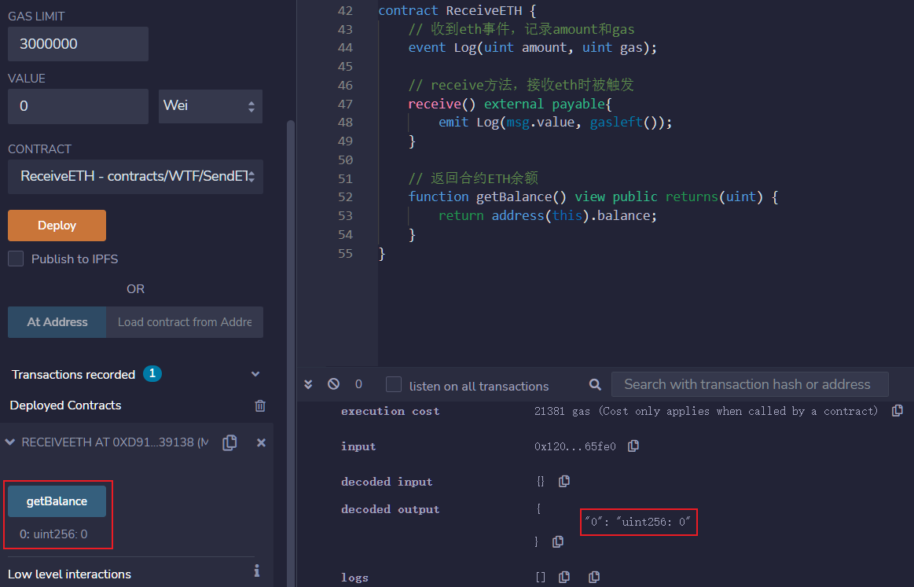

## 总结
Solidity有三种方法向其他合约发送ETH，
* call()，其中call()是被鼓励的用法。call没有gas限制，最为灵活，是最提倡的方法；
* transfer(),有2300 gas限制，但是发送失败会自动revert交易，是次优选择；
* send()有2300 gas限制，而且发送失败不会自动revert交易，几乎没有人用它。

## 1.接收ETH合约-先部署一个接收ETH合约ReceiveETH
ReceiveETH合约里有一个事件Log，记录收到的ETH数量和gas剩余。还有两个函数，
* receive()函数，收到ETH被触发，并发送Log事件；
* 查询合约ETH余额的getBalance()函数。
```js
contract ReceiveETH {
    // 收到eth事件，记录amount和gas
    event Log(uint amount, uint gas);
    
    // receive方法，接收eth时被触发
    receive() external payable{
        emit Log(msg.value, gasleft());
    }
    
    // 返回合约ETH余额
    function getBalance() view public returns(uint) {
        return address(this).balance;
    }
}
```

部署ReceiveETH合约后，运行getBalance()函数，可以看到当前合约的ETH余额为0。


## 2.发送ETH合约
我们将实现三种方法向ReceiveETH合约发送ETH

首先，先在发送ETH合约SendETH中实现payable的构造函数和receive()，让我们能够在部署时和部署后向合约转账。
```js
contract SendETH {
    // 构造函数，payable使得部署的时候可以转eth进去
    constructor() payable{}
    // receive方法，接收eth时被触发
    receive() external payable{}
}
```

### 2-1.transfer
用法是`接收方地址.transfer(发送ETH数额)`
* transfer()的gas限制是2300，足够用于转账，但对方合约的fallback()或receive()函数不能实现太复杂的逻辑。
* transfer()如果转账失败，会自动revert（回滚交易）。
例子：注意里面的`_to`填ReceiveETH合约的地址，amount是ETH转账金额：

代码样例，注意里面的_to填ReceiveETH合约的地址，amount是ETH转账金额：
```js
// 用transfer()发送ETH
function transferETH(address payable _to, uint256 amount) external payable{
    _to.transfer(amount);
}
```

* 测试1，部署SendETH合约后，对ReceiveETH合约发送ETH，此时amount为10，value为0，amount>value，转账失败，发生revert。
* 测试2,此时amount为10，value为10，`amount<=value`，转账成功。
* 测试2后，在ReceiveETH合约中，运行getBalance()函数，可以看到当前合约的ETH余额为10。

## 3.send,用法是接收方地址.send(发送ETH数额)
* send()的gas限制是2300，足够用于转账，但对方合约的fallback()或receive()函数不能实现太复杂的逻辑
* send()如果转账失败，不会revert
* send()的返回值是bool，代表着转账成功或失败，需要额外代码处理一下
```js
// send()发送ETH
function sendETH(address payable _to, uint256 amount) external payable{
    // 处理下send的返回值，如果失败，revert交易并发送error
    bool success = _to.send(amount);
    if(!success){
        revert SendFailed();
    }
}
```
对ReceiveETH合约发送ETH，此时amount为10，value为0，amount>value，转账失败，因为经过处理，所以发生revert。


* 此时amount为10，value为11，`amount<=value`，转账成功。

## 4.call,用法是`接收方地址.call{value: 发送ETH数额}("")`
* call()没有gas限制，可以支持对方合约fallback()或receive()函数实现复杂逻辑。
* call()如果转账失败，不会revert。
* call()的返回值是(bool, data)，其中bool代表着转账成功或失败，需要额外代码处理一下。

例子：
```js
// call()发送ETH
function callETH(address payable _to, uint256 amount) external payable{
    // 处理下call的返回值，如果失败，revert交易并发送error
    (bool success,) = _to.call{value: amount}("");
    if(!success){
        revert CallFailed();
    }
}
```
* 测试1,对ReceiveETH合约发送ETH，此时amount为10，value为0，amount>value，转账失败，因为经过处理，所以发生revert。
* 测试2,此时amount为10，value为11，`amount<=value`，转账成功。

