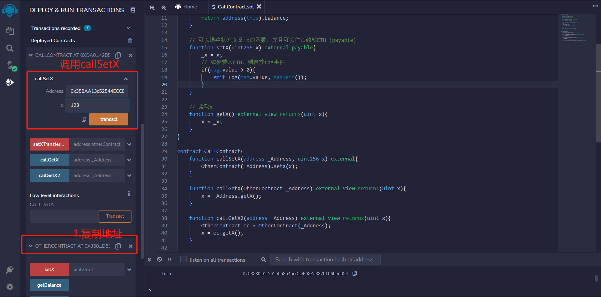
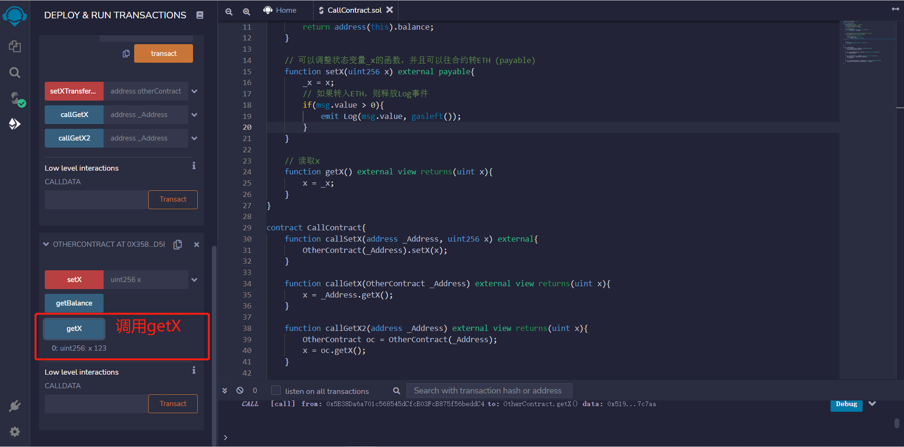
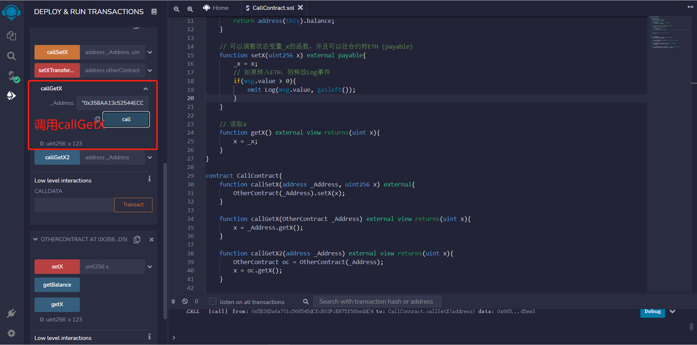
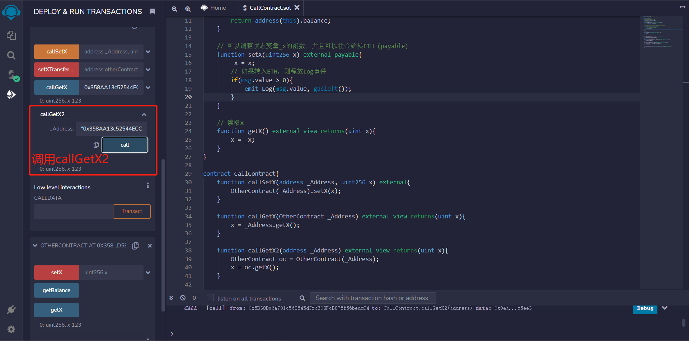

[参考](https://www.wtf.academy/docs/solidity-102/CallContract/)
## 调用已部署的合约
开发者写智能合约来调用其他合约，这让以太坊网络上的程序可以复用，从而建立繁荣的生态。很多web3项目依赖于调用其他合约。

## 1.目标合约,先写一个简单的合约OtherContract来调用
这个合约包含一个状态变量_x，一个事件Log在收到ETH时触发，三个函数：
* getBalance(): 返回合约ETH余额。
* setX(): external payable函数，可以设置_x的值，并向合约发送ETH。
* getX(): 读取_x的值。
```js
contract OtherContract {
    uint256 private _x = 0; // 状态变量_x
    // 收到eth的事件，记录amount和gas
    event Log(uint amount, uint gas);
    
    // 返回合约ETH余额
    function getBalance() view public returns(uint) {
        return address(this).balance;
    }

    // 可以调整状态变量_x的函数，并且可以往合约转ETH (payable)
    function setX(uint256 x) external payable{
        _x = x;
        // 如果转入ETH，则释放Log事件
        if(msg.value > 0){
            emit Log(msg.value, gasleft());
        }
    }

    // 读取_x
    function getX() external view returns(uint x){
        x = _x;
    }
}
```

## 2.调用OtherContract合约
可以利用合约的地址和合约代码（或接口）来创建合约的引用：`_Name(_Address)`，其中`_Name`是合约名，`_Address`是合约地址。然后用合约的引用来调用它的函数：`_Name(_Address).f()`，其中`f()`是要调用的函数。

下面我们介绍4个调用合约的例子，在remix中编译合约后，分别部署OtherContract和CallContract：


### 2-1.传入合约地址
可以在函数里传入目标合约地址，生成目标合约的引用，然后调用目标函数。以调用OtherContract合约的setX函数为例，我们在新合约中写一个callSetX函数，传入已部署好的OtherContract合约地址_Address和setX的参数x：
```js
function callSetX(address _Address, uint256 x) external{
  OtherContract(_Address).setX(x);
}
```
复制OtherContract合约的地址，填入callSetX函数的参数中，成功调用后，调用OtherContract合约中的getX验证x变为123




### 2-2.传入合约变量
我们可以直接在函数里传入合约的引用，只需要把上面参数的address类型改为目标合约名，比如OtherContract。下面例子实现了调用目标合约的getX()函数。

注意该函数参数OtherContract _Address底层类型仍然是address，生成的ABI中、调用callGetX时传入的参数都是address类型
```js
function callGetX(OtherContract _Address) external view returns(uint x){
    x = _Address.getX();
}
```

复制OtherContract合约的地址，填入callGetX函数的参数中，调用后成功获取x的值



### 2-3.创建合约变量
我们可以创建合约变量，然后通过它来调用目标函数。下面例子，我们给变量oc存储了OtherContract合约的引用：
```js
function callGetX2(address _Address) external view returns(uint x){
    OtherContract oc = OtherContract(_Address);
    x = oc.getX();
}
```
复制OtherContract合约的地址，填入callGetX2函数的参数中，调用后成功获取x的值



### 2-4.调用合约并发送ETH
如果目标合约的函数是`payable`的，那么我们可以通过调用它来给合约转账：`_Name(_Address).f{value: _Value}()`，其中`_Name`是合约名，`_Address`是合约地址，`f`是目标函数名，`_Value`是要转的`ETH`数额（以`wei`为单位）。

`OtherContract`合约的`setX`函数是`payable`的，在下面这个例子中我们通过调用`setX`来往目标合约转账。

```solidity
function setXTransferETH(address otherContract, uint256 x) payable external{
    OtherContract(otherContract).setX{value: msg.value}(x);
}
```

复制`OtherContract`合约的地址，填入`setXTransferETH`函数的参数中，并转入10ETH

图略，参考链接
