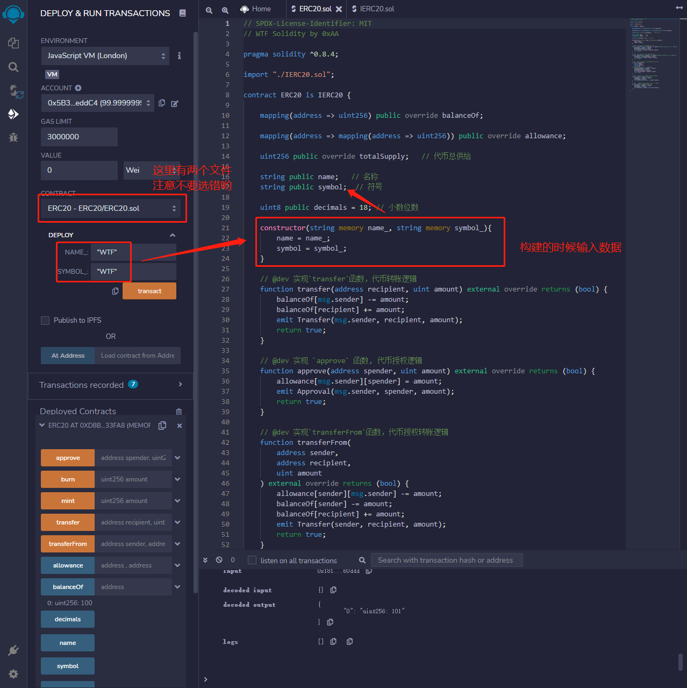
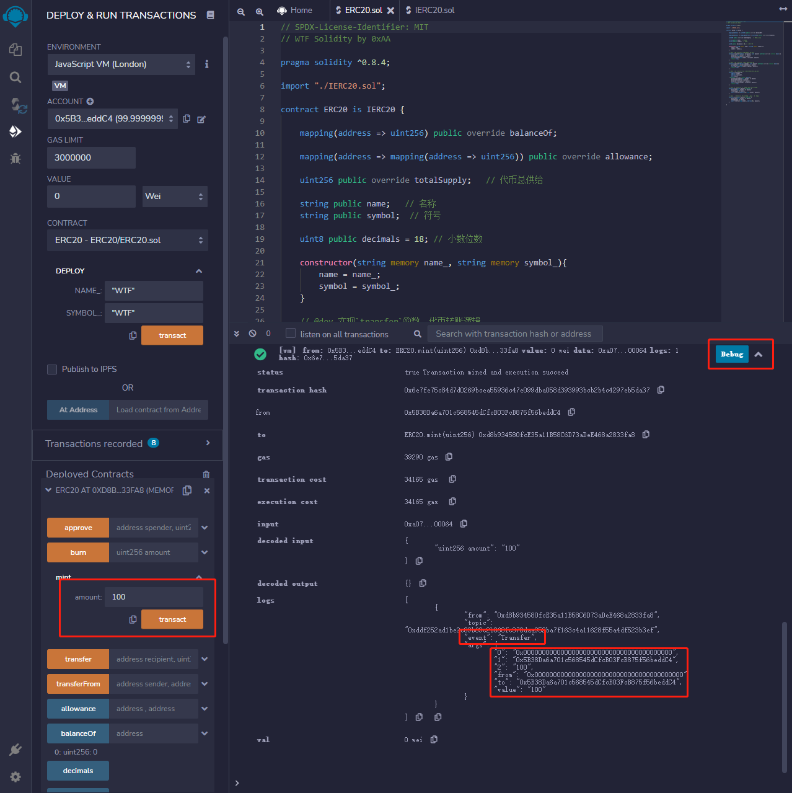
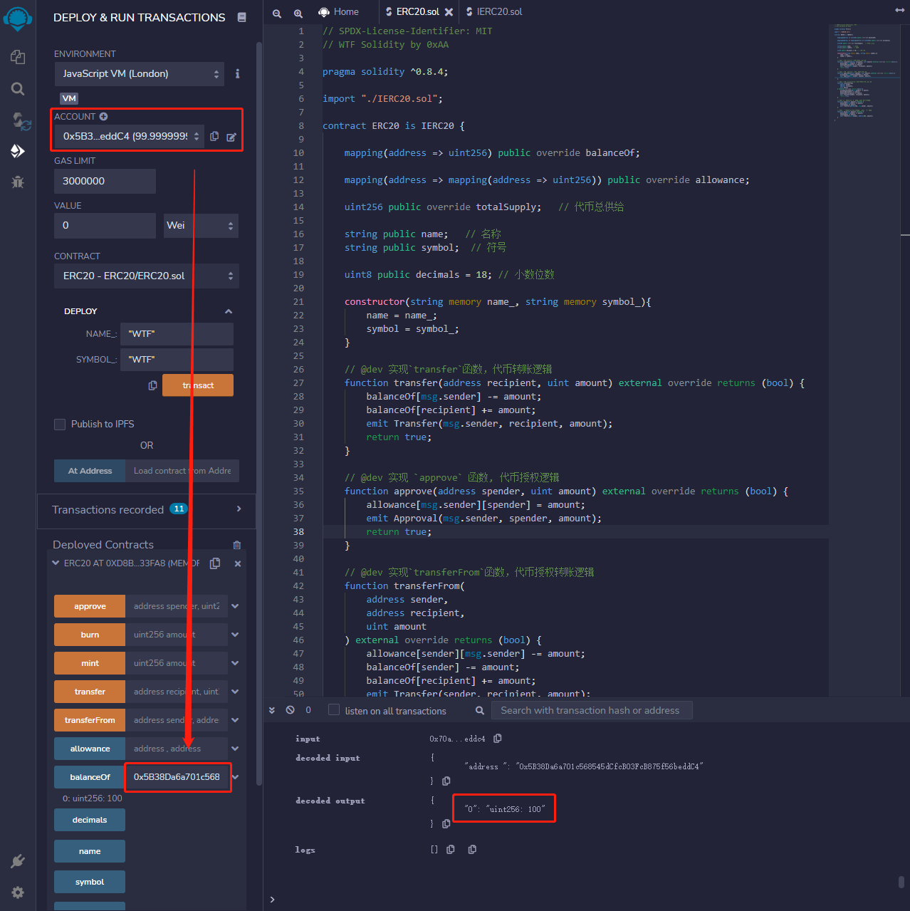

## 将介绍以太坊上的ERC20代币标准，并发行自己的测试代币。
学习以太坊上的ERC20标准及其实现，并且发行了我们的测试代币。2015年底提出的ERC20代币标准极大的降低了以太坊上发行代币的门槛，并开启了ICO大时代。在投资时，仔细阅读项目的代币合约，可以有效避开貔貅，增加投资成功率。


## ERC20
ERC20是以太坊上的代币标准，来自2015年11月V神参与的EIP20。它实现了代币转账的基本逻辑：
* 账户余额
* 转账
* 授权转账
* 代币总供给
* 代币信息（可选）：名称，代号，小数位数

## 1.IERC20是ERC20代币标准的接口合约
规定了ERC20代币需要实现的函数和事件。 

之所以需要定义接口，是因为有了规范后，就存在所有的ERC20代币都通用的函数名称，输入参数，输出参数。 

在接口函数中，只需要定义函数名称，输入参数，输出参数，并不关心函数内部如何实现。 
由此，函数就分为内部和外部两个内容，一个重点是实现，另一个是对外接口，约定共同数据。 这就是为什么需要ERC20.sol和IERC20.sol两个文件实现一个合约。

## 2.事件
IERC20定义了2个事件：Transfer事件和Approval事件，分别在转账和授权时被释放
```js
/**
 * @dev 释放条件：当 `value` 单位的货币从账户 (`from`) 转账到另一账户 (`to`)时.
 */
event Transfer(address indexed from, address indexed to, uint256 value);

/**
 * @dev 释放条件：当 `value` 单位的货币从账户 (`owner`) 授权给另一账户 (`spender`)时.
 */
event Approval(address indexed owner, address indexed spender, uint256 value);
```

## 3.函数
IERC20定义了6个函数，提供了转移代币的基本功能，并允许代币获得批准，以便其他链上第三方使用。
1. totalSupply()返回代币总供给
```js
/**
 * @dev 返回代币总供给.
 */
function totalSupply() external view returns (uint256);
```

2. balanceOf()返回账户余额
```js
/**
 * @dev 返回账户`account`所持有的代币数.
 */
function balanceOf(address account) external view returns (uint256);
```

3. transfer()转账
```js
/**
 * @dev 转账 `amount` 单位代币，从调用者账户到另一账户 `to`.
 *
 * 如果成功，返回 `true`.
 *
 * 释放 {Transfer} 事件.
 */
function transfer(address to, uint256 amount) external returns (bool);
```

4. allowance()返回授权额度
```js
/**
 * @dev 返回`owner`账户授权给`spender`账户的额度，默认为0。
 *
 * 当{approve} 或 {transferFrom} 被调用时，`allowance`会改变.
 */
function allowance(address owner, address spender) external view returns (uint256);
```

5. approve()授权
```js
/**
 * @dev 调用者账户给`spender`账户授权 `amount`数量代币。
 *
 * 如果成功，返回 `true`.
 *
 * 释放 {Approval} 事件.
 */
function approve(address spender, uint256 amount) external returns (bool);
```

6. transferFrom()授权转账
```js
/**
 * @dev 通过授权机制，从`from`账户向`to`账户转账`amount`数量代币。转账的部分会从调用者的`allowance`中扣除。
 *
 * 如果成功，返回 `true`.
 *
 * 释放 {Transfer} 事件.
 */
function transferFrom(
    address from,
    address to,
    uint256 amount
) external returns (bool);
```

## 4.实现ERC20
现在我们写一个ERC20，将IERC20规定的函数简单实现。

### 4-1.状态变量
我们需要状态变量来记录账户余额，授权额度和代币信息。

其中balanceOf, allowance和totalSupply为public类型，会自动生成一个同名getter函数，实现IERC20规定的balanceOf(), allowance()和totalSupply()。

而name, symbol, decimals则对应代币的名称，代号和小数位数。

>注意：用override修饰public变量，会重写继承自父合约的与变量同名的getter函数，比如IERC20中的balanceOf()函数。
```js
mapping(address => uint256) public override balanceOf;

mapping(address => mapping(address => uint256)) public override allowance;

uint256 public override totalSupply;   // 代币总供给

string public name;   // 名称
string public symbol;  // 代号

uint8 public decimals = 18; // 小数位数
```

### 4-2.函数
### 4-2-1.构造函数：初始化代币名称、代号。
```js
constructor(string memory name_, string memory symbol_){
    name = name_;
    symbol = symbol_;
}
```
### 4-2-2.transfer()函数
实现IERC20中的transfer函数，代币转账逻辑。调用方扣除amount数量代币，接收方增加相应代币。土狗币会魔改这个函数，加入税收、分红、抽奖等逻辑。
```js
function transfer(address recipient, uint amount) external override returns (bool) {
    balanceOf[msg.sender] -= amount;
    balanceOf[recipient] += amount;
    emit Transfer(msg.sender, recipient, amount);
    return true;
}
```

### 4-2-3.approve()函数
实现IERC20中的approve函数，代币授权逻辑。被授权方spender可以支配授权方的amount数量的代币。spender可以是EOA账户，也可以是合约账户：当你用uniswap交易代币时，你需要将代币授权给uniswap合约。
```js
function approve(address spender, uint amount) external override returns (bool) {
    allowance[msg.sender][spender] = amount;
    emit Approval(msg.sender, spender, amount);
    return true;
}
```

### 4-2-4.transferFrom()函数
实现IERC20中的transferFrom函数，授权转账逻辑。被授权方将授权方sender的amount数量的代币转账给接收方recipient。
```js
function transferFrom(
    address sender,
    address recipient,
    uint amount
) external override returns (bool) {
    allowance[sender][msg.sender] -= amount;
    balanceOf[sender] -= amount;
    balanceOf[recipient] += amount;
    emit Transfer(sender, recipient, amount);
    return true;
}
```

### 4-2-5.mint()函数
铸造代币函数，不在IERC20标准中。这里为了教程方便，任何人可以铸造任意数量的代币，实际应用中会加权限管理，只有owner可以铸造代币：
```js
function mint(uint amount) external {
    balanceOf[msg.sender] += amount;
    totalSupply += amount;
    emit Transfer(address(0), msg.sender, amount);
}
```

### 4-2-5.burn()函数
销毁代币函数，不在IERC20标准中。
```js
function burn(uint amount) external {
    balanceOf[msg.sender] -= amount;
    totalSupply -= amount;
    emit Transfer(msg.sender, address(0), amount);
}
```

## 5.发行ERC20代币
有了ERC20标准后，在ETH链上发行代币变得非常简单。现在，我们发行属于我们的第一个代币。

在Remix上编译好ERC20合约，在部署栏输入构造函数的参数，name_和symbol_都设为WTF，然后点击transact键进行部署。



这样，我们就创建好了WTF代币。

### 5-2.我们需要运行mint()函数来给自己铸造一些代币
点开Deployed Contract中的ERC20合约，在mint函数那一栏输入100并点击mint按钮，为自己铸造100个WTF代币。

可以点开右侧的Debug按钮，具体查看下面的logs。
* 事件Transfer
* 铸币地址0x0000000000000000000000000000000000000000
* 接收地址0x5B38Da6a701c568545dCfcB03FcB875f56beddC4
* 代币数额100


### 5-3.  利用balanceOf()函数来查询账户余额
输入我们当前的账户，可以看到余额变为100，铸造成功。

账户信息如图左侧，右侧标注为函数执行的具体信息。

