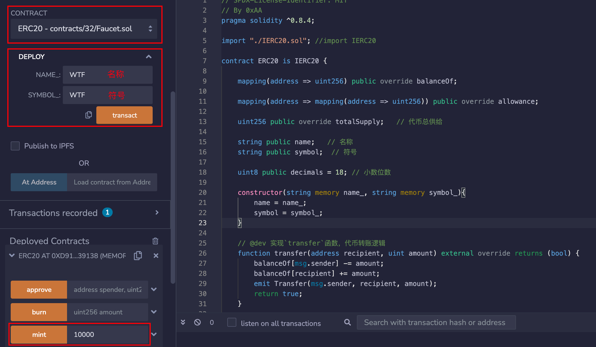
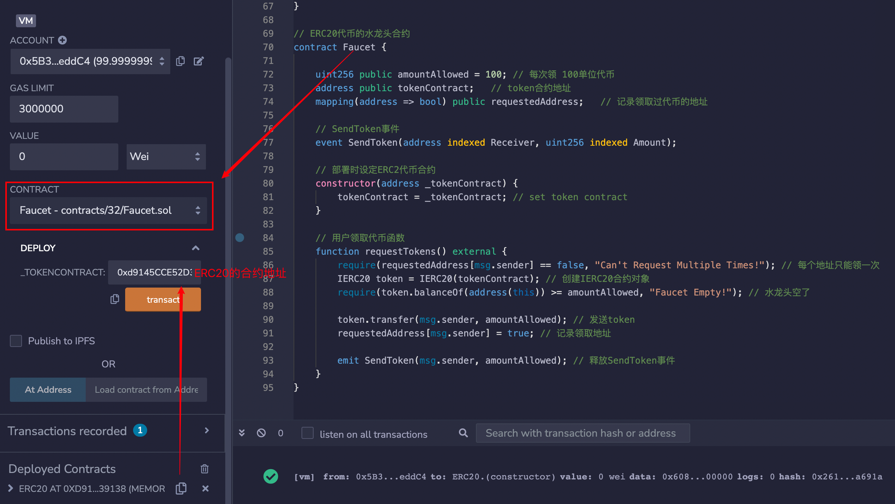
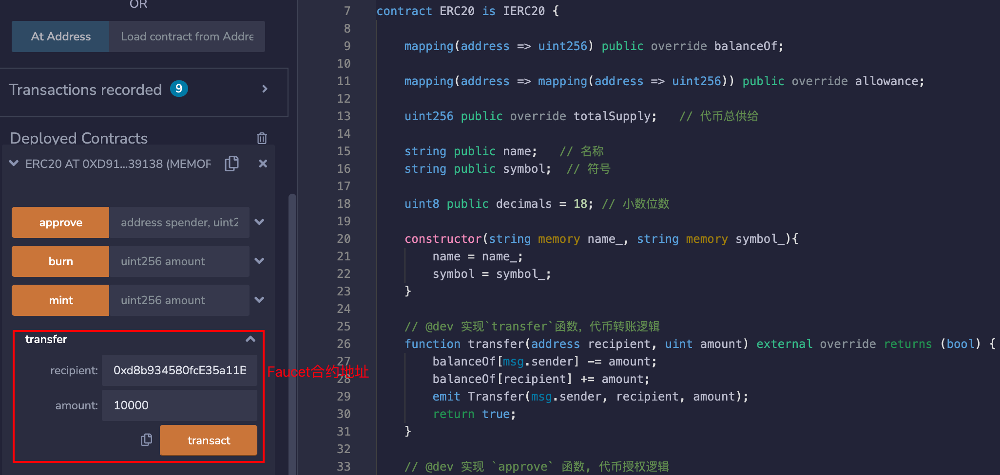
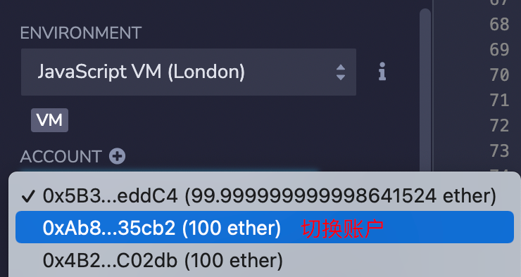
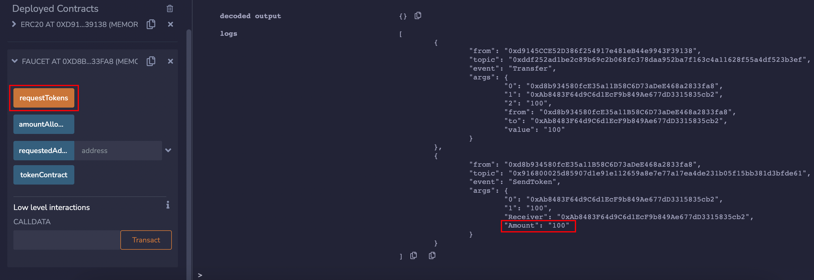
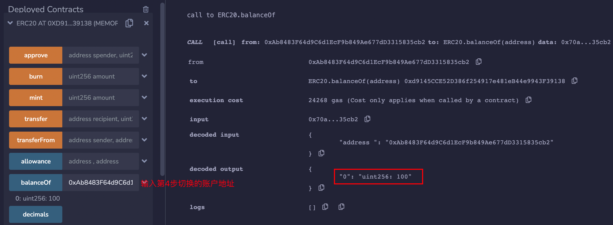

当人想要免费代币的时候，就要去代币水龙头领。代币水龙头就是让用户免费领代币的网站/应用。

为了扩大影响力，比特币社区的Gavin Andresen开发了BTC水龙头，让别人可以免费领BTC。撸羊毛大家都喜欢，当时就有很多人去撸，一部分变为了BTC的信徒。BTC水龙头一共送出了超过19,700枚BTC，现在价值约6亿美元！

## ERC20水龙头合约里
我们实现一个简版的ERC20水龙头，逻辑非常简单：我们将一些ERC20代币转到水龙头合约里，用户可以通过合约的requestToken()函数来领取100单位的代币，每个地址只能领一次。

### 1.状态变量
我们在水龙头合约中定义3个状态变量
1. amountAllowed设定每次能领取代币数量（默认为100，不是一百枚，因为代币有小数位数）。
2. tokenContract记录发放的ERC20代币合约地址。
3. requestedAddress记录领取过代币的地址。
```js
uint256 public amountAllowed = 100; // 每次领 100 单位代币
address public tokenContract;   // token合约地址
mapping(address => bool) public requestedAddress;   // 记录领取过代币的地址
```

### 2.事件
水龙头合约中定义了1个SendToken事件，记录了每次领取代币的地址和数量，在requestTokens()函数被调用时释放。
```js
// SendToken事件    
event SendToken(address indexed Receiver, uint256 indexed Amount); 
```

### 3.函数
合约中只有两个函数：
1. 构造函数：初始化tokenContract状态变量，确定发放的ERC20代币地址。
```js
// 部署时设定ERC2代币合约
constructor(address _tokenContract) {
    tokenContract = _tokenContract; // set token contract
}
```
2. requestTokens()函数，用户调用它可以领取ERC20代币。
```js
// 用户领取代币函数
function requestTokens() external {
    require(requestedAddress[msg.sender] == false, "Can't Request Multiple Times!"); // 每个地址只能领一次
    IERC20 token = IERC20(tokenContract); // 创建IERC20合约对象
    require(token.balanceOf(address(this)) >= amountAllowed, "Faucet Empty!"); // 水龙头空了

    token.transfer(msg.sender, amountAllowed); // 发送token
    requestedAddress[msg.sender] = true; // 记录领取地址 
    
    emit SendToken(msg.sender, amountAllowed); // 释放SendToken事件
}
```

## 2.Remix演示
1. 首先，部署ERC20代币合约，名称和符号为WTF，并给自己mint 10000 单位代币。

2. 部署Faucet水龙头合约，初始化的参数填上面ERC20代币的合约地址。

3. 利用ERC20代币合约的transfer()函数，将 10000 单位代币转账到Faucet合约地址。


4. 换一个新账户，调用Faucet合约requestTokens()函数，领取代币。可以在终端看到SendToken事件被释放。




5. 在ERC20代币合约上利用balanceOf查询领取水龙头的账户余额，可以看到余额变为100，领取成功！

