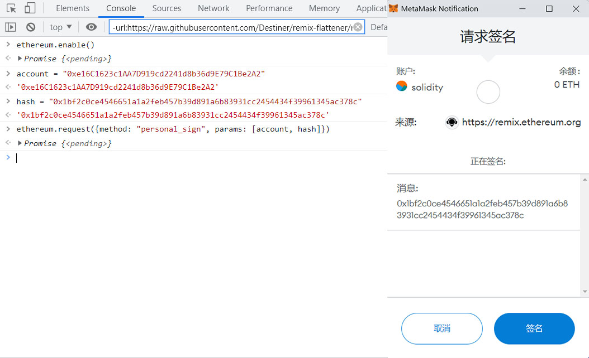

## 1.数字签名
这一讲，我们将简单的介绍以太坊中的数字签名ECDSA，以及如何利用它发放NFT白名单。代码中的ECDSA库由OpenZeppelin的同名库简化而成。

如果你用过opensea交易NFT，对签名就不会陌生。下图是小狐狸（metamask）钱包进行签名时弹出的窗口，它可以证明你拥有私钥的同时不需要对外公布私钥。


以太坊使用的数字签名算法叫双椭圆曲线数字签名算法（ECDSA），基于双椭圆曲线“私钥-公钥”对的数字签名算法。它主要起到了三个作用：
1. 身份认证：证明签名方是私钥的持有人。
2. 不可否认：发送方不能否认发送过这个消息。
3. 完整性：消息在传输过程中无法被修改。

## 2.ECDSA合约
ECDSA标准中包含两个部分：
1. 签名者利用私钥（隐私的）对消息（公开的）创建签名（公开的）。
2. 其他人使用消息（公开的）和签名（公开的）恢复签名者的公钥（公开的）并验证签名。 我们将配合ECDSA库讲解这两个部分。

本教程所用的私钥，公钥，消息，以太坊签名消息，签名如下所示：
```
私钥: 0x227dbb8586117d55284e26620bc76534dfbd2394be34cf4a09cb775d593b6f2b

公钥: 0xe16C1623c1AA7D919cd2241d8b36d9E79C1Be2A2
消息: 0x1bf2c0ce4546651a1a2feb457b39d891a6b83931cc2454434f39961345ac378c

以太坊签名消息: 0xb42ca4636f721c7a331923e764587e98ec577cea1a185f60dfcc14dbb9bd900b

签名: 0x390d704d7ab732ce034203599ee93dd5d3cb0d4d1d7c600ac11726659489773d559b12d220f99f41d17651b0c1c6a669d346a397f8541760d6b32a5725378b241c
```

## 3.创建签名
1. 打包消息： 在以太坊的ECDSA标准中，被签名的消息是一组数据的keccak256哈希，为bytes32类型。我们可以把任何想要签名的内容利用abi.encodePacked()函数打包，然后用keccak256()计算哈希，作为消息。

我们例子中的消息是由一个address类型变量和一个uint256类型变量得到的：
```js
/*
* 将mint地址（address类型）和tokenId（uint256类型）拼成消息msgHash
* _account: 0x5B38Da6a701c568545dCfcB03FcB875f56beddC4
* _tokenId: 0
* 对应的消息msgHash: 0x1bf2c0ce4546651a1a2feb457b39d891a6b83931cc2454434f39961345ac378c
*/
function getMessageHash(address _account, uint256 _tokenId) public pure returns(bytes32){
    return keccak256(abi.encodePacked(_account, _tokenId));
}
```

2. 计算以太坊签名消息： 消息可以是能被执行的交易，也可以是其他任何形式。为了避免用户误签了恶意交易，EIP191提倡在消息前加上"\x19Ethereum Signed Message:\n32"字符，并再做一次keccak256哈希，作为以太坊签名消息。经过toEthSignedMessageHash()函数处理后的消息，不能被用于执行交易:
```js
    /**
     * @dev 返回 以太坊签名消息
     * `hash`：消息
     * 遵从以太坊签名标准：https://eth.wiki/json-rpc/API#eth_sign[`eth_sign`]
     * 以及`EIP191`:https://eips.ethereum.org/EIPS/eip-191`
     * 添加"\x19Ethereum Signed Message:\n32"字段，防止签名的是可执行交易。
     */
    function toEthSignedMessageHash(bytes32 hash) internal pure returns (bytes32) {
        // 哈希的长度为32
        return keccak256(abi.encodePacked("\x19Ethereum Signed Message:\n32", hash));
    }
```

处理后的消息为：
```
以太坊签名消息: 0xb42ca4636f721c7a331923e764587e98ec577cea1a185f60dfcc14dbb9bd900b
```

## 3-1.利用钱包签名
日常操作中，大部分用户都是通过这种方式进行签名。在获取到需要签名的消息之后，我们需要使用metamask钱包进行签名。

metamask的personal_sign方法会自动把消息转换为以太坊签名消息，然后发起签名。所以我们只需要输入消息和签名者钱包account即可。

需要注意的是输入的签名者钱包account需要和metamask当前连接的account一致才能使用。

因此首先把例子中的私钥导入到小狐狸钱包，然后打开浏览器的console页面：Chrome菜单-更多工具-开发者工具-Console。在连接钱包的状态下（如连接opensea，否则会出现错误），依次输入以下指令进行签名：
```js
ethereum.enable()

account = "0xe16C1623c1AA7D919cd2241d8b36d9E79C1Be2A2"

hash = "0x1bf2c0ce4546651a1a2feb457b39d891a6b83931cc2454434f39961345ac378c"

ethereum.request({method: "personal_sign", params: [account, hash]})
```


在返回的结果中（Promise的PromiseResult）可以看到创建好的签名。不同账户有不同的私钥，创建的签名值也不同。利用教程的私钥创建的签名如下所示：
```js
0x390d704d7ab732ce034203599ee93dd5d3cb0d4d1d7c600ac11726659489773d559b12d220f99f41d17651b0c1c6a669d346a397f8541760d6b32a5725378b241c
```



### 3-2.利用web3.py签名
批量调用中更倾向于使用代码进行签名，以下是基于web3.py的实现。
```js
from web3 import Web3, HTTPProvider
from eth_account.messages import encode_defunct

private_key = "0x227dbb8586117d55284e26620bc76534dfbd2394be34cf4a09cb775d593b6f2b"
address = "0x5B38Da6a701c568545dCfcB03FcB875f56beddC4"
rpc = 'https://rpc.ankr.com/eth'
w3 = Web3(HTTPProvider(rpc))

#打包信息
msg = Web3.solidityKeccak(['address','uint256'], [address,0])
print(f"消息：{msg.hex()}")
#构造可签名信息
message = encode_defunct(hexstr=msg.hex())
#签名
signed_message = w3.eth.account.sign_message(message, private_key=private_key)
print(f"签名：{signed_message['signature'].hex()}")
```

运行的结果如下所示。计算得到的消息，签名和前面的案例一致。
```
消息：0x1bf2c0ce4546651a1a2feb457b39d891a6b83931cc2454434f39961345ac378c
签名：0x390d704d7ab732ce034203599ee93dd5d3cb0d4d1d7c600ac11726659489773d559b12d220f99f41d17651b0c1c6a669d346a397f8541760d6b32a5725378b241c
```

## 4.验证签名
为了验证签名，验证者需要拥有消息，签名，和签名使用的公钥。我们能验证签名的原因是只有私钥的持有者才能够针对交易生成这样的签名，而别人不能。

### 4-1.通过签名和消息恢复公钥
签名是由数学算法生成的。这里我们使用的是rsv签名，签名中包含r, s, v三个值的信息。而后，我们可以通过r, s, v及以太坊签名消息来求得公钥。下面的recoverSigner()函数实现了上述步骤，它利用以太坊签名消息 _msgHash和签名 _signature恢复公钥（使用了简单的内联汇编）：
```js
// @dev 从_msgHash和签名_signature中恢复signer地址
function recoverSigner(bytes32 _msgHash, bytes memory _signature) internal pure returns (address){
    // 检查签名长度，65是标准r,s,v签名的长度
    require(_signature.length == 65, "invalid signature length");
    bytes32 r;
    bytes32 s;
    uint8 v;
    // 目前只能用assembly (内联汇编)来从签名中获得r,s,v的值
    assembly {
        /*
        前32 bytes存储签名的长度 (动态数组存储规则)
        add(sig, 32) = sig的指针 + 32
        等效为略过signature的前32 bytes
        mload(p) 载入从内存地址p起始的接下来32 bytes数据
        */
        // 读取长度数据后的32 bytes
        r := mload(add(_signature, 0x20))
        // 读取之后的32 bytes
        s := mload(add(_signature, 0x40))
        // 读取最后一个byte
        v := byte(0, mload(add(_signature, 0x60)))
    }
    // 使用ecrecover(全局函数)：利用 msgHash 和 r,s,v 恢复 signer 地址
    return ecrecover(_msgHash, v, r, s);
}
```

参数分别为：
```
_msgHash：0xb42ca4636f721c7a331923e764587e98ec577cea1a185f60dfcc14dbb9bd900b

_signature：0x390d704d7ab732ce034203599ee93dd5d3cb0d4d1d7c600ac11726659489773d559b12d220f99f41d17651b0c1c6a669d346a397f8541760d6b32a5725378b241c
```
