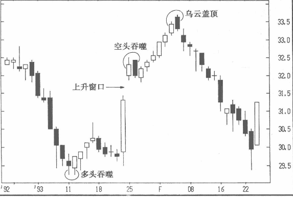
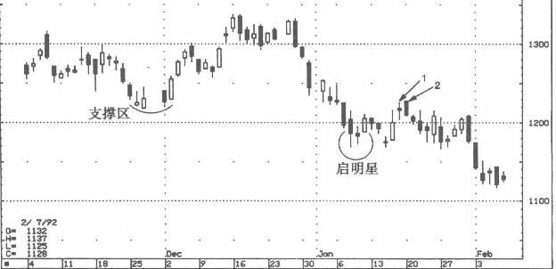

## 择时而攻,择时而退者胜
“耐心等待时间之窗的开启；耐心是交易者成功的最重要的品性。”这就是说，理想的蜡烛图形态出现时，并不意味着最佳交易时机已来临。
我警示学员们，在判断最佳人场时机之前，应该先权衡一下风险与收益的比率。

* 权衡风险与收益，就意味着设定止损点，这是控制风险的手段；
* 同时还意味着设定目标价位，也就是潜在的回报。目标价位的确定有多种方式，包括艾略特波浪理论、支撑位和压力位等。由于蜡烛图技术通常不能给出目标价位，我常常推荐人们将西方技术分析与蜡烛图结合起来使用。蜡烛图最擅长发出趋势反转或者趋势持续的信号，而西方技术分析工具中的回调幅度与趋势线等有助于设定目标位。当然，你也许已经有了自己的目标价位设定方法。

### 在很多情况下，你只能拉弓等待
请记住，在某个蜡烛图形态完成时，除非你判定风险与回报比率很诱人，否则请放弃交易。有句日本俗语所说的极是：“勇士的潜能是一张拉满的弓，但关键在于放弦的时机。”放弦的时机就取决于对风险与收益比率的研判。
在很多情况下，你只能拉弓等待。
* 比如，当蜡烛图形态中多头或者空头信号出现时，如果风险与收益比率并不诱人，你应该放弃交易（除非你的交易是为了对冲保值）。
* 如市场处于长阴长阳交错出现的大幅震荡时期，交易者也该退场观望。某日本技术分析著作将此种状况描述为“像8级地震”。如果有谁试图在此时人场交易，就如同一本日本书中所说的：“这是一种无谓的牺牲，一点不好玩。”

### 风险收益比率-例子
在图4-5中，1月份出现了一个多头吞噬，股价由此回升，后来出现了一个上升缺口，两个交易日后，又是根吞噬形态的长阴线。如果依此形态卖空，交易者必须同一个问题：此时卖空，风险收益比率诱人吗？（一般来说，股市卖空相对较少，但不妨以此蜡烛图指导其他市场的买卖，如期货市场，期货中微空比较常见。）如果全面分析技术形态，权衡风险与收益，就可发现这笔交易形同鸡肋，原因在于空头吞噬前面出现的上升缺口，如在当前价位卖空，止损点应该设定在大阴线的上方，而作为目标价位的上升缺口就在下方不远处，这样，风险与收益只能打个平手，这笔交易的收益风险比率很低。几周之后，蜡烛图走出了乌云盖顶的组合，此时如果以鸟云盖顶的顶部为止损点，以上升缺口的底部为目标价位进行放空交易，将是一次收益不菲的战机。
图4-5说明了一个道理：很难在多个蜡烛图技术形态中确定哪个更重要，哪个更能说明问题。这张图中有一个空头吞噬形态。一般认为，阴线吞噬部分阳线的乌云盖顶组合所显露的空头威力要大大弱于空头吞噬。但是就本例而言，依据乌云盖顶形态卖空相比依据空头吞噬卖空，能够获得更好的交易收益机会。

图4-6显示，一个看涨的蜡烛图信号并不能保证新多获利。1月8~10日，蜡烛图走出了一个启明星的看涨组合，10日（当日启明星形态完成）的收盘价为1205美元。此时的价位是否值得买入？我们来做一次风险收益比率评估。首先要确定收益潜力。我们看到，上一年11月下旬的1220美元附近曾是一个支撑位，根据两极转换原理，原先的支撑位现在（1月上，看多启明星形成之时）变成了压力位，交易员因此可以预计反弹会到达1220这个阻力区附近，因此目标价格也就在1220 附近。其次，我们来控制风险，依据蜡烛图理论，启明星的低点1169美元应该为现在的支撑位，也就是说止损位应在启明星低点1169的下方，如果未来的某个收盘价低于这个点，做多者应止损离场。 
由此可见这笔交易的几个参数：买人点1205美元（启明星形态完成时的价位），止损位1169美元，收益目标价位为1220美元。这就意味着36美元的风险与15美元的目标收益。无论怎么解释，这个收益风险比率都太低。由此得出的结论是：不要在某个蜡烛图形态出现之时就急于下单交易。请注意，这个启明星的底部一周以后成了支撑位。由此展开的上涨又如期在1220美元区域遭遇抵抗，形成高浪线1与长黑实体2，两者构成一个空头吞噬形态。通常来说，一波小幅上涨之后出现空头吞噬不必太在意。但是，在本例这个具体情况中，它却是值得注意的一个信号，因为它确认了1220美元这个阻力区。
