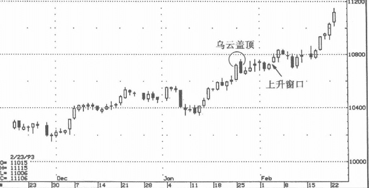
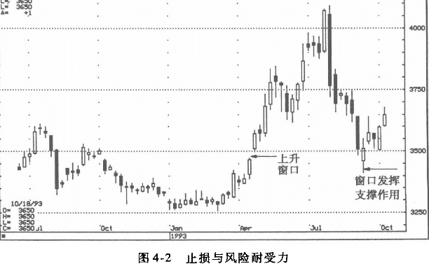
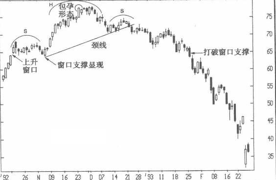

## 止损
无论某种技术分析工具如何可靠，它总会在某个时点给出错误的信号。

当价格到达某个点位时，你必须承认你的判断出了错，而这个价位就是你的止损点。贯彻止损策略，就等于控制交易的风险度。

事实上，止损是技术分析中一个极为重要的方面，是一种风险管理的手段。

一旦市场实际与主观判断背道而驰，人性弱点决定了有些交易者会变得一厢情愿的盲目。

例如，在图4-1 中，市价已经上穿了止损位（乌云盖顶的高点），而某些做空者只会妄想着价格重新转入下跌，但在市场中常常事与愿违。一厢情愿的成本总是太高昂，恰如一句日本俗语所说，它就像“倚靠白云的梯子”，只会导致坠落。

### 投资者的个性和修养也是交易成败的关键因素
如图4-2所示，1993年4月，大盘出现一个向上的跳空窗口。根据蜡烛图理论，这是一个支撑缺口，在9月份出现的回调中，它确实一直起着支撑作用。面对这样一个缺口，交易者可以在回调到缺口区某个点位时买人，而此前做多者则应该把止损卖出点设在缺口底部下方，在周收盘（即周五收盘价）到达该点位时卖出。读者应该注意到，虽然该续口在周内一度被完全回补，但空头力量有限，无力把股价长期压制在缺口下方。 
在这个例子中，尽管这是一个支撑缺口，但股价回调到缺口下方后，它所带来的情绪压力却使很多投资者难以忍受，尽管此后在周五收盘前，股价又被拉回缺口底部之上。它昭示我们，投资者的个性和修养也是交易成败的关键因素。

### 例子
在图4-3中，Amgen 股价的上升缺口体现出支撑力，在11月份的回调中始终没有被回补。回抽考验确认市场状况良好，推动股价向上突破75 美元的高位。到达该价位后，蜻烛图形态呈包孕状（前一蜡烛图完全包住后一蜡烛图），显露出危险的迹象，并在随后的几个交易周内走出典型的头肩顶（S-H-S）形态（日本人称之为“三佛形态”）。一旦股价跌破头肩顶的颈线，往往意味着多头应该离场。如果股价封闭了原先支撑上涨的缺口，到达其下方，那就是市场转弱的最后一次预警，1993年年初的情况就是如此。支撑缺口的完全封闭，是场内的多头止损卖出的信号。
