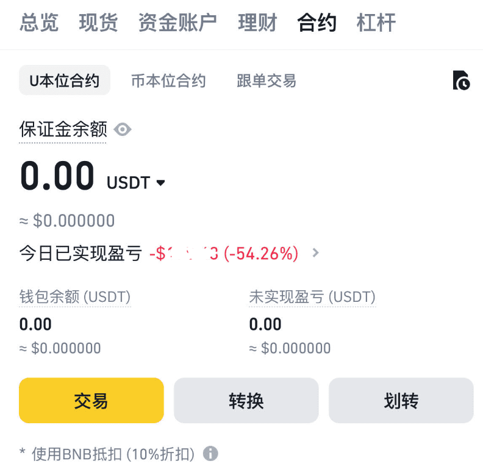

## 做交易想赚钱首先要禁止做合约交易
在我的交易经历中，通过合约的盈利最终都亏回去，至于最后的结果：放大赌性，在拉大杠杆，增加交易频率，最终亏掉本金。
>"年轻的朋友们有一天终于会明白——这个社会上，什么都会有代价的；看上去没有代价的东西、唾手可得的东西，基本是陷阱。"

### 1.关于合约-人性负面:
首先，合约交易非常放大人性负面，一旦有了被赌性控制，就接连亏损，甚至破产。
1. 亏了，你会放大杠杆想回本，频繁交易，越做越错。
2. 盈利了，你会膨胀，做单总会亏损的，然后亏了回到第1点。

### 2.关于合约-市场的规律:
市场和自然一样，周而复始地不断变化着的。但是大部分时间内行情都是不规则波动的。合约在交易大部分无规律的波动中是很难盈利的，此时你开高杠杆比猜大小的赌博胜率还低。 

1. 高杠杆也就意味着你不能长拿着持有，无法吃到长时间的价格涨幅，只能去赌买入的时候就拉升,然而买入就拉升无异于买彩票，市场规则是慢而不是快。

2. 另外一点插针，就算是正常的趋势中也会上下波动，在期间很容易受不了亏损比率选择主动平仓。

3. 市场的规律是缓慢的，合约注定无法长拿，一点回撤就想割肉，涨了一点就想卖，盈利的概率低于50%。

4. 一点回撤不割肉怎么办？可能继续向下爆仓。回撤的亏损比率是非常大的，10倍一个点就是10%，20倍就是20%，1-2点的回撤非常常见!

>总结，合约违背了市场规律，影响长时间持有难以盈利，就算在上涨趋势你也会亏损。

### 3.关于合约-费率:
1. 高杠杆的合约费率很高，意味着心情受涨跌控制,交易操作变形，你不能长拿。

### 例子，你能想象这样的交易，一天-50%？
Wed Mar 13 00:19:16 CST 2024

这样没什么波动的行情，亏损20%，另外一单也是差不多这样的行情亏的,加起来50%没了。

