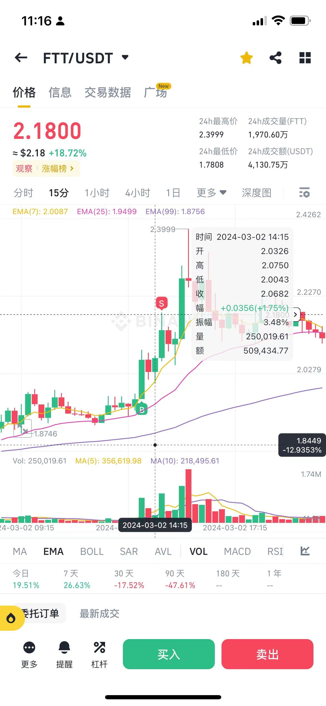

## 总结
* 15m： 200,000
* 1m：20万 / 15 = 1.33万
* 3m：1.33万 * 3 = 4万
* 30m： 40万（20万x2）
* 1h： 80万（20万x4）
* 4h： 320万（20万x16）
* 12h： 960万（20万x48）
* 24h： 1920万（20万x96）

## 1.15分钟k

成交额:二十万以上
```
200,000
```



## 2. 3分钟k
6万以上

## 3. 一小时k

15 X 4 = 60

2x4 = 80w
