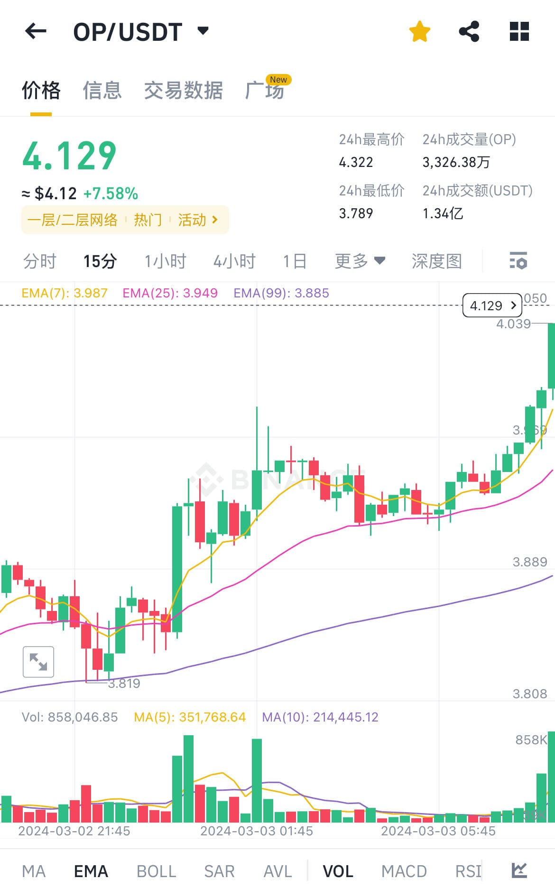

## 1.失败在于追高
这个点进去基本都亏钱，但是不排除一直拉，总之盈亏比太低(亏钱概率高)

### 1-1.思考
1. 在下跌之前收长长的上影线(上图中4.322的长长的上影)

## 2.思考
>所以赚钱关键在于什么点位买入,比如在前2根绿k拉之前，小梯步绿k买入。

### 2-1.买入点的形态
`4.038`就是两种大绿k之前,可见
1. 光头上影
2. 每一次`开盘价`都是高于或等于`上一k收盘价`
