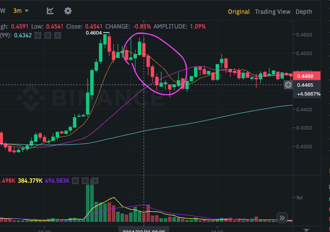
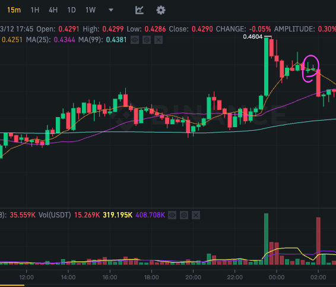
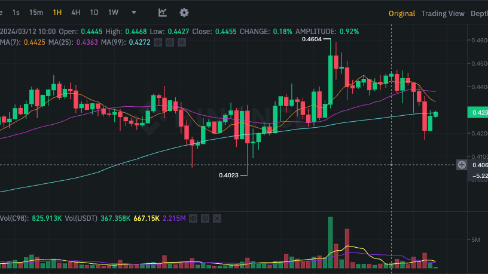
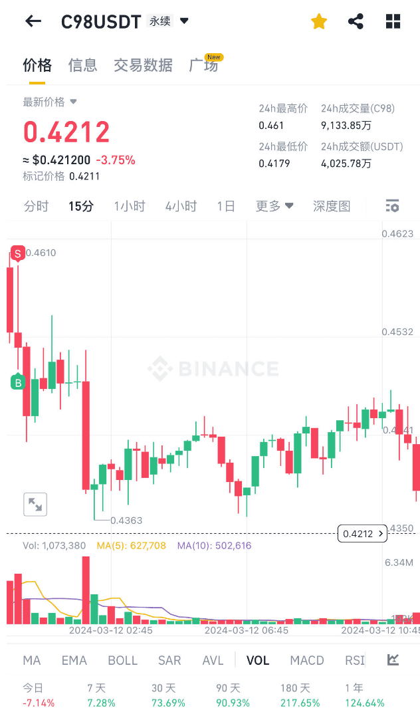
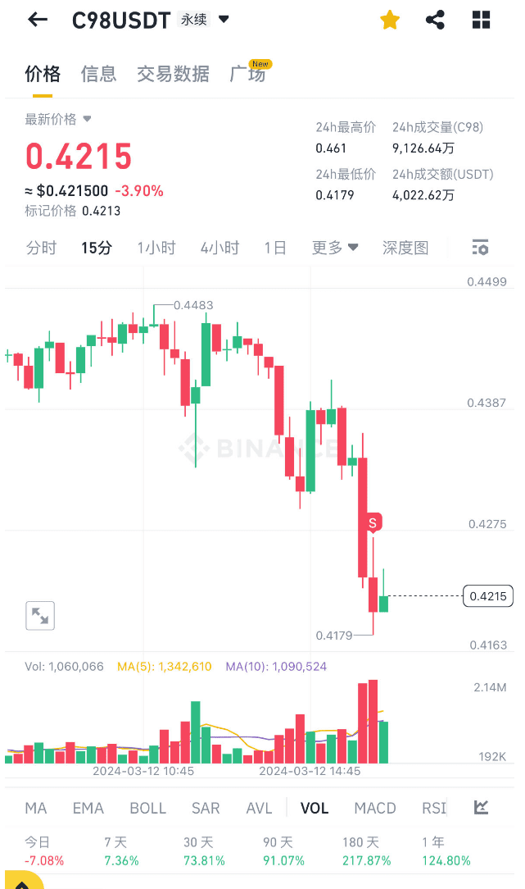

## 亏损经验
Tue Mar 12 17:05:43 CST 2024
### 1. 入场点就不好了
没遵循"小梯步",属于10%涨幅下的追高。--老毛病
### 2. 趋势不对没及时止损。--老毛病
[如果市场运动与所持头寸方向相反，您或许会盘算，“干吗设置止损指令呢?只是短期行情运动，暂时对我不利而已”。](./00-止损.md)
优势在我？怎么可能，亏损就反映了劣势,只是幻想出来的优势。

>在电影《大决战•淮海战役》中。老蒋在战前会议上所说的“80万对60万，优势在我”

## 交易后心态
1. 在亏损后想加大筹码赢回来的心态又回来了,得冷静
2. 需要继续对照蜡烛图，熟悉图表

### 3mk

### 15k
* 这两根十字星，意味着上涨的动力被买方消耗 

### 1h
一小时线也的确收根十字星线 

### 3. 4倍的杠杆对于山寨还是太大
且在高位的情况下容易被埋

## 开单

## 最终止损

