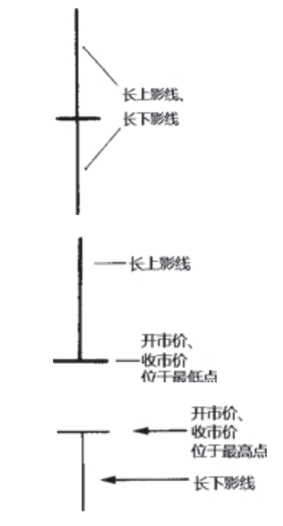
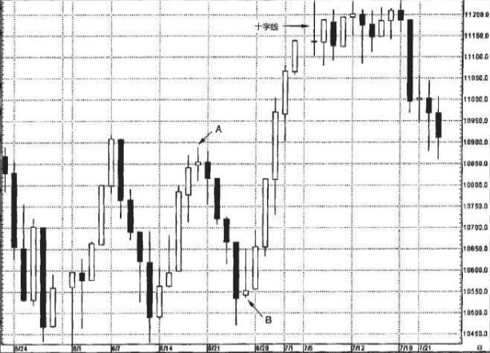
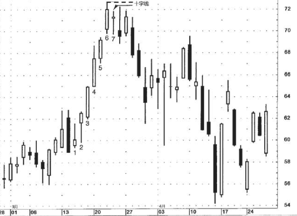
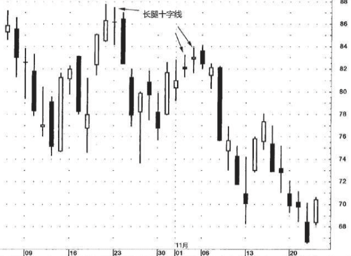
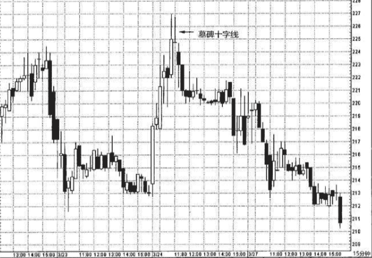

## 十字线
十字线甚至没有实体。在这种极端情况下，蜡烛线的实体实际上缩小为一根水平横线了。

- 其开市价与收市价处在同一个水平上。

当某个交易日的开市价和收市价处于同一水平，或者当开市价与收市价的水平极为相近时，当日的蜡烛线就变成了一根十字蜡烛线。十字线带有反转信号的意味，特别是当它处在上涨行情时。在十字线出现后，如果发生下列情形，则增加了十字线构成反转信号的可能性。

1. 后续的蜡烛线验证了十字线的反转信号
2. 市场正处在超买状态或超卖状态。
3. 十字线在该市场出现得不多。如果在某个行情图上出现了许多十字线，则即使出现了新的十字线，也没有多大意义。

从图8.1到图8.6，显示的是十字蜡烛线的各种例子。因为十字线是一种极其重要的反转信号，所以我们专门辟出这一章来对其进行研究。在前面的各章中，我们已经看到十字线作为 一些蜡烛线形态的组成部分所发挥的重要力量。这类形态包括十字星 形态(参见第五章)，以及十字孕线形态。
* 长腿十字线
* 墓碑十字线
* 蜻蜓十字线

### 判定
这种做法的理论依据是，因为十字线可能构成了重要的警告信号，所以我们宁可错认也不能漏过。
1. 看这根近似的十字线与其邻近的价格变化的相互关系是怎么样的。如果在这根近似十字线的周围，还有一系列的小实体，那么就不应该认为这根蜡烛线有多大的意义，因为在它附近有这么多的小实体蜡烛线。然而，如果在若干长蜡烛线之后出现了一根近似的十字线， 那么我们就可以说这个时段的变化具备与十字线相同的含义，因为本时段的变化与之前的行情显现出本质上的区别。
2. 如果当时市场正处在一个重要的转折点。
3. 如果市场已经处在极度超买或超卖状态。
4. 如果当时已经有其他技术信号发出了警告信息。

### 上升趋势中要特别留意
十字线之所以很有价值，是因为它在揭示市场顶部方面有过人的能力。在上升趋势中，如果前面先出现一根长长的白色蜡烛线，后面 跟着一根十字线，这种情况尤其值得注意(如图8.5所示)。为什么十字线出现在上升趋势中具有负面意义呢?

这是因为十字线代表着市场 处于犹豫不决的心理状态。在上升趋势中，如果买方犹豫不决、看不准市场方向，或者不能当机立断，那么当前上升趋势是维持不下去的。只有在买方立场坚定的条件下，上涨行情才能得到有力的支撑。 在市场已经经历了长期的上涨之后，或者当市场处于超买状态时，如果出现了一根十字线(在这根蜡烛线上大书着“犹疑不定”)，则意味着买方搭起来的脚手架马上就要垮掉了。

### 下降中
另一方面，虽然十字线在引发市场的顶部反转方面是相当有效的，但是根据我们的经验来看，在下降趋势中十字线往往丧失了发挥反转作用的潜力。其中的原因可能是这样的:十字线反映了买方与卖方在力量对比上处于相对平衡的状态。由于市场参与者抱着骑墙的态度，市场往往会“因为自身的重力而下坠”(这是市场参与者的行话)。这一点与下述情形有异曲同工之妙:当市场向上突破时必须伴随着重大的交易量才能有效地验证向上突破信号，而在市场向下突破时，交易量是不是重大、是不是构成验证信号，就不那么重要了

因此，当十字线出现时，在上升趋势中市场可能向下反转，而在下降趋势中市场则可能继续下跌。因为上述这个原因，十字线在构成底部反转信号时，比作为顶部反转信号需要更多的佐证。举例来说，如果十字线的出现验证了支撑水平的作用，则即使这根十字线出现在下降行情中，也得留神。

为了区分上涨行情中的十字线和下降行情中的十字线，我称前者为北方十字线，后者为南方十字线

### 底部中
请记住，根据我们的经验，十字线在揭示底部信号时不如揭示顶部信号时来得有效。

因此，在您的市场上，十字线没准儿就能有效揭示底部信号。这就引出了关于蜡烛图技术的一个关键点。也许所有的蜡烛线或蜡烛图形态在您的市场上都有效，也可能只是其中一部分有效。到底哪些用起来称心如意，需要当事人的经验。

## 北方十字线（上涨行情中的十字线）
如果在高高的白色蜡烛线之后，或者在行情超买的状态下，出现了一根十字线，日本人会说市场“疲惫”了。这样看待十字线，真是恰如其分。十字线的出现不一定意味着价格立即掉头向下。十字线向我们揭示了市场的脆弱状态，可能成为行情转变的起点。

在图8.7中，A和B两处的纺锤线提供了线索，表明它们之前的趋势现在陷入僵局。这类小实体代表了买卖双方正在拔河拉锯，相比之下，十字线则代表了牛熊双方达到了完全的平衡。

从B处开始，上涨行情形成了一系列长白色实体，反映出市场生龙活虎。随着十字线的到来，虽然只是单一一个时段，显示了市场已经与先前的趋势脱钩。十字线表明，当日行情已经发生实质性转变，与之前一系列收市价明显高于开市价的白色蜡烛线大不相同。

在图8.9中，从时段1到时段6，依次具备更高的高点、更高的低 点、更高的收市价。时段7是自蜡烛线1以来第一根具备更低的高点、 更低的低点、更低的收市价的蜡烛线。在通常情况下，这并不会带来 严重后果，但是由于蜡烛线7也是一根十字线，在这方面进一步加强了它的技术意义。有时，一条条不起眼的技术线索叠加起来，便形成了 市场重大转折的信号。正如古语所说:“不积跬步，无以至千里;不 积小流，无以成江海。”于是，尽管单独一个不起眼的技术线索本身并没有多少分量，但是，一旦与其他技术线索结合起来，它们的意义便陡然增加了。

在十字线形成后，我们在图上用虚线标出了相应的阻挡水平。正如对图8.8的解说，如果在高高的白色蜡烛线之后出现了十字线，我们便选取两根线的最高点作为阻挡水平，并按照收市价来判断市场是否突破了该阻挡水平。在本图中，因为白色蜡烛线的高点高于十字线的高点，所以白色线的高点成为首要的阻挡区域(图上用虚线做标记)。在十字线出现后，英特尔变得“疲惫”了。如果英特尔的收市价能向上超越该阻挡线，我们就会说，市场已经休息好了，这是向上突破、重振雄风的信号。

## 长腿十字线
在长腿十字线上，十字的部分表示市场正处在过渡点上。长长的上影线则说明，市场在本时段先是猛烈上推，后是急剧下滑，最后其收市价已经远远离开本时段的最高点了。拉长的下影线揭示了市场在本时段先是剧烈出货，后是强烈反弹，最后其收市价已经收复了相当部分的失地。 
换句话说，市场上冲，暴跌，再上冲，不一而足，大幅动荡。这是一个混乱的市场。对日本分析师来说，非常长的上影线或非常长的下影线的形成——借用他们的话来描述——就表示市场“失去了方向感”。如此一来，长腿十字线就成为市场与之前趋势分道扬镳的标志。

10月23日出现了一根长腿十字线。在该十字线及其 之前的白色蜡烛线之间，选择其中最高的高点，立即可以得到位于88 美元的阻挡水平。指数从该长腿十字线开始下降，直到三天后出现一 根锤子线才收场。11月初，市场本来是上涨的，但是随着接连两根长 腿十字线的到来，任何看涨的念头都打消了。11月6日和7日组成了一 个看跌吞没形态，这是市场进入困境的进一步信号。请注意，在10月 初的下降过程中，十字线频频出现。正如之前曾经讨论的，据我的经验，十字线适合揭示顶部反转信号，不适合底部反转信号。

## 墓碑十字线
在某根蜡烛线上，当开市价和收市价都位于当日的最低点时，就形成了一根墓碑十字线。蜡烛线具有非常直观的视觉效果，这类蜡烛线便是很好的例子。哪怕您从未听说过墓碑十字线的含义，一看到它，您会以为这是一个看涨信号，还是看跌信号呢?当然是看跌的。由于它带有超长的上影线，并且收市价位于整个时段的最低点，我们能够一目了然，在该时段内股票曾经大幅上冲，但是到了本时段结束时，在空方的打压下，股票的收市价跌至最低点。可以把它看成流星线的极致版本。流星线带有长长的上影线和小实体。如果流星线的小实体收缩为十字线，就得到了一根墓碑十字线。

墓碑十字线的长处在于昭示市场顶部方面。从墓碑十字线的外形看，它的名称是颇为贴切的。我们曾经指出过，日本技术分析的很多术语都建立在类似的军事术语之上，从这个意义上说，墓碑十字线恰恰标志着在市场上为捍卫自己的阵地而战死的多头的墓地。

一个墓碑十字线的实例。由于十字线的高点与之前白 色蜡烛线的高点相同，它们也构成了平头形态。虽然“墓碑”听上去 不祥，但请不要误会，误以为墓碑十字线意味着即将出现大幅下跌行 情。尽管墓碑十字线具备拉长的上影线和收市于本时段最低点，这些 因素的确增加了市场向下转折的机会，但是它并不能预测潜在的下跌 幅度。蜡烛图信号在及早提示反转信号方面无可匹敌，但是它不能预 测行情变动的范围。恰如其分地运用蜡烛图，不要超出蜡烛图本来的 功用。正如一句格言所说:“不可缘木求鱼。”

虽然十字线的出现提醒我们多加小心，但是我也不会仅仅根据这 根墓碑十字线转而看空。为什么?请注意，十字线的收市价依然高于3 月22日下半天形成的阻挡水平，大约在224美元处。正是由十字线下一 个时段的收市价(向下突破了该水平)决定趋势向下。在该时段，收市价回落到224美元之下，证明了十字线曾经发出的信号——新高价位不能维持。

## 蜻蜓十字线
是墓碑十字线的反面角色，是看涨的。在蜻蜓十字线上，开市价和收市价位于本时段的最高点。这意味着，在本时段内市场曾经下跌至很低的水平，但后来力挽狂澜，收市价已经回升到或非常接近本时段的最高点。这一点与锤子线相像，但是锤子线是小实
体，而蜻蜓十字线是一根十字线，没有实体。

## 箱体
在运用十字线时，一条具有普遍意义的规则(实际上对所有蜡烛图信号都适用)是，应当首先观察信号之前的行情演变轨迹。举例来说，在行情上涨过程中出现十字线，属于潜在的反转信号。因此，首先必须有上涨行情可以反转。这意味着，如果十字线出现在交易区间的环境下，便没有什么预测意义了，因为没有可反转的趋势。日本人贴切地形容局限在横向区间的行情为“箱体”。