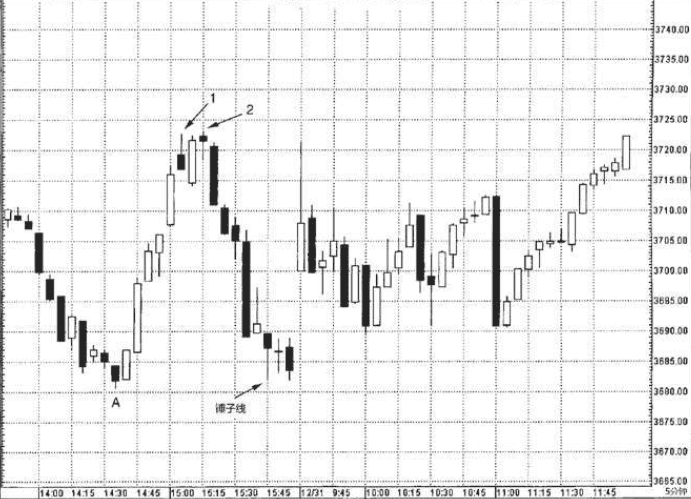

## 伞形线
它们的下影线较长，而实体(或黑或白)较小，并且在其全天价格区间里，实体所处的位置接近顶端。

因为它们的轮廓呈伞状，长长的下影线如伞柄，小实体如伞面。在本图中，我们同时列出了黑白两种蜡烛线。这两种蜡烛线都既可能是看涨的，也可能是看跌的，具体情况要由它们在趋势中所处的位置来决定:

## 1.锤子线-出现在下跌中
伞形线，不管是哪一种，只要它出现在下降趋势中，那么，它就是下降趋势即将结束的信号。在这种情况下，这种蜡烛线称为锤子线，意思是说“市场正用锤子夯实底部”

锤子线属于底部反转信号，就需要之前存在下降趋势才谈得上反转。据我的个人经验，锤子线的成功率不依赖其实体的颜色。

但是，如果锤子线的实体是白色的，其看涨的意义则更坚挺几分(因为其收 市于最高价)。

锤子线带有长长的下影线，且收市于本时段最高价，或接近最高价，意味着在当天的交易过程中，市场起先曾急剧下挫，后来却完全反弹上来，收市在当日的最高价处，或者收市在接近最高价的水平上。这一点本身就具有看涨的味道。锤子线收市价位于最高价或接近最高价，正是其没有上影线，或者上影线很小的原因。这一点是锤子线的判据。反之，如果蜡烛线带有长的上影线，则意味着收市价显著低于本时段最高价。

### 例子1
2月24日看到一根锤子线。它很经典，因为其下影线 很长，而实体较小，且实体位于当日交易区间的顶端。它是在一轮下 跌行情之后出现的。这正是锤子线出现的必要前提。

2月22日的蜡烛线不会被定义为锤子线，因为它不符合条件，下影线长度达不到实体长度的2-3倍。这类长下影线是必要条件，因为它表 示市场在本时段曾经急剧下挫，但在收市时，行情收市价位于或接近 最高价，熊方反倒一败涂地。

我敢打赌，在出现了这样经典的锤子线之后，空头立场一定会动摇。

### 评估交易的风险报偿比
图4.7揭示了蜡烛图技术至关重要的一方面特点。如果您希望借助蜡烛图来成功地交易，那么您不仅需要理解蜡烛图形态本身，还需要在评估交易的风险报偿比的基础上，理解蜡烛图形态所处的相对位置。始终应当先考虑风险报偿比，再根据蜡烛图形态或蜡烛线信号发出交易指令。现在，让我们牢记交易之前应考虑风险报偿比，再重新审视24日的理想锤子线。

在该锤子线即将完成时(请记住，我们不得不等待行情收市)， 股价收市于接近48美元处。如果在锤子线完成时买进(48美元附 近)，当市场再次下跌到锤子线最低点约43美元时止损，则上述两个 价格之差便是风险，即大约5美元。如果您的赢利目标远大于5美元，在锤子线完成时买进并没有什么不对。

不过，对某些活跃的短线交易 者来说，5美元或许风险太大了。
> 于是，为了降低潜在的交易风险，交易者或许打算等待市场回调至锤子线下影线范围内的机会(当然，在锤子线出现后，许多时候市场并不回调)。利用锤子线低点作为潜在的买进点位，就有可能在接近止损的位置上建仓。

> 设想交易者甲识别出2月24日的锤子线。当他看到如此精彩的锤子 线时过于兴奋，以至于在锤子线的收市价附近，即接近48美元处立即 买进了。次日，市场开市时向下跳空，开市价为44.50美元。交易者甲 的头寸现在处在水下3.5美元的深处了。或许他最多承受4.5美元的亏 损，就要采取止损措施，轧平昨日的多头头寸。如果是这样的话，最 终甲或许认为这根蜡烛线不起作用。

> 交易者乙同样意识到锤子线是潜在的反转信号，但是她记住了风险报偿比的前提，没有在锤子线收市时买进(因为对她来说，此处买进的风险太大了)。次日，当市场开市于低价位时，深入锤子线长长下影线的低端，这是潜在的支撑区间。乙认为，股价现在接近支撑水平，决定买进。当股价从支撑位上冲后，乙就会对蜡烛图大唱赞歌。

### 例子2
锤子线具有长长的下影线，实体很短，居于该时段价格 区间的顶端。我们注意到，锤子线应该只有很短的上影线，本例正是如此。该锤子线后来演变为坚实的底部支撑。

