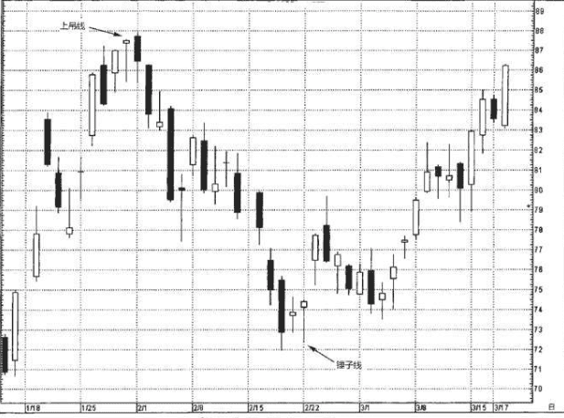
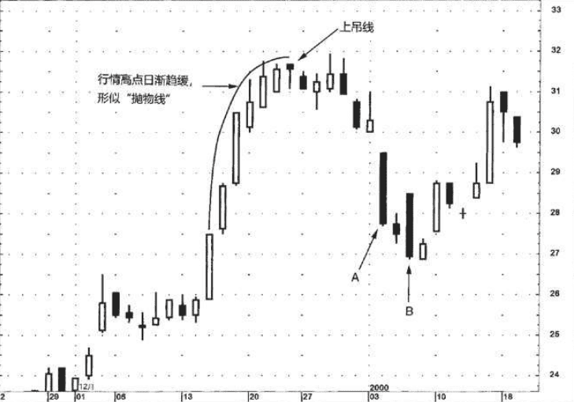
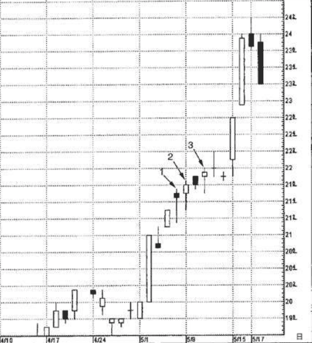

## 1.上吊线
上吊线的形状与锤子线相同，唯一区别是，上吊线出现在上涨行情之后。因为长下影线具有增强功效的作用，而上吊线有这样的长下影线。

上吊线出现后，一定要等待其他看跌信号的证实，这一点特别重要。

最低限度的验证信号是，之后时段的开市价低于上吊线的实体。但是，我总是建议以收市价低于上吊线的实体为验证信号。

一般根据三个方面的标准来识别锤子线和上吊线。
1. 趋势:锤子线只能紧接在下跌行情后出现;
2. 上吊线必须紧接在上涨行情后出现。
3. 上吊线之前必须具备长足的上冲行情，最好是创下行情全历史新高后，方为有效。

在看涨的锤子线的情况下，或者在看跌的上吊线的情况下，其下影线越长、上影线越短、实体越小，那么，这类蜡烛线就越有意义。

### 为什么要等待之后时段的收市价低于上吊线的实体呢?
因为如果次日市场收市在低于上吊线实体的水平，那么凡是在上吊线当日的开 市、收市时买进的交易商(大量的交易活动发生在这两个时段)，会通通背上亏损的头寸，被“吊”在上面。 同样道理，我还希望看到上吊线位于市场全历史最高价，或者至少处于一轮重大行情的最高位。 在这种情况下，多头在上吊线之日的入市点位处在历史新高处，这就 迫使他们更加紧张。结果，这批多头或许决定撤出他们新开的多头头寸。他们的头寸倾泻而至，加重了卖出压力。

### 例子1
1月29日的蜡烛线是上吊线，因为之前趋势是上冲行情。上吊线给 本轮行情创了新高。下一日(2月1日)，收市价低于上吊线的实体， 这让所有的新多头——在上吊线当日开市和收市时买进的——通通陷入困境。 
2月22日的蜡烛线是锤子线，因为它出现在下降趋势之后。锤子线 之前的一个交易日也是短实体。这是一条更早出现的线索，表明空头 的努力遭遇了阻碍。而锤子线成为进一步的看涨证据。

### 例子2

牛方失去主导权的迹象来自上吊线出现的那一天。这一 天不仅是一根上吊线，而且在这轮上冲行情中，这是第一根黑色实体、第一根纺锤线。次日收市价低于上吊线的实体，构成上吊线的验证信号。几天后，市场再次试图向上推进，但在32美元附近陷入停 顿，留下了一系列长长的上影线。

记住，任何人在上吊线开市和收市时买进，都是买在当前行情的最高点。如果在上吊线之后市场持续创新高(此处正如此)，那些多头还会感觉难受吗?当然不会。他们正高兴呢，因为行情比他们买进的点位更高了。

### 注意，只要市场没有收市于上吊线实体的水平之下，则牛市趋势保持稳固
`因此，正如本例所示，只要市场没有收市于上吊线实体的水平之下，则牛市趋势保持稳固。`

