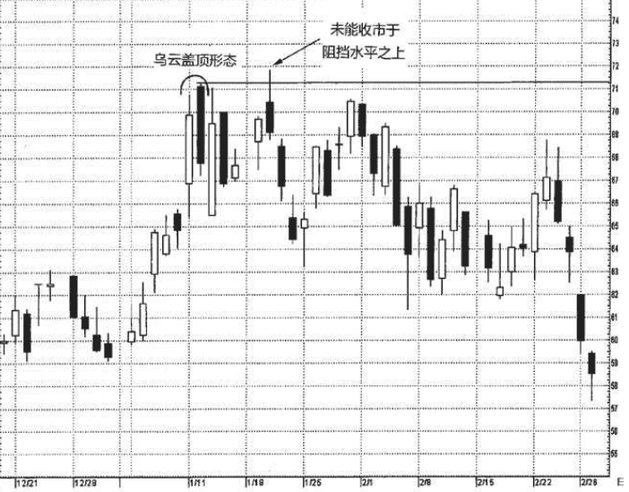
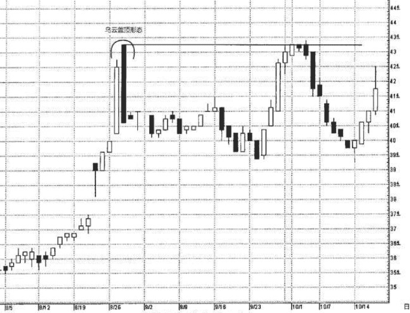

## 乌云盖顶
* 由两根蜡烛线组成
* 顶部反转形态,出现在上升趋势之后,些情况下也可能出现在水平调整区间的顶部。

在这一形态中，第一天是一根坚挺的白色实体;第二天的开市价超过了 第一天的最高价(就是说超过了第一天上影线的顶端)，但是到了第二天收市的时候，市场却收市在接近当日最低价的水平，并且明显地向下扎入第一天白色实体的内部。第二天的黑色实体向下穿进第一天的白色实体的程度越深，则该形态构成顶部反转形态的可能性就越大。

> 这种看跌形态背后的道理很容易理解。在形态发生之前，市场本来处于上升趋势中。有一天出现了一根坚挺的白色蜡烛线，第二天市场在开市时便向上跳空。到此刻为止，多头完全掌握着主动权。然而，此后市场的技术景象却完全改变了!事实上，市场收市在当日的最低价处，或者在最低价附近，并且这个收市价明显地向下扎进了前一天的实体内部，消除了第一天取得的大部分进展。在这种情况下，多头头寸的持有者信心开始动摇。还有一些人一直在找机会卖出做空，那么现在他们就得到了一个设置止损指令的参考水平——乌云盖顶形态的第二日形成的新高价格水平。

### 例子
图4.23所示的乌云盖顶形态终结了一场上冲行情。在这种形态的下一日，英特尔向上推进，但在接近该形态高点的71美元处铩羽而归。一周之后，以及再过了两周之后，在71美元附近，股价同样受阻不前。注意1月20日，英特尔一度在该阻挡水平线上探头张望，却未能收市于该阻挡水平之上，因而无损其有效性。

### 例子2
在图4.24中，从8月中旬开始出现了一轮上冲行情。8月22日，股价向上跳空，并形成了一根上吊线，但是它潜在的看空暗示却没有得到下一日的验证，因为下一日的收市价向上超越了上吊线实体。8月28日，大约在43.25美元附近，该股票以开市价向上跳空的方式发动了最后一轮推进。开市时，从多头的角度看，似乎一切顺利。然而，当日收市时，收市价下降到了40.62美元。这下子完成了一个乌云盖顶形 态，因为这根黑色蜡烛线深深地回落到了前一日的白色实体内部。

这是一个界定清晰的乌云盖顶形态;另一方面，从风险报偿比的角度看，此处却可能不是卖出的好点位。 
原因在于，该乌云盖顶形态在其中第二日收市时才算大功告成，到了这个时候，行情距离其高点已经相当遥远。运用乌云盖顶形态构成阻挡水平的概念，我们可以等待市场反弹，等到市场再次接近乌云盖顶的高位时卖出(假定后来的行情让我们如愿的话)。10月上旬，又一轮上冲行情推进到了该乌云盖顶形态的高位，此时出现了一根短黑色实体，并且接连四根蜡烛线都重复了同一个高点，43.25美元，这迹象表明上冲行情后继乏力。
