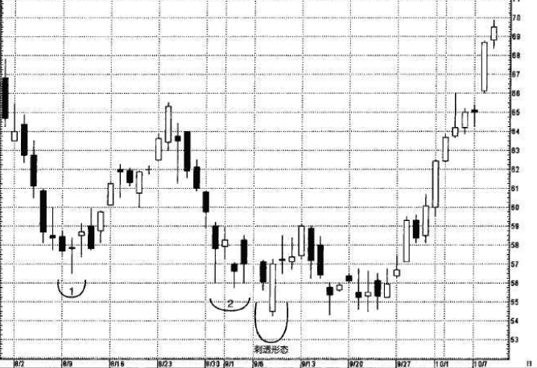
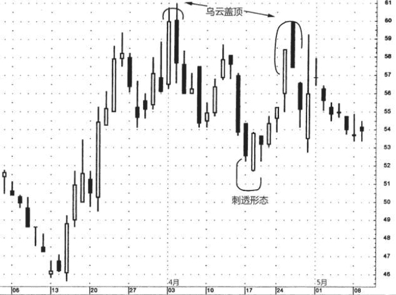

## 刺透形态
与乌云盖顶形态相反的形态，它的名称为刺透形态(如图4.26所示)。刺透形态出现在下跌的市场上，也是由两根蜡烛线所组成的。

在刺透形态中，白色蜡烛线的实体必须向上推进到黑色蜡烛线实体的中点以上。才能构成较为有效的 底部反转信号。
* 第一根蜡烛线具有黑色实体，
* 第二根蜡烛线则具有白色实体。在白色蜡烛线这一天，市场的开市价曾跌到低位，最好下跌至前一个黑色蜡烛线的最低价之下，但是后来市场又将价格推升回来，深深刺入黑色蜡烛线的实体内部。

在刺透形态中，白色实体向上刺入黑色实体的程度越大，该形态构成底部反转信号的可能性就越大。在理想的刺透形态中，白色实体必须向上穿入前一个黑色实体的中点水平以上。

>关于刺透形态背后的心理过程，可以做如下理解:市场本来处于下降趋势中，刺透形态第一天疲弱的黑色实体加强了这种市场预期。第二天，市场以向下跳空的形式开市。到此刻为止，空头观察着行情的发展，感觉诸事顺遂。可是到当日收市的时候，市场却涨了回去，结果收市价不仅完全回到了前一天的水平，而且变本加厉地向上大大超越了这个水平。现在，熊方开始对手上的空头头寸忐忑不安起来。有些市场参与者一直在寻找买进的机会，他们据此推断，市场不能维持这个新低价位，或许这正是入市做多的大好时机。

### 例子
图4.30中区域1和2处出现了一系列长下影线，表示56美元附近可能存在支撑水平。可是在9月8日，戴顿-赫德森(DaytonHudson)连出重拳，开市于54美元上下，开市就跌穿了上述支撑水平。空方掌控了行情——或者这只是他们的错觉。 到9月8日当日交易结束为止，多方杀了一个回马枪，把股价推到了明显高于前一个收市价的水平。9月7 日和8日的蜡烛线组合成了刺透形态。在该刺透形态一周之后，9月16 日，形成了一根锤子线，再次加强了该形态位于54美元左右的支撑水 平。紧接着在锤子线之后的一周内，冒出了一系列长下影线，进一步 验证了上述支撑水平。 

### 例子
在图4.31上，3月中旬有一个看涨吞没形态，由此开始形成一轮上冲行情;3月24日接近59美元的纺锤线显示了这轮行情可能遇到麻烦的迹象。4月3日，收市价超越59美元，全天形成一根长白色实体，标志着多头回来了，至少到本时段为止重掌大局。在4月4日这一天，该股票形成了一个乌云盖顶形态的变体。之所以说它是乌云盖顶形态的变体，是因为在通常的情况下，我们希望该形态第二天的开市价高于第一天的最高价，而在本例中，第二天的开市价只是高于第一天的收市 价。虽然如此，考虑到4月4日黑色蜡烛线向下回落到白色实体的内部如此深入的地步，增加了该形态的技术效力，该形态可能比中规中矩的乌云盖顶形态更有效。

4月17日和18日组成的刺透形态引出了之后的上冲行情。从这个刺透形态开始的上冲行情一直持续到4月24日和25日组成的另一个乌云盖顶形态。这个乌云盖顶形态也可以看成经典乌云盖顶形态的变体。为什么?因为其中的黑色实体没有向下跌破白色实体的中线。无独有偶，虽然这个蜡烛线组合不属于常规的乌云盖顶形态，但是它具备两个要素，让我相信它的看跌性质与传统的乌云盖顶形态不相上下。具体来说:
1. 4月25日的黑色实体开市价急剧上涨，高于前一天的最高价，在这个基础上，其收市价低于前一日的收市价;
2. 该形态验证了4月上旬乌云盖顶形态形成的阻挡水平，也标志着市场向上尝试该阻挡水平以失败收场。
