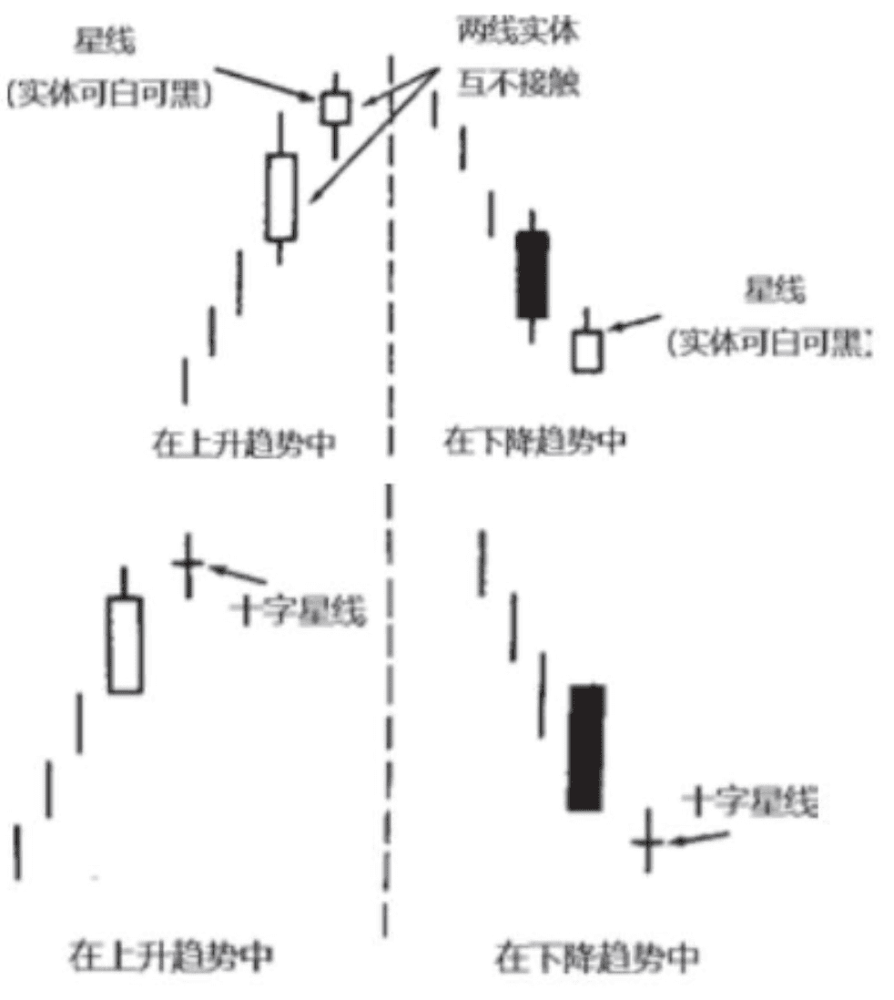

## 星线
实体较小(可以是白色，也可以是黑色)，并且在它的实体与它前面较大的蜡烛线实体之间形成了价格跳空。 
换句话说，星线的实体可以处在前一个时段的上影线范围内;只要星线的实体与前一个实体没有任何重叠(有一些例外情形，本章后面还要讨论)，那么这个星蜡烛线就是成立的。

如果星线的实体已经缩小为十字线，则称之为十字星。当星线，尤其是十字星线出现时，就是一个警告信号，表明当前的趋势或许好景不长了。

