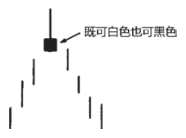
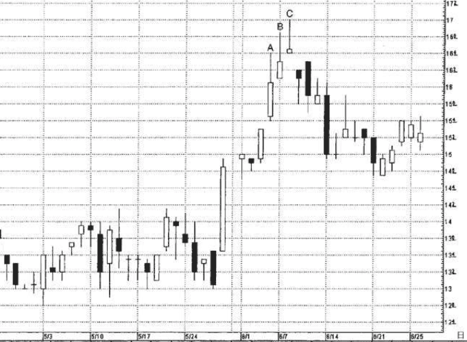
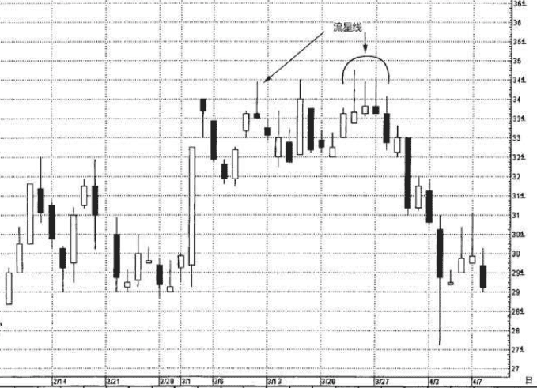
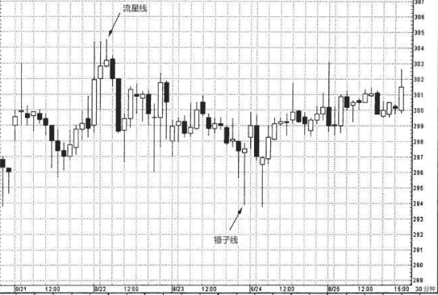
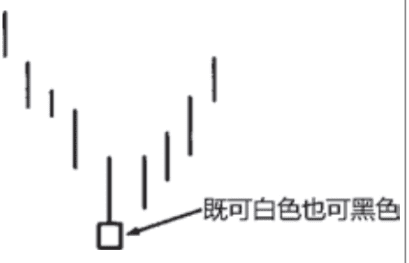
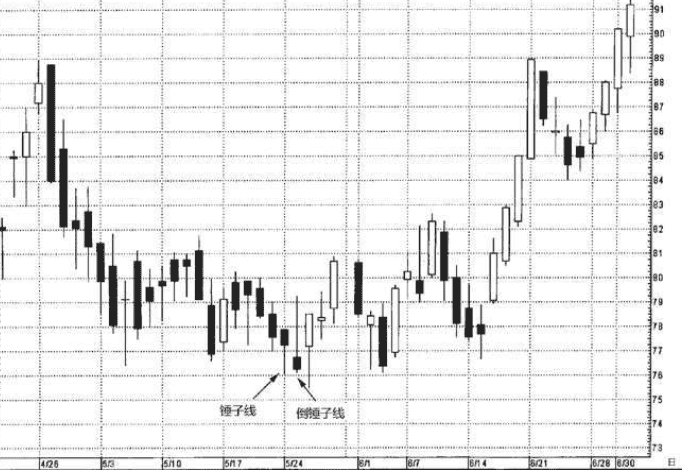
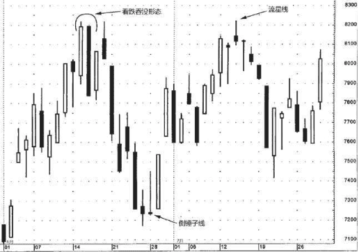

## 1.流星和倒锤线
具有较小的实体，而且实 体处于其价格区间的下端，同时，流星线的上影线较长。

流星形态预示着前方有麻烦了。既然它只是一个时段，通常不像看跌吞没形态或黄昏星形态那 样构成主要反转信号。它与上述两个形态还有一点不同，我不认为流星线构成了关键阻挡水平。

因为流星线属于看跌反转信号，它必须出现在一段上冲行情之后。在理想的流星形态中，流星线的实体与前一根蜡烛线的实体之间存在价格跳空。不过我们将从几个实例中看到，这样的价格跳空并非总是必须的。在流星形态中，没有向上跳空恰恰给它的负面意义增添了一个理由。

### 例子
在图5.20中，假如不是采用蜡烛图格式，而是线图格式，那么时 段A、B和C反映出的是健康的市场环境，因为每个时段都具备更高的高点、更高的低点以及更高的收市价。可是，从蜡烛图技术的角度来观察，我们从它们三者得到的是警告性的图形信号，头顶上悬着麻烦呢。 
在时段C，关于顶部反转的最终验证信号来了，这是一根流星线。或许您注意到，墓碑十字线(第八章将讨论)的外形与流星线看起来相像。墓碑十字线是流星线的特殊形式。流星线具备小实体，而墓碑十字线——作为一个十字线——没有实体。因此，墓碑十字线比流星线来得更疲软。

### 例子2
在图5.21中，出现了一系列流星形态，其中第一根流星线发生在3 月10日，位于34.50美元。几周后，三根前后相续的流星线出现在同一 个水平上，34.50美元。这就告诉我们，虽然多头每一次都有力气把股 票推升到34.50美元，但是这些都是日内新高，多头甚至不能把日内新 高维持到收市时。换言之，这些流星线发出视觉信号，揭示市场正在 排斥更高的价位。正如本例所示，一旦我们在同一个价格水平得到了 一个又一个信号，自然增加了这个阻挡区域的分量。在本例中，几条 流星线在同一个水平相互验证，极大地提升了此处形成行情反转的可 能性。当然，如果多头有足够的力量以收市价向上突破一众流星线的 高点，那么任何看跌观点都需要重新推敲了。

### 例子3
在图5.22中，8月22日上午一根流星线再度强调304美元左右存在 麻烦，因为在连续多个时段中这已经是第三次冲高回落了。紧接着在 流星线之后的30分钟的时段提供了行情见顶的更多证据，因为它产生 了一个看跌吞没形态。后来，康宁公司在一个箱体区间中安顿下来， 区间底部由8月23日位于294美元的锤子线界定(次日上午，通过另一 个锤子线表明，该底部防守成功)。从第二个锤子线的294美元开始形 成上冲行情，之后在304美元附近遭遇该流星线的阻挡作用。

## 2.倒锤线
在下降趋势后，如果出现了与流星线外观一致的蜡烛线，则可能构成看涨信号。这样的蜡烛线称为倒锤线。

虽然倒锤子线不属于星线形态，但是因为它的外形与流星线相像，所以我们把它放在这个部分来讨论。

与流星线颇为相像，它也有较长的上影线和较小的实体，并且实体居于整个价格范围的下端。两者之间唯一不同的是，倒锤子线出现在下降行情之后。结果，流星线是一根顶部反转蜡烛线，而倒锤子线却是一根底部反转蜡烛线。倒锤子线实体的颜色无关紧要。同一种形状的蜡烛线既可以是看涨的，也可以是看跌的，取决于在其出现之前的趋势方向，在这个概念上，倒锤子线和流星线是一对，锤子线和上吊线是一对。

倒锤子线也需要其他看涨信号的验证。验证信号既可以是次日开市价高于倒锤子线的实体，也可以是次日收市价高于倒锤子线的实体，尤其是后者更为有力。

### 例子
在图5.24中，5月24日的一根锤子线在76美元构成了支撑水平。次日，形成了一个倒锤子线。它为当前市场变动创下了收市价的新低，如此一来，它就延续了原来向下的短期趋势方向。无论如何，锤子线的支撑水平依然保持完好。5月26日的收市价起到了一石二鸟的作用: 首先，它再次确认了锤子线的支撑作用;其次，它为倒锤子线提供了验证信号，因为它的收市价高于倒锤子线的实体。如果对76美元的支 撑水平还要求进一步的看涨验证信号，那么6月2日又来了另一个锤子线。

### 例子2
在图5.25中，6月中旬出现了一个看跌吞没形态，几天后演变为一个阻挡水平。市场从接近82美元的阻挡水平开始下降，遇到一根倒锤子线后方告终。倒锤子线的次日，开市价高于倒锤子线的实体，尤其是当日收市价高于倒锤子线的实体，构成了验证信号。从倒锤子线开始，行情上冲，一直持续到7月12日所在的一周。此时，出现了一根流星线，表明那个看跌吞没形态所形成的阻挡水平依然起作用。

