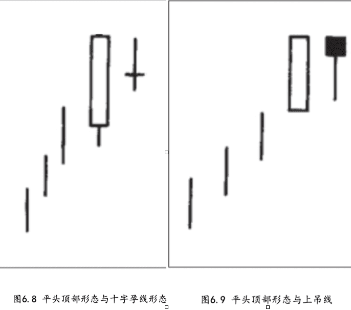

## 平头顶部和平头底部
平头形态是由几乎具有相同水平的最高点的两根蜡烛线组成的， 或者是由几乎具有相同的最低点的两根蜡烛线组成的。之所以将这种形态称为平头顶部形态和平头底部形态，是因为这些蜡烛线的端点就 像镊子腿一样平齐。

平头形态既可以由实体构成，也可以由影线或者十字线构成。在理想情况下，平头形态应当由前一根长实体蜡烛线与后一根小实体蜡烛线组合而成。这样就表明，无论在第一个时段市场展现了什么样的力量 (如果是长白色实体，展现的便是看涨的力量;如果是长黑色实体，展现的便是看跌的力量)，到了第二个时段都被瓦解了，因为第二个时段是一个小实体，且其高点与第一个时段的高点相同(在平头顶部 形态中)，或其低点与第一个时段的低点相同(在平头底部形态中)。如果一个看跌的(对于顶部反转)蜡烛图信号，或看涨的(对于底部反转)蜡烛图信号，同时构成了一个平头形态，该形态就多了一些额外的技术分量。

* 在上升的市场中，当几根蜡烛线的最高点的位置不相上下时，平头顶部
* 在下跌的市场中，当几根 蜡烛线的最低点的位置基本一致时，就形成了平头底部

如图6.8所示，在上升趋势中，先是一根长长的白色蜡烛线，后是一根十字线。这个双蜡烛线形态既是一个十字孕线形态，又是一个 平头形态，因为它们具有同样的最高点。综合来看，这个形态可能构成了重要的反转信号。

如图6.9所示，在这个平头形态中，先是一根长长的白色蜡烛线，后是一根上吊线。下一时段，如果市场开市于上吊线的实体之下，尤其是收市于上吊线的实体之下，那么把这个形态判断为一个顶部反转信号，就有了很大的胜算。只要市场的收市价不高于这个平头形态的顶部，那么看跌的态度就不可动摇。这个双蜡烛线的混合体也 可以看作一个孕线形态。结合以上分析，因为这个孕线形态处于上升趋势中，所以它构成了一个顶部反转形态。

<!-- 如图6.10所示，在这个平头顶部形态中，第二根蜡烛线同时又是一根看跌的流星线。

如图6.12所示，在这里的双蜡烛线形态中，后一根为锤子线， 并且它成功地向下试探了前一根长长的黑色蜡烛线的最低点。锤子线、市场对支撑水平的成功试探，两方面因素同时证明卖方已经丧失了对市场的控制。最后，这个双蜡烛线组合也可以视为孕线形态。这是将此处判断为一个重要支撑水平的第三条理由。 -->

## 1.平头顶部

## 2.平头底部