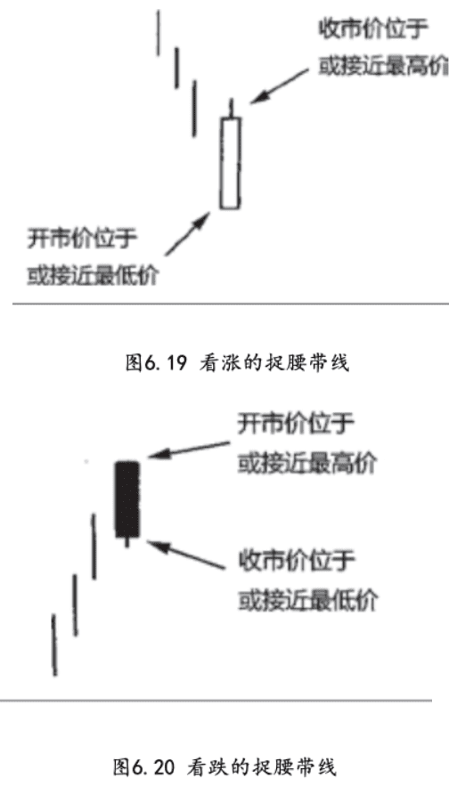
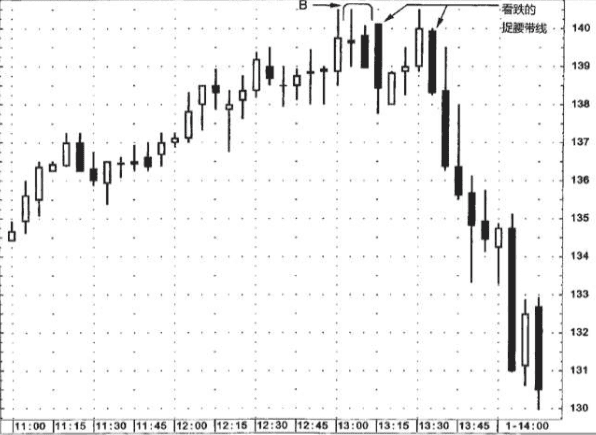
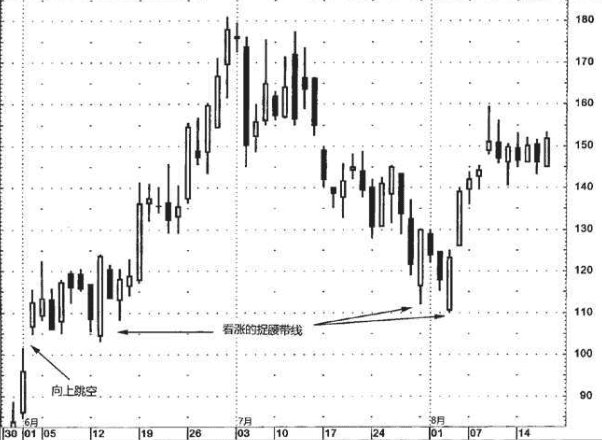

## 捉腰带线
捉腰带线是由单独一根蜡烛线构成的。捉腰带形态的日文名称来自相扑运动的一个术语:yorikiri。这个术语的意思是“抓着对手的腰带，将他推出圈外”。

- 看涨捉腰带形是一根坚挺的白色蜡烛线，其开市价位于本时段的最低点(或者，这根蜡烛线只有极短的下影线)，然后市场一路上扬，收市价位于或接近本时段的最高点,如果市场本来处于低价区域，这时出现了一根长长的看涨捉腰带线，则预示着上冲行情的到来。
- 看跌捉腰带线是一根长长的黑色蜡烛线，它的开市价位于本时段的最高点(或者距离最高价只有几个最小报价单位)，然后市场一路下跌。在市场处于高价区的条件下，看跌捉腰带形态的出现，就构成了顶部反转信号。

如果市场收市于黑色的看跌捉腰带线之上，则意味着上升趋势已经恢复。如果市场收市于白色的看涨捉腰带线之下，则意味着市场的抛售压力重新积聚起来了

如果捉腰带线得到了阻挡区域的验证，或者接连出现了几根捉腰带线，或者有一阵子没有出现捉腰带线，突然来了一根，这样的捉腰带线就更加重要。

### 例子
在图6.21中，B处有一个看跌吞没形态，表明可能遇到麻烦了。与看跌吞没形态大致在同一个区域内，出现了双重的看跌捉腰带线，于是进一步增强了该区域为供给区的结论。虽然这里在短短一段时间里出现了许多看跌信号(看跌吞没形态、两个看跌的捉腰带线)，但是并不必然预示着后来那么糟糕的情形:在第二根捉腰带线之后，市场像自由落体一样下跌。不约而同的蜡烛图信号增加了此 处形成行情反转的可能性，但并不涉及之后行情的尺度。

### 例子2
在图6.22中，6月初出现了一个向上跳空，很快转化为支撑区域，随后在6月上半个月里多次成功地经受了试探，支撑区域得到了验证。 6月13日的蜡烛线是看涨的捉腰带线。到7月底、8月初，市场再次向下试探该窗口的支撑作用，又形成了一系列看涨的捉腰带线。后面这两根看涨捉腰带线也分别与其前一根蜡烛线组成了两个背靠背的刺透形态。从8月初的低点开始形成上冲行情，持续到8月9日的流星线。

