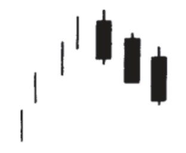
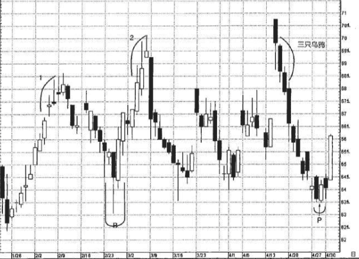

## 三只乌鸦
连续出现了三根依次下降的黑色蜡烛线

如果三只乌鸦形态出现在高价格水平上，或者出现在经历了充分延伸的上涨行情中，就预示着价格即将下跌。

三只乌鸦形态具有看跌的意味。从外形上说，这三根黑色蜡烛线的收市价都应当处于其最低点，或者接近其最低点。在理想的情形下，每根黑色蜡烛线的开市价也都应该处于前一个实体的范围之内。

### 例子1
如图6.27所示，从4月15日开始形成了一个三只乌鸦形态。从三只乌鸦开始的下降行情一路几乎不受阻碍地延续到了P处的刺透形态。三只乌鸦形态中的第二根和第三根蜡烛线(4月16日和17日)都开市于之前的实体之下。虽然在常规的三只乌鸦形态中后续蜡烛线的开市价居于之前的黑色实体内部，但是这两根蜡烛线的开市价低于之前的实体，可以视作更加疲软的信号。其原因在于，第二根和第三根黑色实体开市价低于前一日的收市价，之后在整个交易日里都无力夺得实质性的立足地。

三只乌鸦形态可能对长线交易者更有用处。这是因为本形态在第三根蜡烛线才能完成。显然，到了这个时候，市场已经回落了相当大的幅度。举例来说，上述三只乌鸦是从70.75美元处开始的。既然我们需要第三根黑色实体来完成形态，那么在得到信号的时候，股价已经跌到了67.87美元。

无论如何，在本例中，当三只乌鸦形态的第一根黑色蜡烛线出现的时候，我们就可以看出行情遇到麻烦的一点端倪了。个中缘由是，股票当日开市于之前3月份的历史高点70美元之上，然而牛方未能坚守上述新高，当日收市时，反而跌回到70美元以下。正如您将要在本书第二部分看到的，如果市场先创新高，之后却不能守住，可能带有看跌的意味。这里的情况便是这样。

我们再来看看之前1和2处的高点。在2月初的1处，鹏斯公司为当前行情创了新高，但这里的一组蜡烛线却向我们发出了强烈的“火光”警告信号，行情并不像表面上那么顺利。具体说来，在2月2日所在的一周的后几天，尽管股价不断创下更高的高点、更高的低点、更 高的收市价，但是它们都是小实体，都有长长的上影线。这肯定显示出当前的行情变化其实并不是一面倒地有利于牛方。 
之后价格回落，直到B处的看涨吞没形态才结束。从此处开始的一轮上冲行情持续推 升，持续到3月2日所在的一周，图中用2做了标记。2处的上冲行情与1 处的上涨行情有异曲同工之妙，2处的行情也有更高的高点、更高的低 点、更高的收市价，这样如果在线图上看起来，行情显得很健康。然 而从蜡烛图的角度来看，3月4日、5日、6日的价格攀升带有长长的上影线。这一点证明多方相对强势的力量正在涣散。3月6日的蜡烛线是一根流星线。