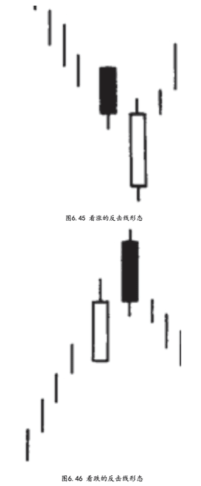
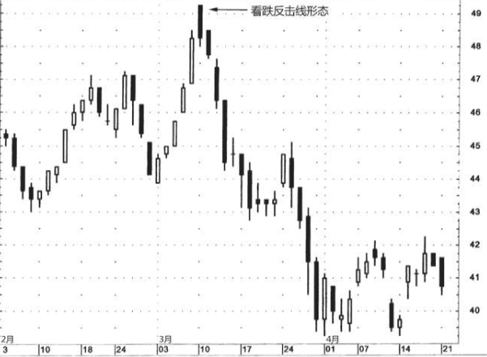
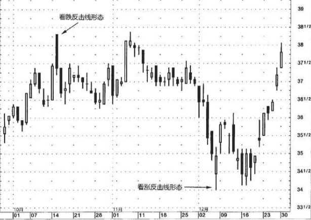

## 反击线形态
当两根颜色相反的蜡烛线具有相同的收市价时。

在反击线形态中，一项重要的考虑因素是，第二天的开市价是否强劲地上升到较高的水平(在看跌反击线形态中)，或者是否剧烈地下降到较低的水平(在看涨反击线形态中)。这里的核心思想是，在该形态第二天开市时，市场本已经顺着既有趋势向前迈了一大步，但是后来，却发生了意想不到的变故!到当日收市时，市场竟然完全返回到前一天收市价的水平!如此一来，朝夕之间竟扭转了行情基调。

### 看涨反击线
本形态出现在下降行情中。在这个形态中，第一根蜡烛线是一根长长的黑色蜡烛线。在第二根蜡烛线上，市场的开市价急剧地向下跳空。到此刻为止，空头觉得信心十足。但是从这时候起，多头发动了反攻，他们把市场推了上来，使价格重新回到了前一天收市价的水平。于是，先前的下降趋势的马头就被勒住了。

我们不妨把看涨反击线形态同看涨刺透形态做一番比较。如果您还记得的话，刺透形态与本图所示的看涨反击线形态一样，也是由两根蜡烛线组成的。它们之间的主要区别是，看涨反击线通常并不把收市价向上推进到前一天的白色实体的内部，而是仅仅回升到前一天的收市价的位置。而在刺透形态中，第二根蜡烛线深深地向上穿入了前一个黑色实体之内。因此，刺透形态与看涨反击线形态相比较，是一种更为重要的底部反转信号。尽管如此，正如我们下面列举的一些实例所显示的，对看涨反击线形态还是不可小觑的，因为它的出现表明，行情流动的方向正在改变。

### 看跌反击线
在这种反击线形态中，第一根蜡烛线是长长的白色蜡烛线，保持了牛市一贯的上升动力。在下一根蜡烛线上，市场在开市时向上跳空，多头很高兴。但从此时起，空头挺身而出，发起反击，将价格拉回到前一天的收市价的水平。在本形态的第二天，多头在开市时的乐观劲头到了收市的时候 恐怕就要变成担惊受怕了。

如果说看涨反击线形态与刺透形态有渊源的话，那么，看跌反击线形态与乌云盖顶形态也有类似的关系。在理想的看跌反击线形态中，第二天的开市价高于前一天的最高点，这一点与乌云盖顶形态是一致的。不过，与乌云盖顶形态不同的是，这一天的收市价并没有向下穿入前一天的白色蜡烛线之内。由此看来，乌云盖顶形态所发出的顶部反转信号，比看跌反击线形态更强。

### 例子1
如图6.47所示，3月10日开市时，相比前一天的收市价该股票跳涨了1美元。可惜好景不长，当日收市时股票的坚挺色彩改换了颜色，因为空头把价格拖低到前一个交易日，即3月7日的收市价的水平。3月10日的反击线在三根黑色蜡烛线中打头阵，三者组成了一个三只乌鸦形态。

在前面三只乌鸦形态的部分曾经提及，因为必须三根蜡烛线就位，信号才能完成，等到三只乌鸦形态的第三根蜡烛线出现后，已经错过了较大幅度的行情变化。无论如何，在本例的情况下，因为其中的第一根蜡烛线是反击线，仅需等待一个时段，就能得到更早的转折信号，然后再通过三只乌鸦来进一步验证。

在图6.48中的10月15日，展现了一例看跌的反击线形态。我们可以看出，该反击线的收市价并没有恰好处于前一时段白色蜡烛线的收市价，而是稍稍低于后者。在判断反击线形态时，对形态的定义应该 留有适当变通的余地，这对于绝大多数蜡烛图信号都适用。举例来 说，12月6日有一个看涨的反击线。当日开市时，股价剧烈下跌向下跳 空，当日收市时，收市价接近前一日的收市价，而不是恰好位于。即 使第二天的收市价与第一天的收市价不是恰好相同，也肯定足够接近了，因此我认为这属于看涨反击线形态。判别这个看涨反击线形态的 主要标准是，虽然白色蜡烛线的开市价非常疲软，却能够当日完全反弹，令人刮目相看。

