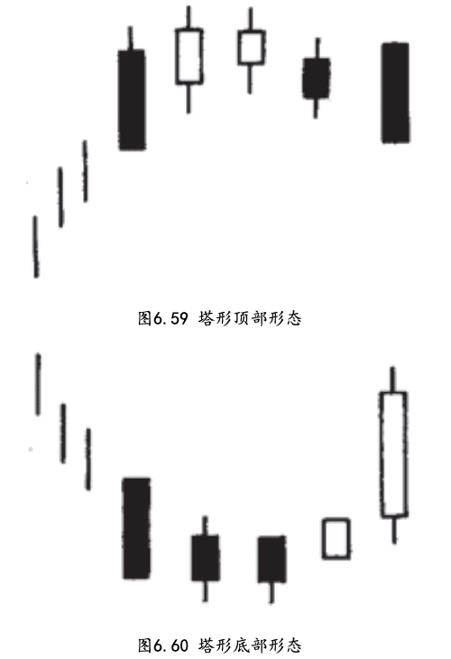
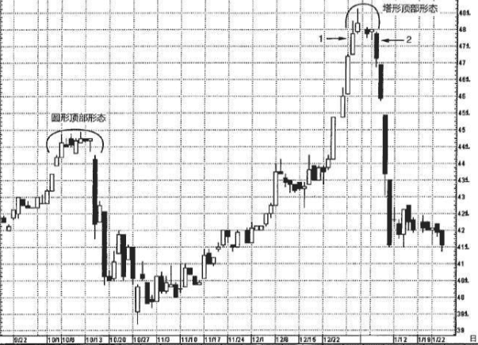
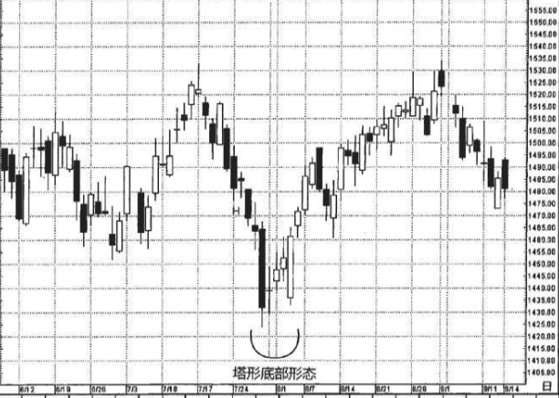
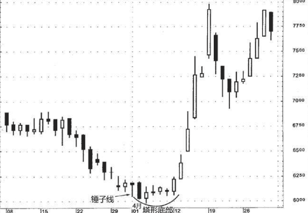

## 塔形顶部-塔形底部
在西方的技术分析术语中，与塔形反转形态最接近的对应形态，要数长钉形态，或者说V形反转形态。在长钉反转形态中，市场原先处在强劲的趋势过程中，突然，市场掉转方向，形成了方向相反的新趋势。

因为塔形形态常常在行情变化的后期才能完成，可能对长线交易者更适用。

塔形底部形态与平底锅底部形态也有相似的地方，而塔形顶部形态则与圆形顶部形态相似。两者最主要的区别是，在塔形形态中，市场反转之前和反转之后，出现的都是长长的白色或黑色实体，但不需要跳空;而在圆形顶部形态和平底锅底部形态中，则含有窗口(跳空)。

## 塔形顶部
塔形顶部出现在高价格水平上。市场本来处在上升趋势中，在某一时刻，出现了一根坚挺的白色蜡烛线或者一系列白色蜡烛线， 然后市场放缓了上涨的步调，接着出现了一根或者数根大的黑色蜡烛线，于是塔形顶部形态就完成了(如图6.59所示)。在本形态中，中间有若干小实体，两侧长长的白色和黑色蜡烛线形如“高塔”。也就是一边由长蜡烛线组成下跌的一侧，另一边由长蜡烛线组成上涨的一侧。

## 塔形底部
塔形底部发生在下降行情中(如图6.60所示)。市场形成了一根或数根长长的黑色蜡烛线，表示空方动力丝毫不减。后来出现了几根小实体，缓和了行情看跌的气氛。最后出现了一根长长的白色蜡烛线，完成了一个塔形底部形态。

在塔形底部形态之后，虽然该股票被急剧推升，请记住，塔形底部形态并不带来关于后续行情变化范围的任何信息。正如之前讨论的，这里想再次强调，蜡烛线构成有效的反转信号，但不提供价格目标。

### 例子
图6.61揭示了塔形顶部形态与圆形顶部形态的区别。该股票在10月的第一周上涨，形成了一系列白色实体，但之后开始踩水，留下了一系列小实体。10月15日的向下跳空完成了一个圆形顶部形态。把注意力转向12月，我们看到了一系列延长的白色蜡烛线。蜡烛线1的出现表明该股票继续上涨的机会不足了。长黑色蜡烛线2带来了第二支 “塔”，完成了塔形顶部形态。

图6.63展示了一例经典的塔形底部形态。它的第一支塔由7月28日的一根超长黑色实体构成。次日是一根十字线，造就了一个十字孕线形态。(请观察7月24日到25日于点H处组成的另一个十字孕线形态。不过，一旦指数行情向下突破到十字孕线形态之下，则该形态所包含的看涨意义通通化为泡影。)在7月底的十字孕线形态之后行情上涨，起初是几根小白色实体，8月3日长长的白色蜡烛线发出了长线的反转信号，因为后者完成了一个塔形底部形态。从塔形底部形态开始，出现一轮上冲行情，持续到8月底，此时标准普尔500指数遭遇7月17日的流星线形成的阻挡水平，行情陷入停顿。

在图6.64中，4月1日是一根锤子线，暗示市场正在探索底部。次日是一根长黑色蜡烛线，其收市价稍稍低于锤子线的支撑水平(即低 于锤子线下影线的低点)，把趋势拨回下降轨道。在这根长黑色蜡烛 线之后，随即产生了一系列小实体。这么一来，上述黑色蜡烛线的看跌意义就多半被消除了。由于4月12日的长白色蜡烛线，股票的健康状 况进一步改善。这是塔形底部形态的第二支“塔”(4月2日的黑色蜡 烛线是第一支“塔”)。

