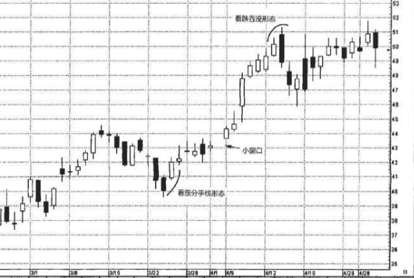

## 分手线
如图7.31所示的分手线形态也是由两根颜色相反的蜡烛线组成的，但是同反击线形态不同的是，分手线的两根蜡烛线具有相同的开市价。

前面提到的反击线形态是一种双蜡烛线形态，前后两根蜡烛线颜色相反，并且后一根蜡烛线的收市价与前一根的收市价处于同一水平。分手线这一形态属于反转信号。

分手线形态属于持续信号。道理很简单。在市场上涨的过程中， 如果出现了一个黑色实体(尤其是相对较长的黑色实体)时，对多头来说，可能成为他们的一块心病。他们满腹狐疑，空头或许正在争得 主动权。无论如何，如果后一天市场在开市时向上跳空，开市价回到了前一根黑色蜡烛线的开市价的水平，就能有力地证明空头已经失去 了对市场的控制——特别是当天能够收市在较高位置，形成了一根白色蜡烛线。上述情形就是如图7.31所示的看涨分手线形态的演变过 程。在这类形态中，白色蜡烛线同时还应当是一根看涨捉腰带线(即其开市价位于或接近本时段最低点，收市价位于或接近本时段最高 点)。在图7.31中，看跌的分手线形态与上述内容完全对应，但方向相反。一般认为，这类形态属于看跌的持续形态。分手线形态难得一见。

图7.32说明了这一点。7月中旬出现了一个看跌吞没形态 (B处)，引领了一轮下跌。该下跌行情发展到8月3日完成的看涨吞没 形态后才算罢手。紧随8月3日白色蜡烛线之后的两根蜡烛线差不多构 成了一个看涨的分手线形态。这是因为8月7日的开市价几乎与前一天 的开市价相同，但不处于同一水平。虽然如此，考虑到8月4日股票收 市于46.25美元，而后一天(8月7日)在开市时便向上急剧跳空，几乎 达到了8月4日的开市价的水平，毫无疑问，这一变化很引人注目。如 果我们对这一点还不满意，还要求更多看涨的证据，8月9日它就来了 ——一个向上的窗口，证明此处需求压倒了供给。

在图7.33中，在8月的第二周里发生了看跌分手线形态。在该看跌 分手线形态之后，股票在来自8月初的接近29美元的支撑区域稳住了阵 脚。8月15日打开了一个向下的窗口，证实新的一轮下跌来临。

9月13日和14日组成了一个看涨的分手线形态。但是，它们发出的 上涨行情持续的信号未能应验。当然，我们对这一点并不感到太大的 意外，因为看涨分手线形态的白色蜡烛线处在28美元处。这里正是8月 21日所在的一周里形成的阻挡水平，图上用虚线做了标记。这个例子 再一次说明，在定夺是否根据蜡烛图信号来买卖的时候，蜡烛图信号 发生的位置是主要考虑因素。在本例中，如果我们在看涨分手线形态 完成时买入股票，就会在阻挡水平处买进。在这种情况下，稳妥的对策或许是等到股票收市于28美元以上，作为进一步的看涨验证信号

## 例子2-看涨分手线
看涨分手线形态难得一遇，它们通常出现在上涨过程中，然而也有少数例子表明看涨分手线形态有助于发出底部信号。

如图7.34所 示，3月24日和25日出现了一个看涨分手线形态。该形态出现后，股票 行情陷入犹豫，位置接近43.50美元。4月5日，一旦股票在43.50美元 的阻挡区域之上向上打开了一个小型的窗口后，就不再犹豫了。

