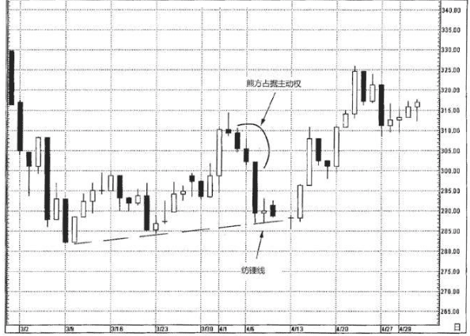

## 纺锤线 
既然长白线和长黑线代表着一边倒的单边行情，那么当实体缩小时，我们就能得到线索，之前的行情势头或许正在减缓。

对短实体 (无论黑白)，纺锤蜡烛线的上下影线到底是长是短是无关紧要的。正是因为纺锤线的实体非常小，纺锤线才成为纺锤线。

纺锤线是蜡烛图形态的一个组成部分，例如启明星、黄昏星、孕线、锤子线等形态

### 1.例子
4月1日所在的一周里，市场从315附近开始下降，形 成了一连串黑色蜡烛线。随着下降过程的延续，黑色实体的长度不断 增加，反映市场的看跌动量不断增强。4月7日出现了一根纺锤线，改变了市场的技术图像，原先熊方完全占据主动，现在转为熊方丧失了 主导权。因为短实体只代表一个时间单位内的市场行为，我们应该把 它看作一条试探性的线索。虽然如此，它依然属于潜在反转信号的第 一个征兆。本例揭示了蜡烛图的一个重大优势:它们经常以一个时间 单位的灵敏度让您察觉可能的市场转折点。

4月7日的纺锤线属于蜡烛图信号，同时它也有助于验证传统西方技术分析工具——具体说来即本图中向上倾斜的支撑线，它是连接3月 10日和3月23日的低点得来的。
于是，我们得到了两个信号，一个是支撑线，一个是纺锤线，加强了285附近的支撑作用。将东西方技术相结 合的概念将是本书第二部分的重点内容。
