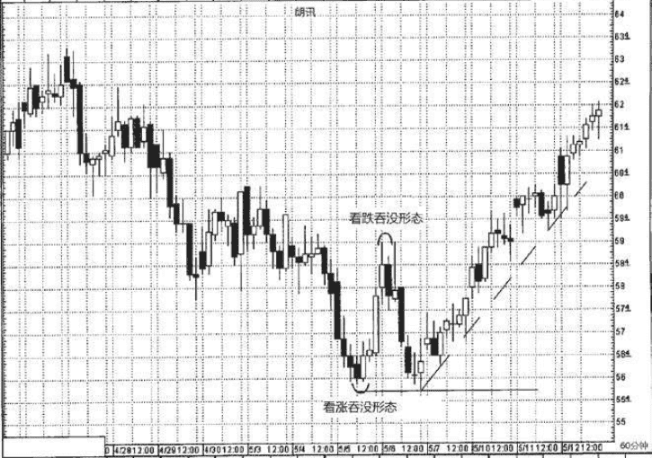
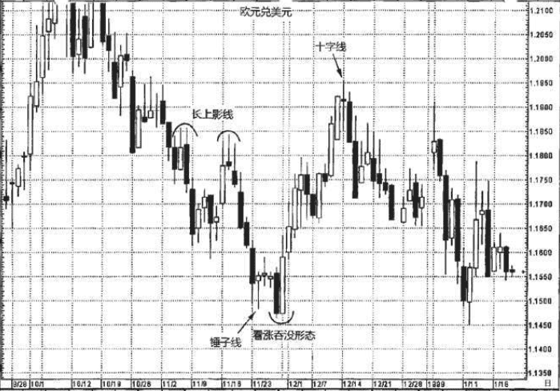
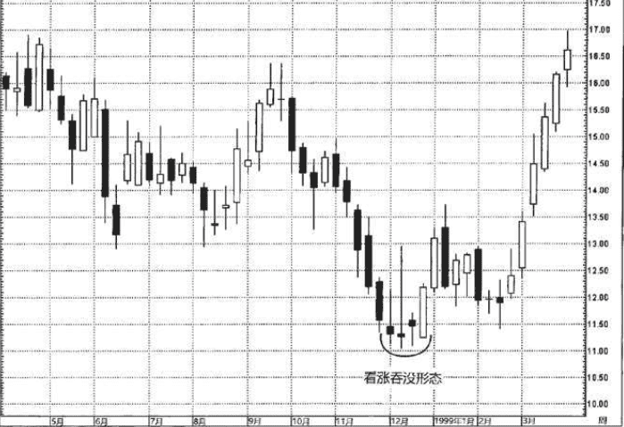
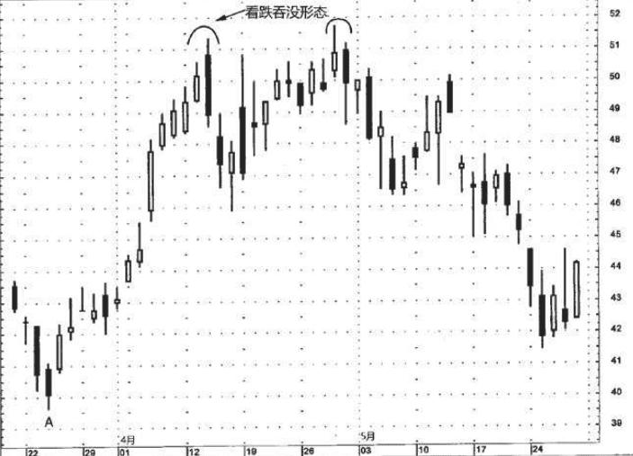
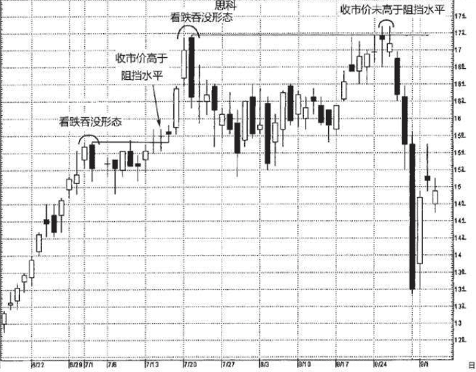

## 吞没形态
在绝大多数情况下蜡烛图技术信号都是由数根蜡烛线组合在一起形成的。吞没形态是我们将介绍的第一类由数根蜡烛线组成的组合形态。吞没形态属于主要的反转形态，由两根颜色相反的蜡烛线实体构成。

三条判别标准:
1. 在吞没形态之前，市场必须处在明确的上升趋势(看跌吞没形态)或下降趋势(看涨吞没形态)中，哪怕这个趋势只是短期的。
2. 吞没形态由两条蜡烛线组成。其中第二根蜡烛线的实体必须覆 盖第一根蜡烛线的实体(但是不一定需要吞没前者的上下影线)。
3. 吞没形态的第二个实体应与第一个实体的颜色相反。(这一条 标准有例外的情况，条件是，吞没形态的第一条蜡烛线是一根十字线。如此一来，如果在长时间的下降趋势之后，一个小小的十字线被一个巨大的白色实体所吞没，就可能构成底部反转形态。反之，在上升趋势中，如果一个十字线被一个巨大的黑色实体所吞没，就可能构成顶部反转形态)。
>在西方的技术分析理论中，与日本蜡烛图技术的吞没形态最近似的是反转日形态。西方反转日形态的具体情形是，在上升趋势(或下降趋势)的发展过程中，某一日市场创出了新高(或新低)，然而当日的收市价却低于(或高于)前一日的收市价。

### 如果吞没形态具有这样的特征，那么它构成重要反转信号的可能性将大大增强:
1. 如果在吞没形态中，第一天的实体非常小(即纺锤线)，而第二天的实体非常大。第一天蜡烛线的小实体反映出原有趋势的驱动力正在消退，而第二天蜡烛线的长实体证明新趋势的潜在力量正在壮大。
2. 如果吞没形态出现在超长延伸的或非常快速的市场运动之后。 如果存在非常快速的或超长程的行情运动，则导致市场朝一个方向走得太远(要么超买，要么超卖)，容易遭受获利平仓头寸的打击。
3. 如果在吞没形态中，第二个实体伴有超额的交易量。我们将在第二部分讨论交易量分析。

### 吞没形态的一种主要作用是构成支撑水平或阻挡水平
* 如图4.15所示，在组成看跌吞没形态的两根蜡烛线中，选取其最高点。该高点构成了阻挡水平(以收市价来观察突破与否)。

* 图4.16把同样的概念运用到看涨吞没形态。该形态的最低 点构成了支撑水平。

将吞没形态看作阻挡水平和支撑水平，是一个很有用的技巧，尤其当市场离开低点过远时(看涨吞没形态)或离开高点过远时(看跌吞没形态)，可以借之选择更舒适的卖出或买进点。举例来说，等到看涨吞没形态完成时(请记住，我们需要一直等到本时段收市时才能确认当前蜡烛线组合属于看涨吞没形态)，市场可能已经远离之前的低点了。因此，我会觉得行情已经离开了有吸引力的买进区域。在这种情况下，我们可以等待市场调整，它可能再次进入看涨吞没形态低点附近的支撑区域，然后，再考虑入市做多。在看跌吞没形态的情况下，同样的道理，而方向相反。

### 例子-看涨吞没
如图4.17所示，连续6根黑色实体依次下降，之后，5月5日早些时 候首次出现了一根白色蜡烛线。这根白色蜡烛线完成了图示的看涨吞没形态。

我们借图4.18来说明这个方面。一 系列长上影线——也有说法为“看跌的影线”——在11月2日到16日之 间的几周里冒了出来。这批长上影线发出强烈的视觉信号，表明市场 正被1.1850的区域挡开。从第二批一系列长上影线开始，市场开始下 降，之后被一根锤子线(它带有长长的下影线——这是说明影线重要性的另一个案例)终止。几个交易日后，该股票以一根长黑实体的形 式回落(稍稍向下突破了锤子线的支撑水平)。第二天，一根长白蜡烛线完成了一个看涨吞没形态。

如图4.19所示，原油市场上一个主要低点伴随经典的看涨吞没形态而来。其中第一根蜡烛线 为小黑色实体(这表明空方正在失去立足地)，第二根蜡烛线是一根 生机勃勃的长白色实体，开市于最低点、收市于最高点。本看涨吞没 形态之所以特别重要，是因为其中的白色实体不是吞没了之前的一根 黑色实体，而是吞没了三根。请记住，该形态一方面清晰无疑地揭示 了多头已经从空头手中夺得了完全的控制权。

### 看跌吞没
在图4.20中，从A处开始形成了一轮上冲行情。到了3月底，大约在43.50美元处，曾经有几个交易日表现犹豫。这些日子有几根长上影线，还有一根十字线。后来行情向上推动，一举突破了这5个交易日组成的阻挡区域。 
上冲行情急不可待地恢复了，一直持续到4月13日和14日组成的看 跌吞没形态，才被阻挡了。请注意，该看跌吞没形态的黑色实体极 长。这一点突出地显示，空头曾经与多头进行了殊死搏斗，之后夺得 市场主导权。后来，这个看跌吞没形态的阻挡作用，通过另一个看跌 吞没形态得到了验证。这反映了如下事实:多头虽然每次都能把股价推升到51.50美元附近，却不能继续保持对市场的控制权。

### 例子2
在图4.21中，7月初有一个看跌吞没形态，取代之前的上冲行情， 抢到了控制权。该看跌吞没形态在之后一周半的时间里构成了阻挡水平。 
7月15日，一旦思科的收市价向上超越了该看跌吞没形态的最高点，便成为看涨突破信号(尽管这一天是一根十字线，但其收市价创了新高，这依然是正面信号)。对那些惯性交易者来说，市场向上突破看跌吞没形态，可以视为新一轮上涨行情的发端，正是考虑买进的时候。为了验证突破信号，我建议等待市场以收市价突破阻挡区域， 而不只是日内行情的突破。7月21日完成了另一个看跌吞没形态，它转化为阻挡水平，等到8月下旬的时候受到市场试探。请注意，当价格向上接近该看跌吞没形态的阻挡区域时，形成了一群小实体，反映了市场在此处的犹豫心理。

