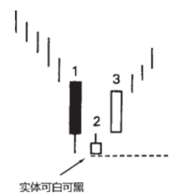
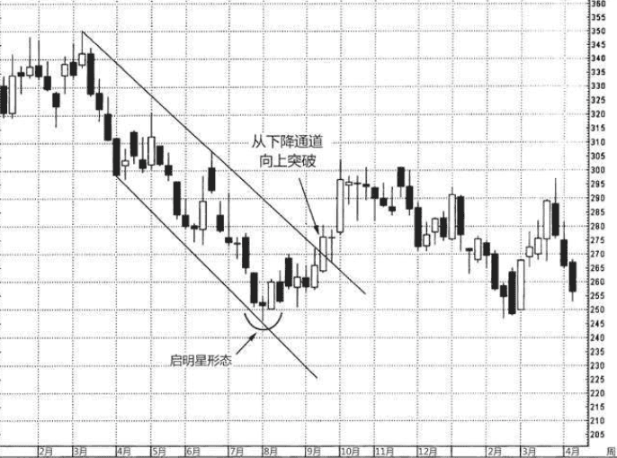
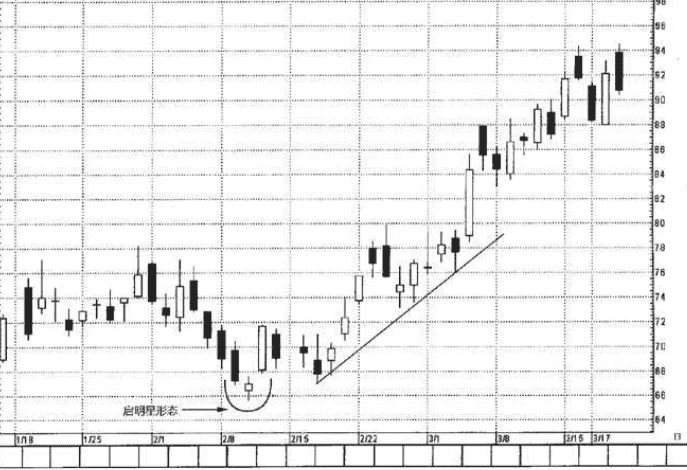

## 启明星-底部反转形态
本形态由三根蜡烛线组成:
1. 蜡烛线1。一根长长的黑色实体，形象地表明空头占据主宰地位。
2. 蜡烛线2。一根小小的实体，并且它与前一根实体之间不相接触 (这两条蜡烛线组成了基本的星线形态)。小实体意味着卖方丧失了 驱动市场走低的能力。
3. 蜡烛线3。一根白色实体，它明显地向上推进到了第一个时段的 黑色实体之内，标志着启明星形态的完成。这表明多头已经夺回了主导权。

在理想的启明星形态中，第二根蜡烛线(即星线)的实体，与第三根蜡烛线的实体之间有价格跳空。根据我的经验，即使没有这个价格跳空，似乎也不会削减启明星形态的技术效力。其决定性因素是，第二根蜡烛线应为纺锤线，同时第三根蜡烛线应显著深入到第一根黑色蜡烛线内部。

启明星形态的不足之处是，既然形态由三根蜡烛线组成，就得等到其中第三个时段收市时，形态才算完成。在通常情况下，如果第三根蜡烛线是长长的白色线，那么当我们得到信号的时候，市场已经走过一段急速反弹了。换句话说，当启明星形态完成时，或许并不能提供风险报偿比具有吸引力的交易机会。针对这一点，一种选择是等待行情回落到启明星形态构成的支撑区域时，再小口小口地吃进做多。

### 例子
7月底、8月初，我们看到有三根蜡烛线满足了组成启明星形态的各项条件:一根长长的黑色蜡烛线，一个小实体，再来一根长长的白色蜡烛线。当然，作为这类形态，它应该出现在下降行情之后。这不是一个理想的启明星形态，原因在于第三根蜡烛线包裹了第二根蜡烛线。 
不过，从我的经验来看，即使第二根和第三根蜡烛线有所重叠，也不会降低本形态的效力。事实上，在这个启明星形态中，第二根和第三根蜡烛线组成了一个看涨吞没形态。

本图还有另一个妙处，它是一个精彩的实例，揭示了在线图发出 更传统的反转信号之前，蜡烛图经常提前一步发出信号。从2月开始形 成了一段下降通道，持续发挥作用，直到当年的第三季度。当市场以 收市价的方式向上突破该下降通道的顶部时，构成了传统的西方技术分析信号，标志着下降趋势被打破。借助蜡烛线发出的“光亮”(即通过那个启明星形态)，我们能更早获得警示信息，比下降通道的突破信号提早了许多个时段。

### 例子2
2月初有一个启明星形态。如果在该启明星形态完成时买进，则成本价接近74美元，第二天，就有可能发生亏损。如果在该启明星形态出现后，等待市场调整到接近其低点的水平(接近65.50美 元)再买进，由于止损指令设置在该启明星的低点之下，就能降低风险。当该股票上涨时，其轨迹沿着一条向上倾斜的支撑线。(趋势线 是第十一章的核心内容。)
