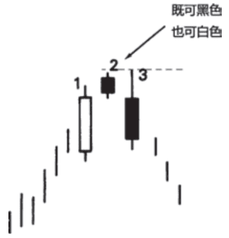
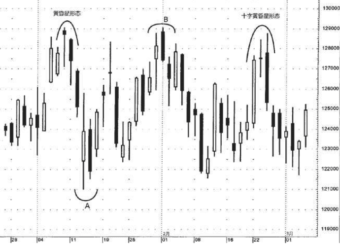

## 黄昏星是启明星的反面对等形态，在顶部，是看跌的。
原则上说，在黄昏星形态中，首先在第一根实体与第二根实体之间，应当形成价格跳空;然后在第二根实体与第三根实体之间，再形成另一个价格跳空。但是，正如前面关于启明星的部分曾经详细介绍的那样，上述第二个价格跳空并不常见，而且对本形态的成功来说可有可无，不是必要条件。本形态的关键之处在于第三天的黑色实体向下穿入第一天的白色实体的深浅程度。

### 下面列了一些参考因素，如果黄昏星形态兼具这样的特征
则有助于增加它们构成反转信号的机会
1. 如果第一根与第二根蜡烛线，第二根与第三根蜡烛线的实体之间不存在重叠。
2. 如果第三根蜡烛线的收市价向下深深扎入第一根蜡烛线的实体内部。
3. 如果第一根蜡烛线的交易量较小，而第三根蜡烛线的交易量较大。这表明之前趋势的驱动力正在减弱，新趋势方向的驱动力正在加强。

### 例子
请看图5.9，1月初形成了一个经典的黄昏星形态。该黄昏星形态具备理想的先决条件，即蜡烛线1和2，2和3的实体互不重叠。单独观 察其星线部分(就是黄昏星形态的第二根蜡烛线)，这是一根上吊 线，且它的下一日发出了看跌验证信号。从该黄昏星形态开始形成的 下跌行情持续到一周之后的A处告终，接近1210。从A处开始的上冲行 情一周后遭遇该黄昏星形态构成的阻挡区域，于是犹豫起来，形成了 一个十字星。这个十字星暗示了该轮上冲行情已经耗尽能量。(第八 章将讨论十字星。)

2月的第一周，市场再次上冲到该阻挡水平，在B处形成了一个看跌吞没形态。之所以提起该看跌吞没形态，目的在于强调借助趋势来判别蜡烛图形态的重要性。前文曾经介绍，在看跌吞没形态中，一根黑色实体吞没了一根白色实体。A处有一根黑色实体，包裹了前一根白色实体。这是不是一个看跌吞没形态呢?不是，因为它出现在一轮下降行情之后。看跌吞没形态作为顶部反转信号，必须之前存在上升行 情才谈得上反转。因此，我认定B处的是看跌吞没形态，而A处的则不是。

2月下旬，再次出现一个十字星，反映了在上述黄昏星形态构成的阻挡水平处市场持续出货。在这个十字星之后有一根长长的黑色蜡烛线，组成了另一个黄昏星形态。本黄昏星形态的第二根蜡烛线是一个十字星，而不是纺锤线。这属于特殊类型的黄昏星形态，称为“十字黄昏星形态”，本节后面再来讨论。第二个黄昏星形态是第二根与第三根蜡烛线相互重叠的实例。根据我的经验，这种情况无损于本形态的效力，与那些蜡烛线1和2、2和3概不重叠的更经典形态相比并不逊色。