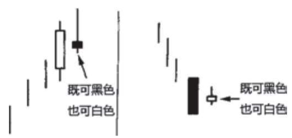
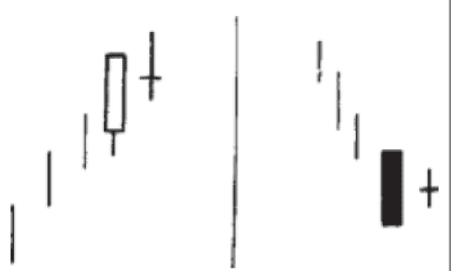
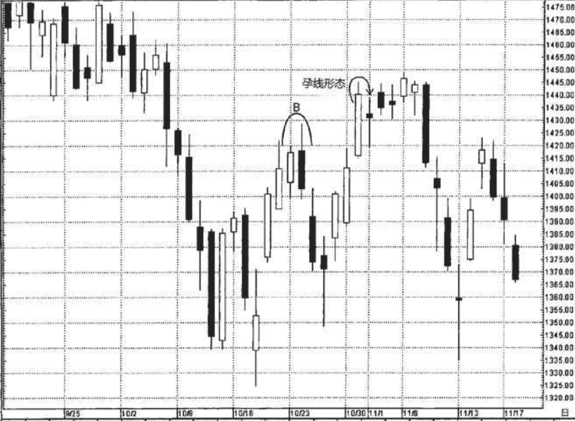
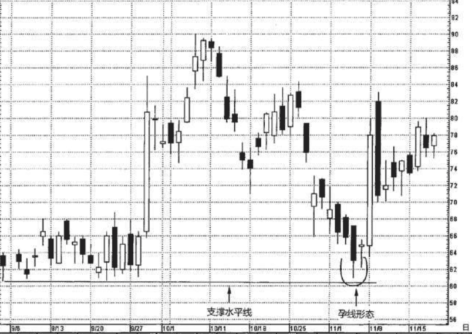

## 1.孕线
纺锤线(即小实体的蜡烛线)是特定蜡烛线形态的组成部分。孕线形态就是这些形态中的一个例子

其中后面一根蜡烛线的实体较小，并且被前一根的实体包进去了，日本人描述前一根蜡烛线为 “非常长的黑色实体或白色实体”。

在本形态中，长的蜡烛线是“母”蜡烛 线，而小的蜡烛线则是“子”或“胎”蜡烛线。孕线形态的第二根线 既可以是白色的，也可以是黑色的。举例来说，如果孕线形态的第一 根和第二根蜡烛线都是白色的，便称之为“白-白孕线”形态。

线形态揭示了市场在本形态出现前后健康状况的明显反差。在牛市行情中，孕线形态的前一个长长的白色实体表现出市场本来充满了活力，但是后一个小小的实体却反映出市场犹疑不定。

* 小实体的开市价和收市价都收缩到前一根蜡烛线的开市价到收市价的范围内，从另一个侧面表明牛方向上的推动力正在衰退。由此看来，有可能发生趋势反转。
* 在熊市行情中，孕线形态的前一个长长的黑色蜡烛线反映了沉重的抛售压力，但是，随后的小实体却表明市场踌躇不前。第二天的小实体是个警告信号，说明熊方的力量正在减弱，因此本形态可能构成趋势反转信号。于是，有可能发生趋势反转。

### 和吞没相比
> 孕线形态与吞没形态相比，两根蜡烛线的顺序恰好颠倒过来。在孕线形态中，前一个是非常长的实体，它将后一个小实体包起来。而在吞没形态中，后面是一根长长的实体，它将前一个小实体覆盖进去了。
孕线形态与吞没形态的另一个区别是，在吞没形态中，两根蜡烛线实体的颜色应当互不相同。而在孕线形态中，这一点倒不是必要条件。无论如何，最终您会发现，在绝大多数情况下，孕线形态的两个实体的颜色也是不同的。

## 2.十字孕线形态
作为一条普遍的经验，在孕线形态中，第二根实体越小，则整个形态越有力量。这条经验通常都是成立的，因为第二个实体越小，市场的矛盾心态就越甚，所以越有可能形成趋势的反转。在极端情况下，随着第二根蜡烛 线的开市价与收市价之间的距离的收窄，其实体便越来越小，最后就形成了一根十字线。在下降行情中，前面是一根长黑色实体(或者在 上涨行情中前面是一根高高的白色实体)，后面紧接着一根十字线， 构成了一类特殊的孕线形态。

因为十字孕线形态包含了一根十字蜡烛线，所以这类形态的技术 意义比常规孕线形态更强，被视为更有效的反转信号。

一旦在一根很长的白色蜡烛线之后出现了一根十字蜡烛线，如果多头交易商对这个形态视而不见的话，他就把自己推到了危险的境地。十字孕线形态也可能引发底部过程，不过，当这类形态出现在市场顶部时 更有效力。

### 例子
如图6.4所示，从10月26日开始，出现了一轮敏捷的上冲行情。10月31日，这轮上冲行情的第三根白色蜡烛线将指数推升到10月23日—24日的看跌吞没形态(B处)形成的阻挡水平之上。然而，无论什么原因导致多头在10月31日的乐观态度都是昙花一现，因为11月1日的蜡烛 线随即完成了一个孕线形态。这个蜡烛线的实体如此短，以至于可以 把上述形态归结为十字孕线形态。十字孕线形态之后出现了一系列纺锤线，进一步加强了如下结论，趋势已经从上升转为中性。11月8日，长长的黑色蜡烛线完成了一个塔形顶部形态。

### 例子2
在图6.5中，从上吊线开始出现了一轮跌落行情，终于在11月4日 —5日通过一个孕线形态探得底部。孕线形态的第二根实体很短，因此 我把它视为一根十字线。于是，这是一个十字孕线形态。这个形态尤 其有意义，原因在于它的出现有助于清晰地验证位于61美元的先前定 义的支撑水平(图中用水平直线标注)。如果这是一张线图，那么基 于贯穿9月份始终的行情，我们也将得到同一个支撑水平。虽然我们采 用的是蜡烛线图，依然可以，也应该用传统的线图支撑水平或阻挡水 平。由此，这里有一个东方技术信号(孕线形态)验证了传统的西方 技术信号(支撑水平线)

在本图中，更早些的9月29日和30日组成了另一个十字孕线形态。随着这个孕线形态的出现，短线趋势从上升转为横向延伸。这个形态强调了一个要点——在第四章的引言部分曾有介绍:当趋势发生变化时，并不意味着行情必将从上升转为下降，或者从下降转为上升。在本图所示的两例孕线形态中，在前者出现后，原来的上升趋势并没有改变。具体说来，在11月的孕线形态出现后，趋势从下降转为上升，而在9月的孕线形态出现后，趋势从上升转为中性。在上述意义上，两个孕线形态都正确地预告了趋势的转变。
