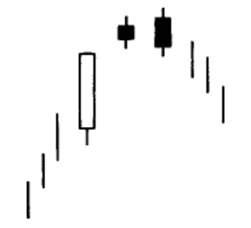
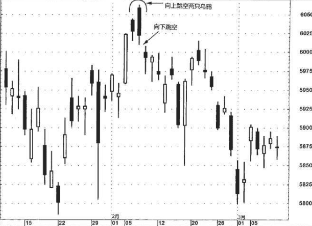
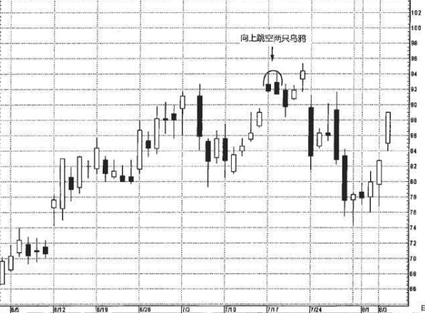

## 向上跳空两只乌鸦
它很罕见。“向上跳空”指的是图示的小黑色实体与它们之前 的实体(第一个小黑色实体之前的实体，通常是一根长长的白色实 体)之间的价格跳空。在图示的形态中，两个黑色的小实体自然就是 “两只乌鸦”。两个黑色的小实体好像是栖立在高高的树枝上的两只 乌鸦，不祥地向下凝视着。从这个形象的比喻来看，显而易见，这是 一种看跌的价格形态。在理想的向上跳空两只乌鸦形态中，第二个黑 色实体的开市价高于第一个黑色实体的开市价，并且它的收市价低于第一个黑色实体的收市价。

这个形态在技术上看跌的理论依据大致如下:市场本来处于上升趋势中，并且这一天的开市价同前一天的收市价相比，是向上跳空的，可是市场不能维持这个新高水平，结果当天反而形成了一根黑色蜡烛线。到此时为止，多头至少还能捞着几根救命稻草，因为这根黑色蜡烛线还能够维持在前一天的收市价之上。 
第三天，又为市场抹上了更深的疲软色彩:当天市场曾经再度创出新高，但是同样未能将这个新高水平维持到收市的时候。然而更糟糕的是，第三日的收市价低于第二日的收市价。如果市场果真如此坚挺，那么为什么它不能维持新高水平呢?为什么市场的收市价下降了呢?这时候，多头心中恐怕正在惴惴不安地盘算着上述两个问题。思来想去，结论往往是，市场不如他们当初指望的那样坚挺。如果次日(也就是指第四天)市场还是不能拿下前面的制高点，那么，我们可以想见，市场将会出现更低的价格。

### 例子1
图6.24中包含一个向上跳空两只乌鸦的实例。紧接着该形态，出现了一个很小的向下跳空，它揭示空方卷土重来。从2月20日所在的一周开始形成的一轮上冲行情，在遭遇这个跳空的阻挡作用后停步不前。

### 例子2
图6.25说明了把蜡烛图形态与它贴身的周边环境相结合的重要意义。7月中旬虽然出现了一个向上跳空两只乌鸦形态，但是它本身并不构成卖出信号。这是因为，正如第七章将要详细讨论的，7月17日该股票向上跳空，通常向上跳空是行情坚挺的征兆——无论是在蜡烛图上还是在线图上都是如此。因而，尽管该向上跳空两只乌鸦形态发出了警告信号，与图6.24中的向上跳空两只乌鸦形态之前没有向上跳空的情形相比，我认为它没有那样疲软。
