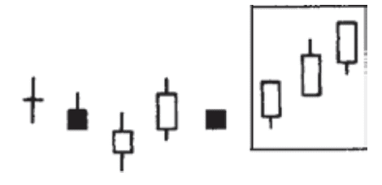
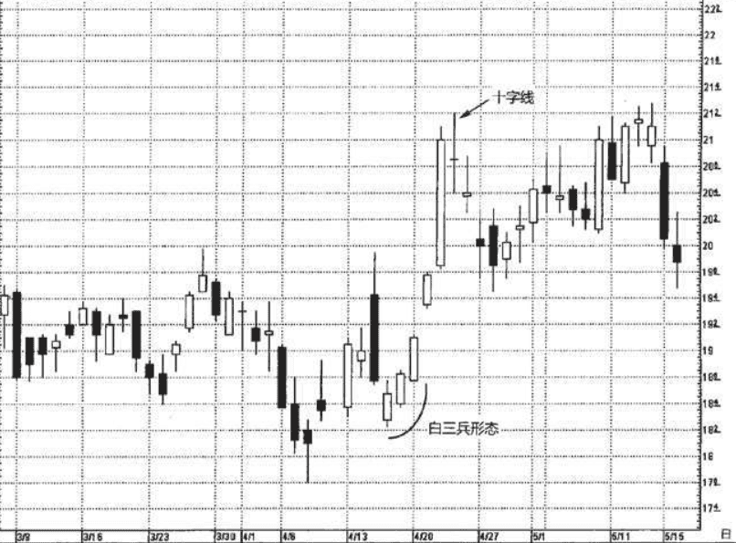
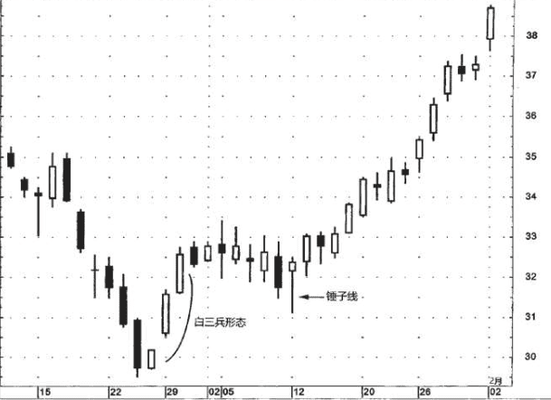
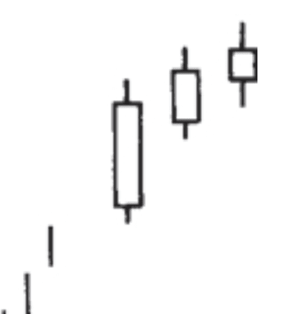
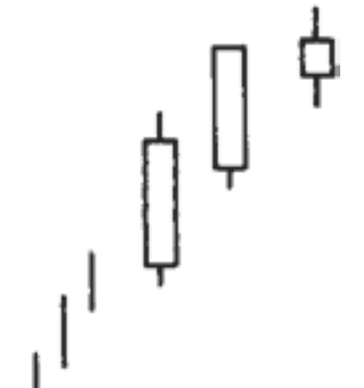
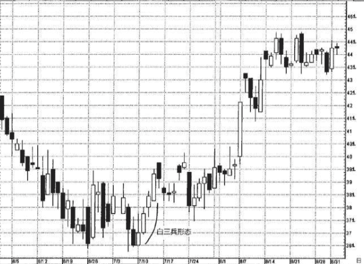
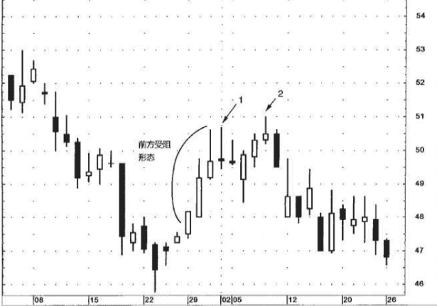

## 白色三兵挺进形态
与三只乌鸦形态相对的形态。
本形态是由接连出现的 三根白色蜡烛线组成的，它们的收市价依次上升。当市场在某个低价位稳定了一段时间后，如果出现了这样的形态，就标志着市场即将转强。

白三兵形态表现为一个逐渐而稳定的上升过程，
* 其中每根白色蜡烛线的开市价都处于前一天的白色实体之内，或者处在其附近的位置上。
* 每一根白色蜡烛线的收市价都应当位于当日的最高点或接近当日的最高点。
这是市场的一种很稳健的攀升方式(不过，如果这些白色蜡烛线伸展得过长，那么我们也应当对市场的超买状态有所戒备)。

图6.31展示了一例几乎算是经典的白三兵形态，因为其中的每根蜡烛线，尤其是后两根相对更坚挺，它们的开市价接近本时段最低点，收市价位于或接近本时段最高点。4月23日是一根十字线，并形成了一个十字孕线形态，这是行情进入犹疑状态的征兆

图6.32是白三兵形态良好的实例。三根白色蜡烛线的收市价都非 常接近本时段最高价，每一根的开市价都位于先前一根实体的内部或之上。关于白三兵形态需要考虑的一个方面是，等到白三兵形态完成时，市场可能已经明显脱离其低位了。在本例中，微软离开其低位差不多4美元，这可是较大比例的行情变化了。因此，除非交易者长线看好，在白三兵形态完成时买进或许并不具备有吸引力的风险报偿比。

>我发现，在白三兵形态出现后，一旦行情调整，则其中的第一根或第二根白色蜡烛线，即白三兵的起点处，经常构成支撑水平。在本例中，在白三兵形态出现后股票进入整理阶段，缓缓回落，直到形成一根锤子线为止。这验证了白三兵形态中第二根蜡烛线内部形成的支撑水平。

### 前方受阻形态
如果其中的第二根和第三根蜡烛线，或者仅仅是第三根蜡烛线， 表现出上涨势头减弱的迹象，那就构成了一个前方受阻形态。这就意味着这轮上涨行情碰到了麻烦，持有多头头寸者应当采取一些保护性措施。特别是在上升趋势已经处于晚期阶段时，如果出现了前方受阻形态，则更得多加小心。
* 在前方受阻形态中，作为上涨势头减弱的具体表现，既可能是其中的白色实体一个比一个小，也可能是后两根白色蜡烛线具有相对较长的上影线。

### 停顿形态
如果在后两根蜡烛线中，前一根为长长的白色实体，并且向上创出了新高，后一根只是一个小的白色蜡烛线，那么就构成了一个停顿形态。 
当这一形态出现时，说明牛方的力量至少暂时已经消耗尽了。在本形态中，最后一根小的白色蜡烛线既可能从前一根长长的白色蜡烛线向上跳空(这种情况下， 该蜡烛线就变成了一根星线)，或者正如日本分析师所描述的那样 “骑在那根长长的白色实体的肩上”(这就是说，位于前一根长长的白色实体的上端)。这根小小的实体暴露了牛方能量的衰退。当停顿形态发生时，便构成了多头头寸平仓获利的紧要时机。

### 例子
在图6.33中，6月中旬、下旬和7月初形成了一个底部，位于36.50 美元上下。然后，出现了白三兵形态(虽然它们都带有非常短的上影 线)。在其中的第三根白色蜡烛线之后，股票开始犹豫，回调到了7月 11日的第一根白色蜡烛线的内部。本图再次说明，在白三兵形态之后 有时市场或许会调整。一旦发生调整，我们预期股票在进入其中第二根，特别是第一根白色蜡烛线的内部时将得到支撑。

### 前方受阻形态-例子
图6.34展示了一例前方受阻形态的实例。虽然那是三根相对较高的白色蜡烛线，但是其中后两根带有看跌的上影线。这反映出当前上冲行情受阻陷入停顿。事实上，之后又形成了更多带上影线的蜡烛线，请看图中标注的1和2处，揭示了此处接近51美元的阻挡水平。2处那根带长上影线的蜡烛线是一根流星线，它与次日的蜡烛线组成了一个看跌吞没形态。
