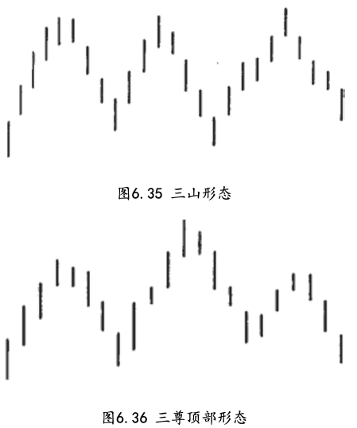
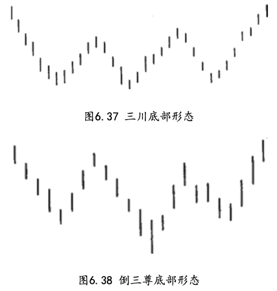
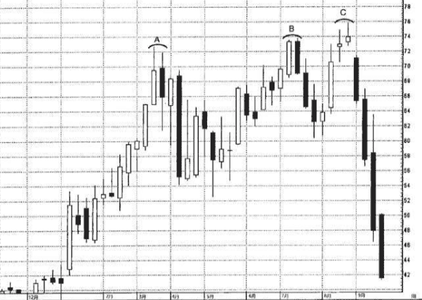
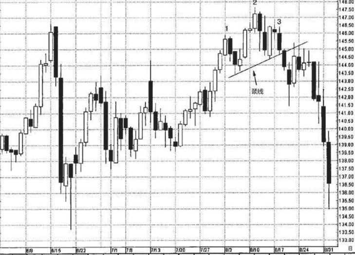
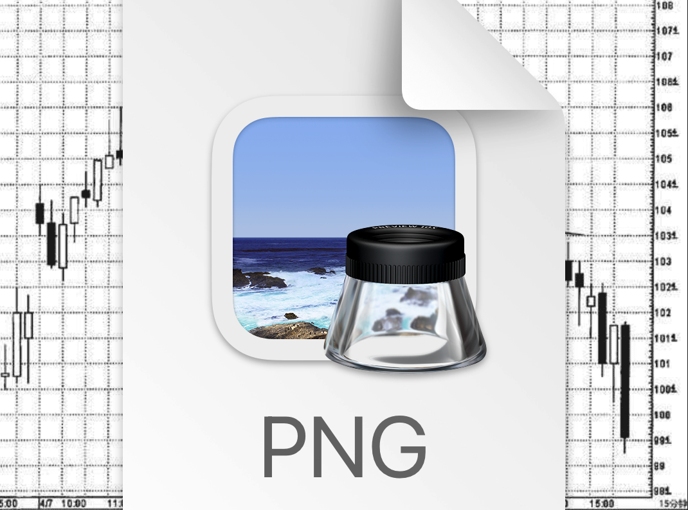
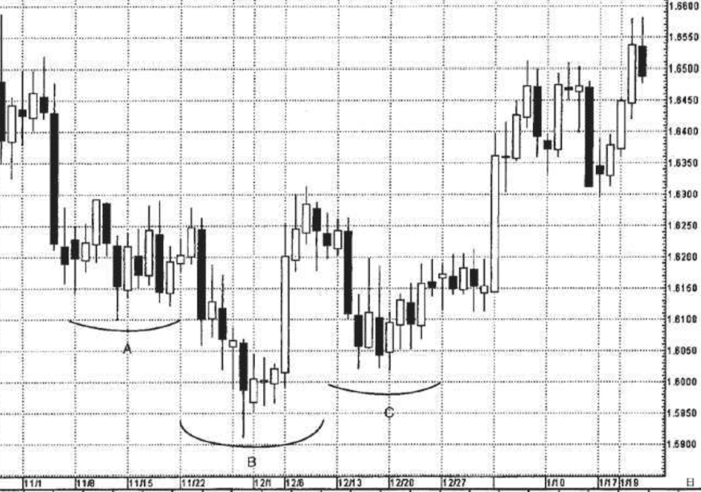
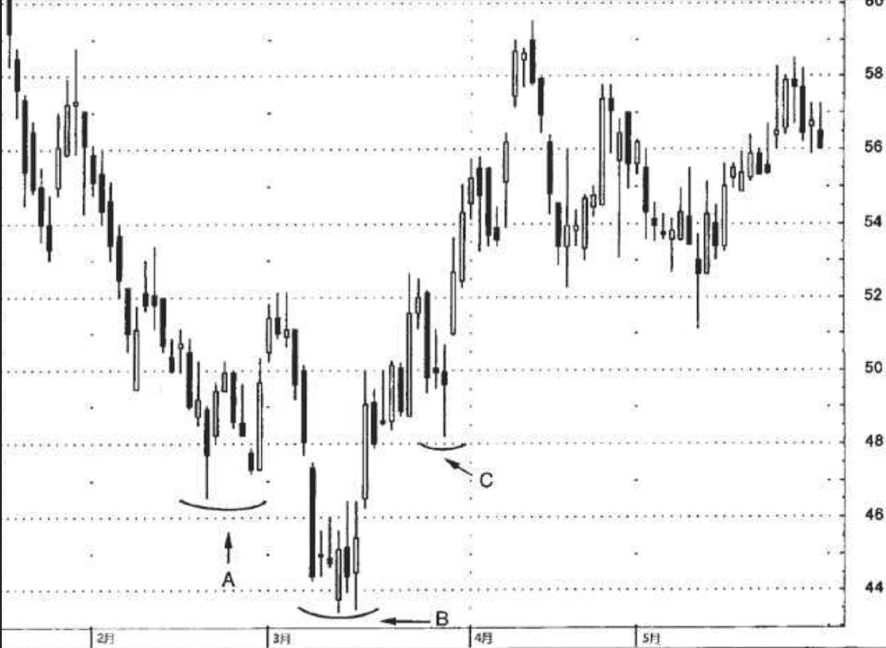

## 三山形态-三川形态
在蜡烛图技术中，还有一些较长期的顶部反转形态和底部反转形态，
* 三山形态
* 三川形态
* 三尊顶部形态
* 倒三尊底部形态
* 圆形顶部形态
* 平底锅形态
* 塔形顶部和塔形底部形态

## 三山顶部和三尊顶部
### 1.三山顶部
本形态构成了一种主要顶部反转过程。如果市场先后三次均从某一个高价位上回落下来，或者市场对某一个高价位向上进行了三次尝试，但都失败了，那么一个三山顶部形态就形成。在三山顶部形态的最后一座山的最高点，还应当出现一种看跌的 蜡烛图指标(比如说，一根十字线，或者一个乌云盖顶形态等)，对三山顶部形态做出确认。

### 2.三尊顶部
三尊顶部形态与西方的头肩形是对等的技术信号。
>有意思的是，西方的市场观察家与东方的技术分析先驱在这种价格形态上殊途同归了。环绕整个地球，市场心理都是共通的。

在三山顶部形态中，如果中间的山峰高于两侧的山峰，则构成了一种特殊的三山形态，称为三尊顶部形态(如图6.36所示)。采用这个名字的原因是，在佛教寺庙的大殿里，中间供奉着释迦牟尼，他的塑像最高大，两边是他的弟子，他们的塑像比较小。这个形态与头肩形形态对应得非常完美。

## 倒三尊形态和三川底部形态
### 1.倒三尊形态
与西方的头肩形底部形态(也称为倒头肩形)对等的蜡烛图形态是变体三川底部形态，或者称倒三尊形态

### 2.三川底部形态
恰巧是三山顶部形态的反面。在市场先后三度向下试探某个底部水平后，就形成了这类形态。市场必须向上突破这个底部形态的最高水平，才能证实底部过程已经完成。

## 例子

### 例子1-三山顶部
在图6.39中，在区域A接近124美元处，市场表现得犹豫起来，特别是当11月最后两个星期造就了一个看跌的吞没形态后。从看跌吞没形态开始，市场回落，直到遇上一个看涨的吞没形态后才能稳定。市场从看涨的吞没形态开始上涨，之后不出所料，当市场在区域B接近124美元时——先前的看跌吞没形态构成的阻挡水平，上涨行情止步不前。区域B出现了另一个看跌的吞没形态。5月中旬的下一轮上冲行情，在区域C遭遇了下一个看跌吞没形态，于是A、B、C三处连成了三山顶部形态。

在图6.39中，每一个山峰几乎都处在同一个水平上。这一点并不是必需的。如果三个价格波峰并不是恰好位于同一个高度，依然可以认定为三山顶部形态。在图6.40中，行情在A、B、C三处形成波峰，其中B和C的波峰均处在略高的水平上。

在图6.40中，行情在A、B、C三处形成波峰，其中B和C的波峰均处在略高的水平上。

这个组合依然可以判别为三山顶部形态。在C处的最后两个时段， 英特尔的上涨行情是通过两个非常短的实体来体现的。它们便是不安 的症状。股票价格在76美元见顶，留下一根流星线。真正的转折信号，以及对三山顶部形态的验证信号，是在8月底的流星线之后出现的 向下跳空。

### 例子-三尊顶部
在图6.41中，我们看到了一个三尊形态的实例，实际上也就是头肩形顶部形态，价格波峰1、2、3组成了本形态。图上标出了一根上升的直线，按照西方术语，应称为头肩形顶部形态的颈线。在常规情况下，头肩顶的颈线一旦被向下突破，便转化为阻挡线。这里简直是按脚本上演，自从8月19日行情向下跌破颈线后，8月21日(以及之后的三个时段)发生了微弱的向上反弹，都在颈线下方受阻，它们看跌的长影线验证了颈线新的阻挡作用。

### 例子-三尊顶部
图6.42是三尊顶部形态的又一个例子。既然本形态与头肩顶同质而异名，我们就可以转而采用西方技术分析，正如上一个图例所讨论的，以头肩形颈线的概念为基础来分析。

具体说来，一旦头肩顶颈线被向下突破，它从支撑作用转为阻挡作用。4月10日13:30，市场力图通过一个小小的看涨吞没形态来站稳脚跟，但是市场没能突破颈线的阻挡作用，将指数推升到颈线之上，说明空方保持着控制权。这反映出，关键的一点是要弄清楚蜡烛图形 态到底是在什么样的位置形成的。在本例中，看涨的吞没形态是潜在的底部反转信号，不过，如果等市场以收市价突破到颈线阻挡水平之上之后，再从容买进，岂不是更有道理——即使拿到了看涨吞没形态 的这张好牌?耐心等待是值得的，因为如果行情收市到颈线之上无疑有助于增强信心，表明多头更占上风。

### 例子-倒三尊底部
西方的倒头肩形底部反转形态(头肩底)与日本的倒三尊底部形 态异曲同工。也就是说，在三个波谷中，中间的波谷最低，两边的波 谷稍高。这种情形在图6.43中如A、B、C的低点所示。因为B处的低点 低于A处和C处的低点，它们组成了倒三尊形态。请注意，一旦1月初那 根长长的白色蜡烛线将英镑推升到1.63之上，原先这里是阻挡水平,现在便转化为新的支撑水平了。原先的阻挡区域转为新的支撑区域，
这个概念构成了非常强大的交易手段。有关内容将在第十一章讨论。

图6.44展示了一例倒三尊形态。请注意，从52美元到52.50美元之 间，3月份曾经构成阻挡区域，一旦这里被向上突破，就转化为支撑区域，在4月的大部分日子里发挥了作用。

