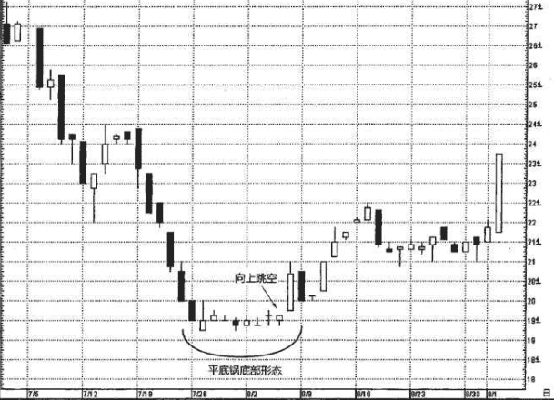

## 圆形顶部
市场逐步形成向上凸起的圆弧状图案，在这个过程中，通常出现的是一些较小的实体。最后，当市场向下跳空时，就证明圆形顶部形态已经完成。这一形态与西方 的圆形顶部形态是相同的。不同的是，在日本的圆形顶部形态中，应当包含一个向下跳空，作为市场顶部的附加验证信号。

对圆形顶部形态来说，道理相同，而方向相反。也就是说，市场从更高的高点转为相同的的高点，再转为更低的高点。于是，上升行情的节奏松弛下来。在这之后，再来一个向下跳空，便完成了圆形顶部形态。跳空对多头行情做了进一步的盖棺论定。

图6.54显示了IBM在7月12日所在的一周开始陷入停顿状态，它从前一周大多数蜡烛线为白色实体，转为本周主要制造更低的高点的黑色实体。向下跳空完成了圆形顶部形态。

## 平底锅底部
平底锅底部形态比常规的圆形底部形态更重要。

反映出市场正处于底部反转过程中，市场逐步呈现出向下凹进的圆弧状图案，然后市场向上跳空(打开一个向上的窗口)。本形态的外观与西方的圆形底部形态是一致的，不过在日本的平底锅底部形态中，必须出现一个向上的窗口，以证实市场底部的完成。

在平底锅底部形态中，市场从更低的低点转为相同的低点，再转为更高的低点。这个过程形象地证明了空头正在逐步丧失立足之地。在这之后，再添加一个向上跳空，带来
进一步的证据，表明空头失去了对市场的控制权。

### 例子-
在图6.57中，7月19日所在的一周里形成了一系列击鼓传花般的黑 色蜡烛线，将该股票保持在压力之下。接下来的几周，出现了一些微小的实体和十字线，暗示该股票终于稳定下来。最终的看涨证据是， 在8月5日与6日之间构成了一个非常小的向上跳空(即图上箭头所指处)，通过这个跳空完成了从底部的向上突破。正如本图所示，即便 该跳空很小(即只有几美分)，依然可以判定为向上跳空，因此证实 了平底锅底部形态的完成。这一点对于圆形顶部形态也是正确的。也就是说，即使向下跳空的幅度很小，不论有多小，依然足以证实圆形顶部形态的完成。

