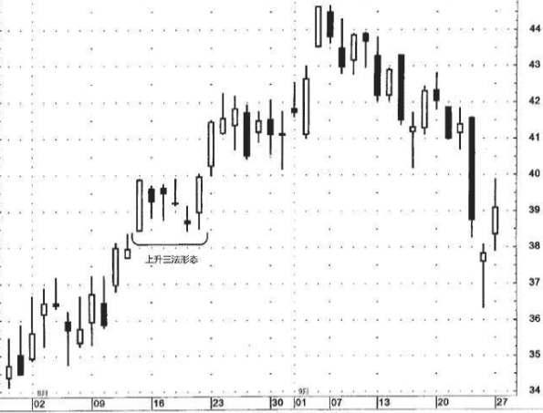
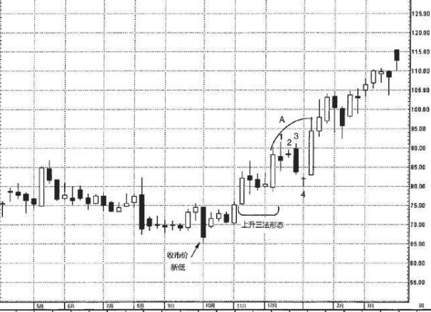
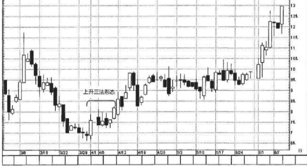
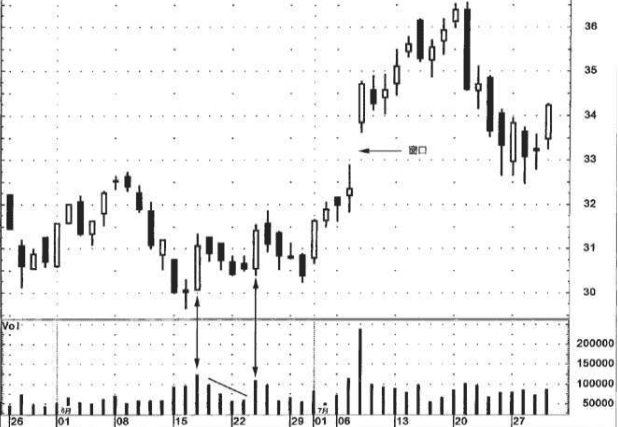
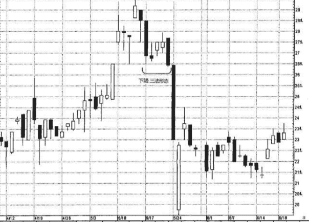
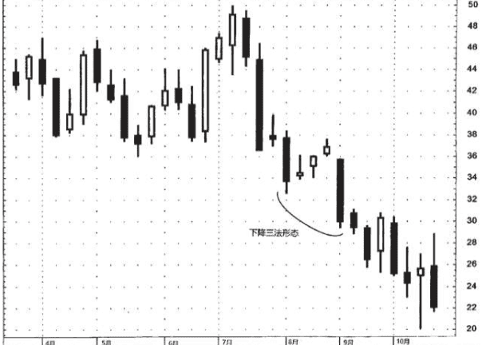

## 上升三法和下降三法
这两类形态均属于持续形态。也就是说，一旦看涨的上升三法形态完成后，之前的趋势应当恢复，行情继续走高。相应地，在看跌的下降三法形态完成后，之前的下降趋势继续有效。

## 1.上升三法
1. 首先出现的是一根长长的白色蜡烛线。
2. 在这根白色蜡烛线之后，紧跟着一群依次下降的或者横向延伸的小实体蜡烛线。这群小实体蜡烛线的理想数目是3根，但是2根或者3根以上也是可以接受的，条件是:只要这群小实体蜡烛线基本上都局 限在前面长长的白色蜡烛线的高点到低点的价格范围之内。我们不妨做这样的理解:由于这群较小的蜡烛线处于第一天的价格范围之内， 它们与最前面的长蜡烛线一道构成了一种类似于三日孕线形态的价格形态。(在本形态中，所谓处于最前面的蜡烛线的价格范围之内，指的是这群小蜡烛线均处于该蜡烛线的上下影线的范围之内;而在真正 的孕线形态中，仅仅是小蜡烛线的实体包含在前面那根蜡烛线的实体之内。)小蜡烛线既可以是白色的，也可以是黑色的，不过，黑色蜡 烛线最常见。
3. 最后一天应当是一根坚挺的白色实体蜡烛线，并且它的收市价高于第一天的收市价，同时其开市价应当高于前一天的收市价

本形态与西方技术分析理论中的看涨旗形或看涨三角旗形形态有相似之处。不过，上升三法形态的理论起源可以上溯到18世纪。一般认为，三法形态代表了买、卖之外的第三种情况——休息，也代表了牛熊之争的一次休战。用更时髦的说法来形容:市场通过这一群小蜡烛线，获得了一次“喘息的机会”。

在绝大多数情况下，上升三法形态发生在上升趋势或横向延伸趋势中。

在理想的上升三法形态中，应有3根黑色小实体，且它们都位于白色实体的全部交易范围之内。在图7.23中，8月13日出现了一根看涨的 捉腰带线。在它之后跟随着4根黑色小实体(其中一根是十字线)，它们都位于8月13日的高点到低点范围内。8月21日的收市价完成了上升三法形态。

如图7.24所示，10月的第一个周，橙汁市场是一根拉长的黑色蜡烛线，将行情打到新低。下一个时段，橙汁重新回升到69美分以上，表明前一周所创的新低不能持续。正如我们将在第十一章看到的，当市场向下突破重要的支撑区域(本市场向下突破了8月—9月的低点， 这正是一个重要的支撑水平)，后来却不能守住新低，这一现象常常具有看涨的意味。
>在上升三法形态之后，市场在12月剩下的时间里横向延伸，直到一根拉长的白色蜡烛线将多头行情推回正轨。这根拉长的白色蜡烛线 紧随着一根十字线(图上用数字“4”标记)。有人可能已经注意到， 图上标注“A”的区域看起来与上升三法形态非常相似，因为从1到4的 几根实体都藏身于之前那根白色蜡烛线的范围内。由于上升三法形态 要求由小实体组成，长实体3不符合要求，意味着它不属于上升三法形态。

在图7.25中，3月30日和31日股票走低，不过下跌过程是一系列非常小的实体，几乎成十字线了。这使得当前趋势不那么悲观。4月1日 出现了看涨吞没形态，显示多方现在主宰行情。之后的四天，市场进 行了一定程度的调整，其中黑色小实体和白色小实体交替出现。4月10 日的蜡烛线完成了上升三法形态。

现在我们来观察一个实例，其中展示了交易量分析与上升三法形态相结合的具体做法。在理想的上升三法形态中，第一根蜡烛线和最后一根蜡烛线，即那两根长的白色蜡烛线，伴随着在上升三法的所有交易时段里最大的交易量。这一点为每一根白色蜡烛线都提供了验证信息，表明多方对市场的控制力更强大。在图7.26中，6月17日是一根长长的白色蜡烛线，伴随着相对强大的交易量。不仅如此，这根蜡烛线与之前的两根还组成了一个十字启明星形态。

## 2.下降三法形态
与上升三法形态完全是对等的， 只不过方向相反。这类形态的形成过程如下:市场应当处在下降趋势 中，首先出场的是一根长长的黑色蜡烛线。在这根黑色蜡烛线之后， 跟随着大约3根依次上升的小蜡烛线，并且这群蜡烛线的实体都局限在 第一根蜡烛线的范围之内(包括其上、下影线)。最后一天，开市价 应低于前一天的收市价，并且收市价应低于第一根黑色蜡烛线的收市 价。本形态与看跌旗形或看跌三角旗形形态相似。本形态的理想情形 是，在第一根长实体之后，小实体的颜色与长实体相反。也就是说， 对看涨的上升三法形态来说，应当是黑色的小实体;而对看跌的下降 三法形态来说，应当是白色的小实体。虽然如此，从我的经验出发，2 根，至多5根小实体都可以很好地完成形态。同时，小实体可以是任意 颜色的。

### 例子
图7.29展示了一个下降三法形态的实例。请注意，本形态的第一 根小实体出现在5月18日，它已经超出了之前那根长黑色实体的界限。不过，这一点并不妨碍这个下降三法形态的成立，因为本形态要求的是小实体应当藏身于那根长黑色实体的全部交易区间之内，而不必限定在它的实体之内。

5月21日的黑色实体收市于5月17日的黑色实体之下，满足了下降 三法形态的条件。5月25日的反弹行情令人印象深刻，当日股票的开市 价急剧下跌，但是收市价与前一日相比几乎没有变化，几乎形成了一 个反击线形态。虽然该白色蜡烛线的收市价并没有恰好处在5月24日收 市价的同一个水平，但是5月25日从开市到收市的强力反弹足以具备与 常规的反击线形态同等的技术意义。

在图7.30中，世通公司跌破了维持数月的接近38美元的支撑区 域，它发生于8月的第一周。8月初出现了一轮小规模的上涨行情，将 股票吃力地推回之前位于38美元的支撑区域处。但好景不长，反弹在 此处化为泡影。(第十一章将介绍原来的支撑水平转化为新的阻挡水 平的分析技巧。)9月的价格变化形成了一个下降三法形态

