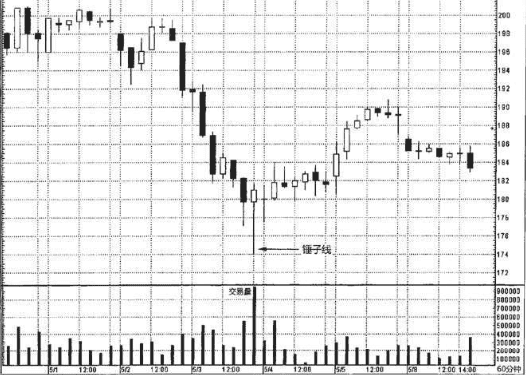
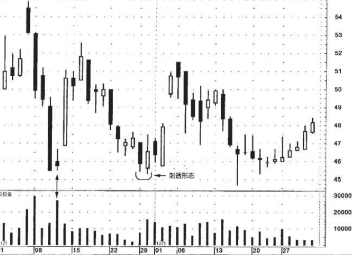
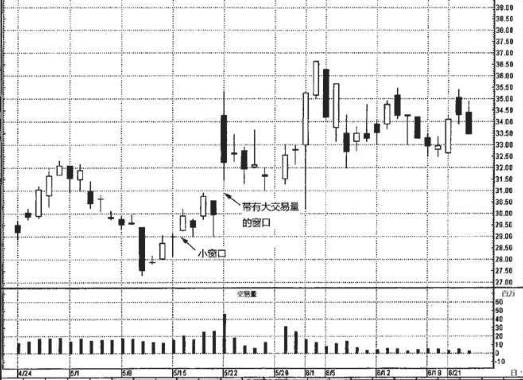

交易量是市场发出的最重要的行情线索之一

只要交易量按照趋势方向保持增长的态势，那么当前的价格趋势
就将以更大的可能性持续下去。

但是，如果在价格趋势发展时，交易量不增反降，那么判断当前趋势仍将继续发展的理由就不充分了。另外，我们还可以通过交易量来验证市场的顶部或底部过程。

不论在哪个市场，我们观察的都是交易量的相对增减，尤其是交易量井喷的情况。

## 例子
在图15.1中，5月3日晚间该股票的交易量发生了井喷现象。我们 看到，相比之前的各个时段，这一时段的交易量之大超乎寻常。如此 一来，我们就应当对它多加小心了。这个时段不仅交易量异常大，而且是一根锤子线。这种情况我们喜闻乐见——交易量验证了价格变化。

本图还引出了另一个方面。如果锤子线带有非常长的下影线，就意味着等到锤子线完成时(我们需要等到收市时才能确定锤子线已经形成)，市场已经处在远离低点的位置了。遇到这样的锤子线，如果在收市时买进，其风险与报偿之比或许并不具有吸引力，因为市场可能一波三折，再次回落到锤子线的低点，然后才恢复上升的征途。不过正如本图所示，一根带有巨额交易量的锤子线，降低了市场回落到锤子线低点的可能性。因此，如果锤子线带有异常高的交易量，那么我们的态度可以更积极，更愿意在收市时买进;相比之下，如果锤子线的交易量没有发出相同力度的验证信号，那么我们的态度可能更为保守，倾向于等待更好的机会。

### 例子
在图15.2中，11月初出现了一轮自由落体般的俯冲下跌行情，由 一群长黑色实体构成，它们触目惊心，在图形上大大助长了空头的气 势。11月11日，单枪匹马的一个交易日，如中流砥柱一般，扭转了技 术图像的乾坤。这一天属于纺锤线，它同时作为孕线形态的第二根蜡烛线完成了形态。然而，真正带来巨大影响力的是纺锤线这一天的超 级交易量。这就表明了，尽管此处供给量极大(从当天的巨额交易量 可以得知当天的供给量极大)，但是需求量与之不相上下，足以抵挡空方气势汹汹的打压——因此，形成了当天的小实体。

市场从该孕线形态开始上冲。11月下旬，又是一轮抛售行情。11 月底，遇到一个刺透形态，行情稳定下来。在看涨的刺透形态中，我 们一般预期其中黑色蜡烛线的交易量较轻，而白色蜡烛线的交易量较 重。这样有助于加强其技术意义，即空头已经失去力量，而多头已经 站稳了脚跟。在本图中，第一资本金融公司上演的正是这一出戏码，

黑色蜡烛线交易量较小，白色蜡烛线交易量较大。这样的交易量格局 进一步增强了刺透形态作为支撑水平的成功概率。在本例中，12月15 日的锤子线表明，本刺透形态的支撑作用得到了坚强的捍卫。

### 交易量可以用来验证蜡烛图形态
这个概念适用于任何蜡烛图信号。举例来说，这一点意味着在看跌吞没形态中，第一根蜡烛线(白色的)应当具有较小的交易量，而第二根蜡烛线(黑色的)应当具有较大的交易量，这样的交易量分布加重了看跌吞没形态的技术意义。

如果将交易量分析添加到向下的窗口或向上的窗口，那简直是 “如虎添翼”。在图15.3中，在5月8日所在的一周里，市场形成了一 个看涨的十字孕线形态。几天之后，在5月13日和15日之间打开了一个 小小的向上的窗口。这个微不足道的小窗口在5月15日所在的一周里始 终发挥了支撑作用。5月22日，打开了一个放大了的向上的窗口。这个 窗口还得到了进一步的看涨助力，即，它带有格外重大的交易量。向 上的窗口被看作潜在的支撑区域，而巨大的交易量则提升了它作为支 撑区域的有效性(或者在向下的窗口的情况下，提升了窗口作为阻挡 区域的有效性)。6月1日，一根看涨的长下影线确认了多头的力量， 股票的收市价维持在30美元的支撑水平之上(这个支撑水平是根据5月 22日的窗口的底边来确定的)。

### 作为一条普遍性的经验法则
我们可以认为白色蜡烛线的实体越长，则上冲行情持续的可能性越大。但是，交易量给上述法则增添了另一个重要的维度。

如图15.6所示，5月12日是一根超长的白色蜡烛 线，将股票推上了新高水平。然而，虽然蜡烛线表现得牛气十足，但是其交易量太轻，将它的牛气打了折扣。当市场创新高的时候，我们 更乐于看到交易量放大，从而验证价格变化。在本例中，交易量与突 破信号背道而驰。虽然在市场向上突破时，仅凭缺少交易量这一条并不足以说服我们从看多转向看空，但是它足以构成理由令我们多加小心。这是因为以这样的低交易量形成的上冲行情很可能后继乏力。正因为交易量的缘故，这种前景发生的可能性增加了。就本股票来说，在5月12日的长白色蜡烛线之后紧随着一根长黑色蜡烛线，进一步增强了我们对多头控制力不足的判断。

