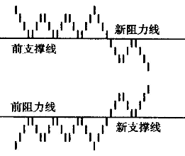
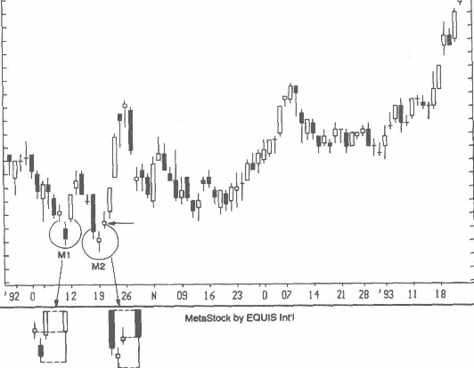

“市场参与者的心理、筹码的供需状况，以及买卖双方的相对强弱，都反映在某一单根蜡烛线或数根蜡烛线的组合中。”

西方技术分析中有一个基本的观念：阻力位一旦被穿破，即转变为支撑位；支撑位一旦跌破，即转变为阻力位，我称此为极性转换原则。
这个观念也体现在图3-9中。我发现“极性转换原则”是一个有效的交易工具，结合蜡烛图一起使用尤其有效。在实践中你也会发现，某个阻力位或支撑位在突破以前所受到的考验次数越多，其极性转换越彻底。

## 蜡烛图与市场的整体技术面
我曾经翻译过的一本日文书中有言：“无视市场情况而贸然投资，必将遭受伏击，损兵折将。”——日本人常将军事术语引入技术分析。
这句话很形象地告诉我们：依据蜡烛图进行买卖决策前，一定要先考虑市场的整体状况，否则难免亏损。
日本技术分析师协会的一位会员曾给我来信说，在他眼中，市场整体技术面的重要性远大于一个个孤立的蜡烛图形态。我完全同意这种看法。要掌握有效的蜡烛图交易技术，不但需要对蜡烛图有正确理解，而且要采取稳定而连贯的交易战略和策略。可惜一些交易者只懂得蜡烛图形态，却往往忽视了那些交易策略。蜡烛图必须与其他交易策略原则有机结合，才能成为一个有效的工具。从这个意义上说，蜡烛图虽然很重要，但也仅仅是我的工具箱中的诸多工具之一。

有弟子曾问孔子：他会带哪种秉性的人上战场？孔子回答说，他要的不是视死如归的莽汉，而是谨慎面对困难、以策略谋胜的战士。策略也正是本章的主题。我拟阐述几个策略原则的重要性：止损、风险与收益的权衡、以大势为背景观察个股的蜡烛图、交易后跟踪市场的变化。

只有全面掌握、使用这些策略原则，你才能真正发挥蜡烛图的力量。当你认真理解本章的内容后，你将会意识到：某个蜡烛图形态形成前后所出现的因素，才是交易成败的关键因素。

某个蜡烛图形态形成前后所出现的因素，才是交易成败的关键因素。

## 灵活变体-以启明星为例
>典型的启明星形态，第一根蜡烛线是长黑实体，第三根蜡烛线是长白实体，且上插第一根蜡烛线实体的高处。

然而，在图3-75 中标示为MI 的肩明星形态中，第一根蜡烛线是小白线而不是长黑实体；在标示为M2的组合中，第三根蜡烛线是小白线（箭头所指者）而不是更传统的长白实体。
由于这两个启明星变体都靠近同一个支撑区域，因此；尽管两个组合都不是传统的启明星形态，但还是应该视为多头信号。这个走势图凸显了一个重要的事实，那就是蜡烛图识别分析是一种形态分析形式，因此蜡烛图分析中必然有一定的主观性。
关于这一点，我曾致函日本技术分析师协会，请教他们对非典型的蜡烛图形态有何高见。他们回答说：“这个讨论令我们兴趣盎然，因为你竭力在日本图形解读中追求具体与精确，而我们都喜欢保留灵活性，以免挂一漏万。这或许可以归因于思维模式的差异，西方人在思考中追求精准性与确定性，而东方人喜欢保留弹性。”

这个说法强调了一个很重要的事实：我在本书中所列举的所有图形大多数属于标准形态，但在实际交易中，你不应该只识别标准形态，而排斥了不十分标准的形态，因为非标准形态也可能是有效的。如果你碰到一个不十分标准的形态，又必须据此进行交易决策，你又该如何操作呢？基于我所钻研过的日本文献、与日本交易员的广泛讨论以及我个人的经验，提出如下建议：
* 将图形视沩标准形态，判读其信号，然后等待市场的进一步确认。例如，典型的乌云盖顶形态中，第二根黑线的收盘价应深度入前一个白色实体（到达中点以下）。如果切入的深度不及一半，应该等待观察，看看第二天的行情是否继续维持弱势格局。
* 如果某个非理想形态确认了一个支撑位或阻力位，或出现在严重超买或超卖区，形态构成反转信号的几率很大。举例来说，即使一根锤子线的下影线不是很长（因此是非典型锤子线），但如果出现的位置正好是行情下跌到前一次涨幅的50%附近，那么我会认为，它包含了传统锤子线所蕴涵的所有多头信号价值。
* 碰到非理想形态，你又需要判定它的信号，有一种方法比较有用，那就是将这个形态组合成一根合成蜡烛线，然后看看这根合成蜡烛线给出的信号与这个形态的预测是否相符。例如，图3-75中，M1 与M2的合成蜡烛线都是下影线很长的蜡烛线，两者发生在同一个支撑区域附近，而且 M2之后又出现长白实体，将这些综合起来考虑，可以认为空方已经失去对行情的主导。

