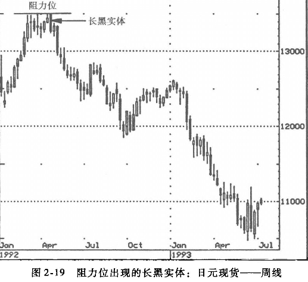

## 实体
在日本蜡烛图中，即使是单根蜡烛图也有其深意。考察市场活力的第一个线索便是实体的长度与颜色。对于日本交易员来说，实体部分是价格走势的本质部分，这是蜡烛图技术的关键优势所在，只需根据实体的长度与颜色，即可掌握多空双方的相对力量。

长白实体代表该交易时段内多头主导，长黑实体则代表空头占优。

## 长白实体
根据日本蜡烛图技术交易员的看法，一根具有明显意义的长白实体，其实体的长度至少应是前一天实体长度的3倍。

一位机构客户告诉我说，他发现在出现长白实体之后，行情有时会出现修正。我告诉他，这在情理之中，因为在出现长白实体之后，市场往往处于超买状态，所以很容易遭打压。我建议他将长白实体视为支撑，在回抽时买进。

### 低价区的长白实体
一般来说，单根蜡烛图很难提供构成趋势反转的充分理由，但可能是趋势发生变动的早期征兆。

### 长白实体突破阻力
图2-9显示，一根长白实体穿越阻力位的形态，可以证明市场势头强劲。在图2-10中，标示为A与B的两个高点显示44美元与45美元附近为阻力位。11月下旬，一根向上跳空的长白实体突破这个阻力位。
这根蜡烛图的开盘价在低点附近，并以最高价收盘，实体的长度极长，确认这是一个有重要意义的突破。还可以看出，这根长白实体之前所形成的缺口，成为后来的重要支撑。我们在第3章讨论鋏口（窗口）时将再探讨这方面的问题。

### 长白实体构成支撑
在图2-11中，长白实体是令人激动的市场信号之一，它构成支撑。
我发现这是一个非常出色的研判工具，因为它能让交易者注意条形图不能显示的支撑区域；行情一旦向下修正，会在这个长白实体的中点或蜡烛图底部（下影线的下端）获得支撑。根据日本文献的说法，涨势中的长白实体构成支撑；而根据我个人的经验，下跌市场中，长白实体也有支撑功能。在一根长白实体之后，价格很容易出现回抽，因为行情可能处于短期超买状况（即价格在：短期间内上涨过速）。在这种情形下，价格可能需要跌去部分涨幅，以缓解超买状况。

图2-12显示，1992年初出现了•根超长的长白实体，将价格由
10.50美元推升到15美元左右，⋯周涨幅几乎为50%。在这种巨幅上涨之后，市场进入整固也在情理之中。根据长白实体构成支撑的观念，这根长白实体的中点12.50美元（箭头标示处）应该可以作为支撑点来考察。在1992年此后的交易中，价格始终维持在这个支撑位之上，反映市场动能强劲。

## 长黑实体
### 高价区的长黑实体
低价区的长白实体有可能是努力构筑底部的信号；同理，高价区如果出现长度明显大于先前数根蜡烛线的长黑实体则有可能是顶部信号。
这根蜡烛线的实体必须明显长于此前几根。图2-16中，长黑实体代表空头已经取得盘面的控制权。先前的涨越大，超买的情况越严重，这根长黑实体作为谨慎信号的可靠性就越强。 
图中的长黑实体（2）显示，空头已经夺取盘面的控制权。请留意这个长黑实体的长度，至少是1992年11 月以来最长的黑实体。这是一个严重的预警信号：市场将要发生重大变化，应该采取适当的防卫措施，即使不卖出股票，也要卖出所持有股票的到期到价买入期权，或对冲（了结）部分的多头头寸。熟悉蜡烛图形态的交易者，应该可以看出长白实体（1）与长黑实体（2）构成了空头塔顶。

### 长黑实体确认阻力位
如果市场以一根长黑实体形态由阻力位急剧下跌，可以确认该阻力位的有效性。因为这种蜡烛图代表多头已经撤出，或空头已经非常强劲，足以压倒多头。不论是哪一种情况，都代表市场可能走熊。 
在图2-19中，135日元处有明显的压力，图中横线对此表露无遗。图形中的箭头所指的第一根长黑实体，显示价格到此不能再上升，长黑实体的长度表明多头大规模撤退，明确发出谨慎信号。两周后，出现另一根更长的黑色实体，表明空方能量超凡，足以进一步打压市场价格。

### 长黑实体构成阻力
长白实体可以构成支撑，同理，长黑实体可以构成压力（见图2-22）。在图2-23中，长黑实体（1）向下突破上升支撑线。
可以发现，长黑实体（1）与六周前的长黑实体X构成一个阻力区，一旦价格反弹到这个区域，可了结多头头寸或卖空。

## 实体的大小、频率与颜色
### 大小
比较一组蜡烛的相对高度、频率与颜色，可以判定市场状况。在图2-25中，长黑实体（1）是第一个不祥之兆。请注意，它是一根久违的长黑实体。紧接着出现一根更长的黑实体（2），这是明显的预警。此后价格持续下跌，直到2月的长白实体（3）为止。这根白线的长度为数月之最，表明大牛强力进场。看一下后面的走势可以发现，2月的这个长白实体的中点成为后来小规模反弹的一个支撑。

### 数量对比
在图2-26所标示的方框内，是一组横盘的蜡烛，如果画成条形图，多空力量对比很难反映出来，但这组蜡烛反映得比较清晰。方框内的蜡烛线中，有八根黑线，仅有四根白线。另外，黑线的长度大多超过白线。由于黑色实体比较多，而且比较长，显示空头更占优势。经典的西方技术分析理论认为，在窄幅整理之后，市场将重拾先前的走势。在本例中，先前走势属于下降趋势，所以，这组横盘的蜡烛线组合所发出的信号，可以进一步证实西方理论的预测，随后出现进一步下跌走势的几率大大增加。

