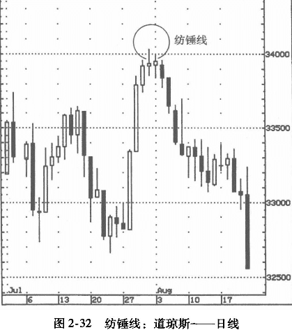

## 纺锤线
小实体表示多空双方正处于拉锯战中，供需状况相对长实体而言比较均衡。
这种实体很小的蜡烛线为纺锤线（spinning tops），代表盘势上下两难，或如同日本人所形容的：“市场喘息困难”。

图2-31所示为纺锤线，尽管有很长的上影线和下影线。是否为纺锤线，取决于实体部分是否很短。纺锤线警示我们：市场正在丧失动能。如果纺锤线出现在新高点或其附近，尤其是在急升之后，有可能代表上涨动能不济，先前的涨势有可能停滞于此，投资者需要谨慎。

## 筹码积聚与派发
积聚（accumulation）与派发（distribution）是价量关系中的两个重要概念。 
筹码的积聚与派发有一个共同的特征，即价格呆滞。纺锤线便是这些走势的标准蜡烛图（表现为开盘价与收盘价非常接近）。因此，将纺锤线与成交量结合在一起考量，就可以判断是否有人在积聚或派发筹码。

### 积聚发生在低价区
成交量放大而价格呆滞。成交量放大，代表空头全力抢攻，投人所有的人力与火力。可是，呆滞的价格显示空头无法压低价格。空头所投人的筹码，都被多头接手。发生这种情况之后，空头要么打光所有的子弹，要么就此休战，停止打压。无论如何，结果都是一波上涨。

### 派发与积聚正好相反
派发发生在高价区，表现为成交量放大而价格几乎停滞不动。在这种态势的背后，是“聪明钱”正将筹码派发给所有人场买家。由于卖方所派发的筹码足以应付买盘的需求，所以价格停滞不涨。

因此，派发应该视为见顶信号。

### 例子1
在图2-33中，1月12日出现纺锤形蜡烛，同时成交量也明显放大。如前所述，在低价区，价格呆滞而成交量放大，是典型的积聚信号。本例中的放量纺锤线显示，卖方压力很容易就被化解。这一积极信号又被另一个信号所强化：出现纺锤线的交易时段内，价格一度创出新低，但空头无力守住这个阵地。

### 例子2
在图2-34中，6月所出现的长白实体伴随着大成交量，就这个蜡烛图本身而言，它构成一个很强的多头动向，因为价格急升，而买盘强劲（反映在成交大量中）。可是，下一个交易时段的走势让人不安，因为出现了小实体（即纺锤线），而成交量（图中以圆圈所示处）虽然不是前一天那样的天量，但再看看图形底部的一组成交量，可以发现，相对于前几日，这仍然属于异乎寻常的放量。也就是说，这是放量的纺锤蜡烛。这代表什么意思呢？大成交量代表多头强力买入，但小实体，即纺锤形态代表空头强大，几乎可以压得多头无法动弹，这是典型的派发形态。此后出现了一系列小实体蜡烛线，进一步显示多头无法推升价格。
请注意，纺锤线出现后的最长的实体是黑色的，它显示空头已经在市场上站稳了脚跟。

