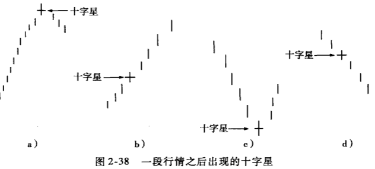

## 交易时段的开盘价与收盘价相等（或几乎相等）
如果交易日的开盘价与收盘价接近，但不完全相等，何种条件下才可以将其视为十字星？方法之一是将它与最近几个交易日的价格变动做一个比较。如果有许多根实体很小的蜡烛线，则近乎十字星的这根蜡烛并没有什么特殊的意义，因为其他交易日也出现了这么多小实体蜡烛或者十字星。

如前所述，如果十字星发生在上升趋势中的一个长白实体之后，则是值得注意的信号。这种情况表明（按日本人的说法）市场已经相当“疲惫”。另外，如图2-37所示，十字星的顶端（即上影线的顶端）经常意味着阻力。但是，如果十字星的顶点在此后被超越，则意味着上升趋势还将继续。

* 如果当时的行情处于横盘之中，十字星既不能代表走熊趋势，也不能代表走牛的趋势。从本质上讲，这个十字星从微观上反映了市场的犹豫不决，而更长周期内的横向走勢则相对宏观地反映了同样的信息：市场举棋不定。

* 但是，十字星如果发生在上升与下降趋势的成熟阶段，则较有可能是变盘的征兆。

### 不要讲将十字星直接视为买进或卖出信号
蜡烛图的使用者有个比较常见的错误，那就是将十字星直接视为买进或卖出信号。诚然，如日本人所言，十字星意味着“多空的十字路口”。

十字星固然有可能意味着对先前趋勢的反转，但交易者应该将其视为市场处于过波状态的一个信号，而不是直接将它认定为反转蜡烛组合形态。因此，十字星出现以后，交易者应该等待一两个交易时段，等待行情变化的明朗化。

如果十字星发生在弹升中，而此后行情继续强劲，则这个十字星应该视为走牛标志，因为这种组合表示市场已从十字星所示的过渡状态结束，转入新的趋势—一上涨。所以，在一段弹升之后的十字星虽然有可能表示趋势即将反转（因为行情处于十字路口），但最好等待市场的进一步确认，等一两个交易日，看看是否有熊态确认信号，是否已经形成了顶部反转。

对于见十字星卖出的投资者而言，十字星构成阻力位（如图2-37所示），因此，一旦随后有交易时段收盘于十字星顶点上方，则应该认定（按日本人的说法）市场已经“从疲劳中恢复”。基于这个理论，上述见十字星卖出的投资者，应该在十字星顶点的上方设定买人止损点。在下降趋势中，十字星也具有相同的作用。具体说来，就是代表市场暂时处于犹豫之中，如果在十字星之后出现长白实体，表明市场已经结束犹豫，选择向上。在一段下跌行情后，如果有投资者见十字星而买进，则应把卖出止损点设在十字星的低点（下影线的下端）下方，因为这种十字星应该被视为熊市持续信号。

### 明确的上升趋势形成后，如果出现一个长白实体
而且此后又出现十字星，我们就需要特别警惕。不论该十字星位于长白实体上方的位置还是被这个实体“包头包脚”，其呈现的都是市场分歧。一方面，上涨趋势和此后出现的长白实体，表明多头仍然掌控局面；另一方面，十字星的出现，表明多头已经不能维持上升动力，如图2-36所示。

### 十字星-背后
如此明确地表达市场的均衡状态呢？这么一根简单的蜡烛线就已经充分显露牛熊均势状态，因此可以判定市场处于过渡期。

十字星技术的一个关键点，就是必须考察这个十字星在趋势中的位置。

图2-38要说明的一个主要概念就是，市场的超买或超卖情况越严重，十字星作为可能的反转信号的重要性就越大。图2-38用来说明十字星与趋势的关系:
* 在图2-38a中，在急升之后或超买状态中出现的十字星有可能是见顶信号
* 图2-38b中，十字星出现于行情上升之初，其构成顶部的机会就要小一点
* 图2-38c中，十字星出现在大跌之后，就可能是行情见底的信号。
* 在图2-38d中，市场刚开始下跌，十字星之后，行情可能继续下跌。

### 例子
从图2-39中我们看到，11月初开始了一波弹升，接着出现一个长白实体，此后又有两个十字星。这两个十字星说明，市场处于多空均势状态，这与前一个长白实体所反映的情况明显不同，长白实体表示市场富于活力、状态健康，多头控制局面，而这两个十字星表明（如日本人所说的）“行情开始背离其趋势”。 
如前所述，十字星构成阻力。在这个走势图中，十字星出现之后没几天就出现了一个长黑实体（箭头标示处），这根蜡烛线也应该视为阻力位。因此，从十字星到这个长黑实体之间构成了37~38 美元的阻力区。1993年早期的上涨在这个区域受阻回落。

### 墓碑十字星
在图2-40中，箭头所指的十字星的开盘价、收盘价与最低价处于同一个位置。这种十字星被称为“墓碑十字星”，因为其形态犹如佛教风俗中放在墓碑处的木质牌位。有人会说，在墓碑十字星出现后，如果有交易者在高价买人，就会“死得很惨”，变成“冤魂”（另外，熟悉蜡烛图理论的人能够在图2-40中看到，这个基碑十字星是一个蜡烛线组合形态—-黄昏十字星—的组成部分。
