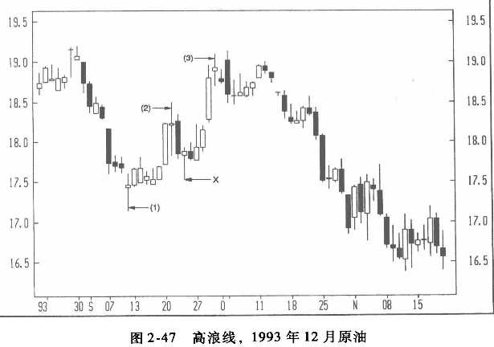

## 上下影线
在蜡烛图中，实体被认为是最重要的部分，但上下影线的位置与长度也会透露大量信息。因此，在分析市场背后的心理时，也应该考虑上下影线的位置与长度。
* 一根长长的上影线，若发生在高价区、阻力区或超买区，就必须引起重视，因为这种蜡烛图暗示在该高价区域卖盘沉重或买盘不断“蒸发”。 不论是哪一种情况，长长的上影线（如图2-42所示）有可能是走熊的一个征兆。
* 反之，长长的下影线，如果出现在支撑区或超卖市道中，也有可能是一个重要信号，表示空头正在丧失控制权。 

如图2-43所示，1992年初，在一个长白实体之后出现一个十字星，是一个不祥之兆。鉴于十字星构成阻力，在随后的两周中，市场反复受阻于这个十字星的高点；其后的两个交易周的错烛图都留下很长的上影线，显示109美元附近要么有凶悍的卖盘，要么买盘在这个高点附近蒸发。不论是哪一种情况，这些长长的上影线均显示上攻动能衰减。1992年中期的下跌进一步确认了这个阻力位的重要性。 

### 例子
在图2-44中，蜡烛线1、2、3都是在0.59美元附近反弹向上，留下很长的下影线，显示这个支撑非常强劲，买盘意愿强烈。另外还要注意这个底部的构筑时间之长。在将近两个月的交易中，空头反复企图将价格打压在0.59美元以下，但均无功而返。一般来说，底部愈宽，上升平台便愈稳固。

## 高浪线
上影线与下影线都很长的蜡烛图称为“高浪线”（high-wave candle，参考图2-46），代表多空对峙的状态。如果在一段上升趋势或下降趋势后出现高浪线，日本人会说市场已经丧失方向感，如此则先前的趋势可能岌岌可危。同时带有很长上影线与下影线的十字星则称为“高浪十字星”或“长腿十字星”。

图2-47中（1）、（2）、（3）分别标示了三根高浪线。
高浪线（1）代表牛熊对峙均衡。因为此前的行情为熊市形态，因此这根高浪线的出现表示市场发出趋势变动的信号。随后出现两根白线进一步强化了这个变动信号。行情从高浪线（1）起开始上升，最后停滞于高浪线（2）。 
第二天行情以一个长黑实体的方式急挫，但随即又出现一根下影线很长的蜡烛线（X），显示前周的低点构成了很有吸引力的买人机会。价格又从蜡烛线 X处开始上涨，但高浪线（3）又透鰩不祥的征兆。两天之后所出现的长黑实体，代表大熊已经气势汹汹地杀入，进一步确认了高浪线（3）是市场顶部反转信号的可能性。 
