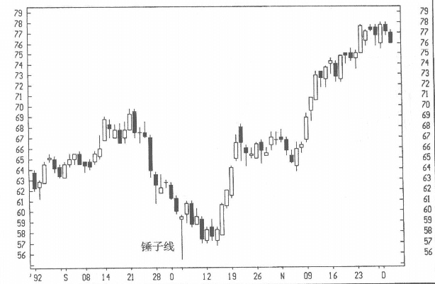
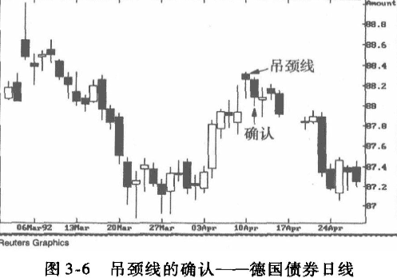
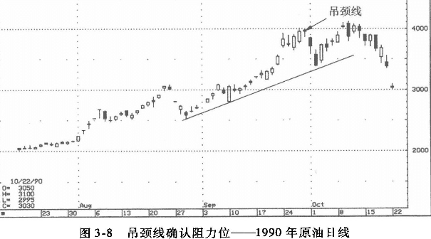
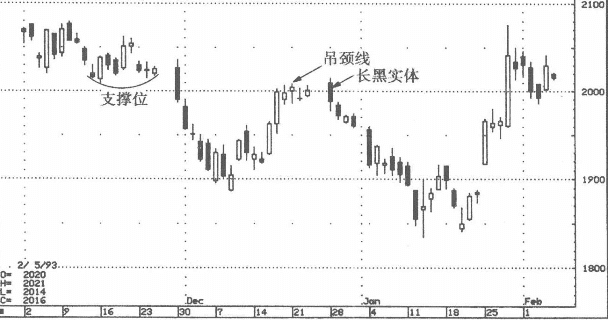

## 前言
在本节讨论的单一蜡烛包括锤子线、吊颈线与流星线，它们都有很长的上影线或下影线，但是实体都很小，而且都接近蜡烛的高点或低点。如果使用蜡烛图帮助决策，这些蜡烛尤其重要。

* 锤子线的下影线很长
* 收盘价位于或接近高点。

锤子线的名称有两个含义：一是市场正在“锤磨底部”；一是底部坚实，即使以锤子敲打都不能砸破。

要将一根蜡烛线认定为锤子线，必须确认它出现在大幅下跌之后还是严重的超卖市道中。锤子线是一个反转信号，也就是说此前已经出现了下行趋势，否则何谓翻转？如果发生在两三天的下跌走势之后，类似锤子线的蜡烛线通常没有特别的指示作用。由于锤子线必须出现在大幅下跌之后，因此由锤子线开始的反弹很可能遭受卖压，因此，锤子线引发的第一波反弹常常以失败告终，行情有可能下探以重新考验锤子线的支撑能力。

因此，如何根据锤子线进行交易，取决于交易者的激进程度与风险偏好。某些交易者担心行情未必会回落重新考验锤子线的支撑，所以可能会在锤子线之后立即买进；另一些交易者则会等待市场回落测试锤子线的支撑，并在这个回落过程中买人。如果锤子线的支撑经受住了考验，那就意味着底部更为坚实，上行的概率更大。我有时建议客户采用如下的交易方式：当锤子线刚出现时，先少量做多试水，如果价格拉回，并成功证实锤子线的支撑，再加码买进，完成多头头寸的建立。不管如何使用锤子线进行决策，止损点（以收盘价为准）可以设定在锤子线低点的下方。

图3-2中有一个典型的锤子线，下影线极长，显示多方有很强的能力推升股价脱离底部。锤子线所引发的反弹在此后几个交易日内出现停滞，但此后的回抽确认了支撑。这种行情帮助扩大了底部，有利于准备更凌厉的涨势。 

### 锤子线-背景
任何市场中的大鳄，都会试探支撑位与阻力位的力度，他们想知道一旦支撑位或阻力位被穿破后，市场会产生什么反应。这些交易者的试盘动作与前述的佯动战术一样，以大单打破支撑位（或阻力位），随后观察战场内的布置。价格接近支撑位时，其卖单也许足以把价格拉到支撑位之下，然后观察市场中隐藏的力量。如果支撑位跌破之后，行情不能维持在低位，而是立即回升，形成弹蜜线，他们就了解了多方所具备的韧性，于是有可能平仓空单。

## 吊颈线
同一形状的这根蜡烛线可以代表转熊，也可能代表转牛，取决于它在趋势中的位置。如果是在下降趋势中的低价位处，就代表转牛；如果出现在上升趋势中的高价位区域，则是空头的吊颈线。 
如图3-5所示，吊颈线的下影线很长，上影线不存在（或很短），实体（或黑或白）很小而位于价格区间的上端。吊颈线的形态与锤子线完全相同，但是，正如日本教科书所说的：“如果它出现在下方，买人；如果出现在上方，卖出”。

### 例子
图3-6是其中之一。如果隔天出现空头确认信号，这个吊颈线应该代表短期见顶，后来的情况证实了我的判断：

### 例子2
图3-7说明，等待市场对吊颈线的确认是多么重要。图中出现了一根吊颈线，但紧接着就是一根长白实体，价格被推高到吊颈线上方。在这种情况下，吊颈线交易时段买进的人都有获利，也就是说他们没有理由卖出自己的多头仓位。其结果是，高于吊颈线的收盘价化解了吊颈线所蕴涵的转熊信号。行情超越吊颈线后的市场情况果然证实了这一点。

### 例子3
价格—一旦突破这个水平，我就把日标设定在40美元左右，这是现货市场在1979年构成的阻力位。从图中可以看出，40美元附近出现了一个转熊信号，其形态为一根吊颈线。
行情在此回头，下行后考验了一下支撑位，然后再次上行，但这只是一次垂死挣扎，尽管行情一时勉强突破40美元，但此后出现了崩溃性下跌。 

### 例子4
在图3-10中我们可以看到，在11月中旬到下旬之间，市场在20美元上方不远处构筑了一个明显的支撑位。如果该重要支撑位被突破，依据极性转换原则，它就必然会成为阻力位。事情的发展果然如此：12月中旬出现了吊颈线，确认了这个阻力位；12月28日的长黑实体—一也出现在20美元附近—显示空方已经掌控行情。
