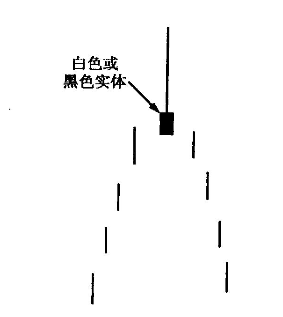
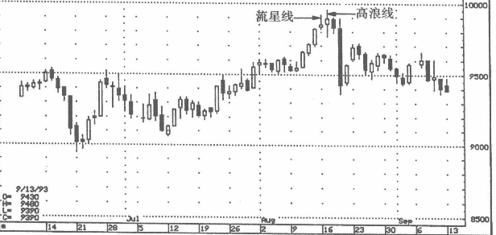
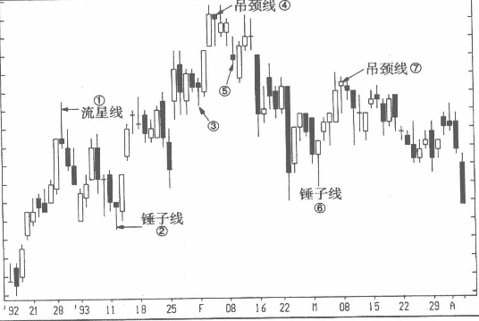

## 流星线的上影线很长，实体很小且接近蜡烛线的低点(见图3-11)
如果说锤子线的长下影线是个看多信号，那么流星线的长上影线就是个看空信号。这根长长的上影线，代表空方有能力让价格从高位急挫而下。

图3-12中8月中旬出现一根流星线，其上影线的长度可以是示空方的势头很猛，第二天又出现一根高浪线，同样反映市场处于不确定的状态。而且，这两根蜡烛线出现在100日元的重要心理关口，该价位更凸显了这两个信号的重要性。

## 区别
* 1流星线，必须发生在明确的上升走势之后。上影线很长，代表市场拒绝接受新高价格。
* 2锤子线，必须出现在下降走势之后，下影线很长。
* ③尽管形状完全符合锤子线与吊颈线本身的形态条件（下影线很长，实体很小且靠近蜡烛上端），但它不是锤子线也不是吊颈线，因为它并不处于上升或下降走势之后，而是处于横盘之后，且在横盘价格的中位。因此，它不是锤子线（尽管其长长的下影线可以被视为一个积极信号）。
* ④和⑦吊颈线，在吊颈线之前是一波上行，下一交易时段的蜡烛收盘于吊颈线实体下方，确认吊颈线的空头信号。⑦有小上影线，但其长度很短，仍然可视为吊颈线（锤子线同样允许短上影线）。注意，吊颈线的实体颜色可以是白色也可以是黑色。
* ⑤形状完全符合流星线的标准（上影线很长，实体很小且接近蜡烛
低端），但它不是位于上升走势中，所以不能如传统的流星线那样视为空头信号。
* ⑥的信号价值相对有限，因为此前的下行幅度有限；但其下影线成功确认了1月下旬与2月上旬的低点所构成的43美元支撑位。 
总之，是否要在锤子线、吊颈线与流星线出现后做出相应的买卖决策，首先必须观察先前的趋势。记住，它们都是反转信号，有了先前明确的趋势，才有反转可言。

