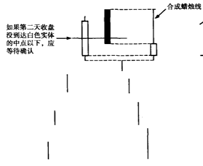
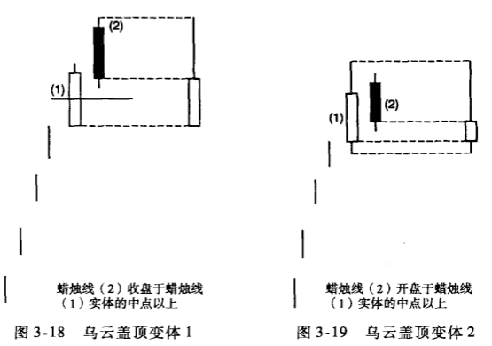
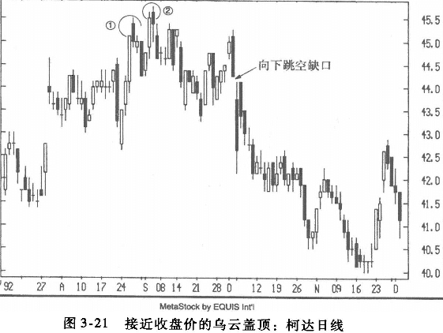
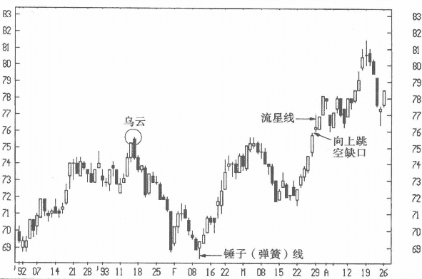

## 乌云盖顶-上涨概率很小
以我个人的经验，乌云盖顶的发生频率高于刺穿形态，其部分原因可能与华尔街的一句名言有关：“因贪婪而进场，因恐惧而出场。”贪婪与恐惧，两者虽然都是非常强烈的情绪，但恐惧更易造成行情的剧烈波动。

乌云盖顶的第一根蜡烛是强劲的长白实体，而到第二个交易时段，虽因买盘力量尚存而惯性高开，但价格下行，收盘于第一个白色实体的中点以下。乌云盖顶形态表示，长白实体所代表的上升动能被第二根黑色蜡烛线逐渐消耗。观察图3-17中的合成蜡烛线，可以看出它留下很长的上影线；换言之，这个乌云盖顶形态形象地显示此时市场的卖压正在超越买盘的力量。

>一个理想的乌云盖顶形态中，第二根黑线的收盘价应该切人第一个白色实体的中点以下。如果切入未到达中点以下，则有些日本交易者会认为属于未完成形态，一如此，则应该观察下一个交易时段，如果收盘更弱，才视为走弱确认。一般来说，乌云盖顶形态中第二根黑线收盘价切人第一个白色实体愈深，形态的空头意味愈强烈。

如果第二根黑线的收盘价未到达第一个白线实体的中点以下，那么将它们合成一根蜡烛线后，这根合成蜡烛的上影线相对较短，因此，如图3-18所示的乌云盖顶形态的空头意义也逊于标准的乌云盖顶形态。
在这种情况下，我们就要等待下一个交易时段能否走弱再来确认这个鸟云盖顶形态是否成立。

### 乌云盖顶变体
理想的乌云盖顶形态中，第二根蜡烛线的开盘价应该高于第一根蜡烛线的高点。

但是，因为期货市场的价格波动通常高于股票市场，所以股票市场上的乌云盖顶形态在判定时更为灵活:
* 第二根蜡烛线的开盘价只需要高于第一根蜡烛线的收盘价而不是最高价，即可判定为乌云盖顶形态，如图3-19所示。

但是，如果某股票的第二根蜡烛线的开盘价高于第一根蜡烛图的最高价（而不是收盘价），这种形态的反转信号更为强烈，因为价格由新高下滑，相比从非新高下滑，其空头意味更为明确。

图3-21中所示的两个乌云盖顶都属于非典型形态。乌云盖顶①的第二根黑线没有切人第一根白线的中点以下。乌云盖顶②的第二根黑线开盘价仅仅略高于前一个收盘价，转熊意味减弱。但是，这两个非典型形态出现时间接近，相互呼应、强化。也就是说，它们共同反映一个市场情况：行情在45美元附近创出新高时，空头就有能力将价格打回前一天的收盘价下方。这绝非好兆头。此后在这个鸟云盖顶下方出现的向下跳空缺口最终确认了下跌趋势的形成。

### 乌云盖顶形态经常成为后来的阻力位

