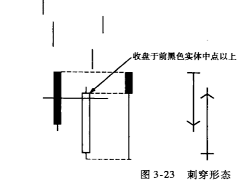
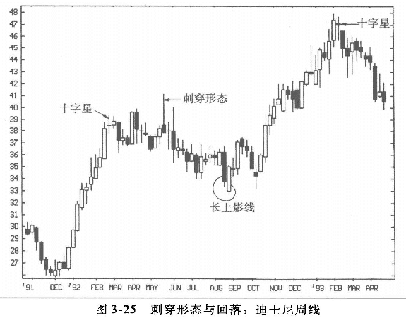
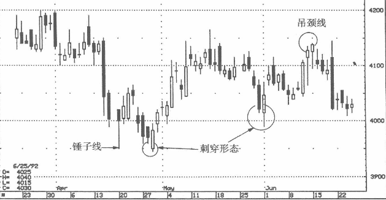

## 刺穿形态-下行能量已经被消耗殆尽
以我个人的经验，乌云盖顶的发生频率高于刺穿形态，其部分原因可能与华尔街的一句名言有关：“因贪婪而进场，因恐惧而出场。”贪婪与恐惧，两者虽然都是非常强烈的情绪，但恐惧更易造成行情的剧烈波动。

在行情的底部区域，投资者或交易员通常会有机会等候进场的机会。他们耐心等待价格回落，或等待市场筑底，或者在消息出现后等待一下，以便观察市场的反应。而在顶部区域的恐惧则更有威慑力，投资者仿佛听到恐惧在叫嚷：“我要出去—立刻！马上！”

如图3-23所示，刺穿形态与乌云盖顶恰好相反。乌云盖顶出现在上升趋势后，体现为一个长黑实体深度切入此前的白色实体。刺穿形态则体现为一个白色实体切人此前的黑色实体之中，这个形态显示在低价区有强劲买盘。

如果第二根白线的收盘价不能够深度切人第一个黑线实体的一半以上，这个形态有多种名称。

### 基本观念:即第二根白线切入第一根黑线的程度愈深，信号越积极
就目前的讨论来说，我们无须执著于名称，只需了解一个基本观念，
* 第二根白线切入第一根黑线的程度愈深，信号越积极；
* 如果切入的深度不够，表示多头的反攻力度不够，卖盘可能还会涌出。

如图3-24所示，第二根白线的收盘价未到达前一个黑线实体的中点，这两根蜡烛线的合成蜡烛线的下影线也相对较短；与此对照，可以看一下图3-23中的超长下影线，这说明多头实施了强劲的反攻。第二根蜡烛的开盘位置越低，合成蜡烛图的下影线也就愈长。也就是说，刺穿形态中第二根蜡烛开盘越低，收盘就越能切人前蜡烛的上部，这个形态就越理想。

### 例子
如图3-25所示，我们看见1991年底开始的上行，停滞于一个长白实体之后的一个十字星。5月的一根超长上影线反映了十字星所构成的阻力位意义。行情由此回落，直至8月出现刺穿形态。这个刺穿形态的形成基础是这里的支撑力已经到达12月低点与5月高点之间的中点区域。任何行情回落50%后，我们都应该密切关注盘面变化，因为大多数技术分析派都会关注这个点位。本图中的刺穿形态形成了底部，这个底部又在10月间受到一根高浪线的证实。由33美元附近的底部开始，行情上行，直至1993年初出现一个长白实体，并紧接着出现十字星，价格的攀升到此止步回头。

在图3-26中，4月的刺穿形态确认了前一周的锤子线所发出的底部信号。五六月之交形成了又一个刺穿形态，这就为一波攻击构成了暂时的基础（底部），这波攻击的目标是5月份在4.15美元一带形成的阻力位。
在此区域连续出现两根吊颈线。请留意，第一根吊颈线并未立即得到确认（因为第二天的走势依然强劲），但在第二根吊颈线出现后的那个交易日——收盘价处于第二根吊颈线的实体的下方—这根吊颈线得到了确认。

