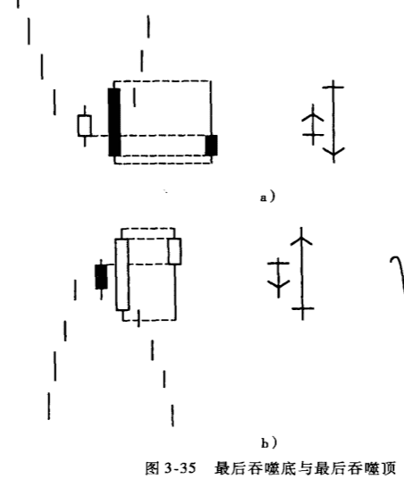

## 吞噬形态
吞噬形态是个双蜡烛线形态。
* 多头吞噬形态（见图3-27a）发生在下降走势中，体现为第二根白线的实体包裹第一根黑线的实体。
* 空头吞噬形态（见图3-27b）发生在上升走势中，体现为第二根黑线的实体包裹第一根白线的实体。

吞噬形态的基本定义是：第二根蜡烛线的实体完全吞噬前一根相反颜色的实体。但是吞噬形态之间的信号强度并不相同。吞噬形态的信号价值高低取决于实体的相对长度、影线之间的关系以及其他因素。

吞噬形态的最严格定义是：第一根蜡烛线实体很短，第二根蜡烛线的实体很长，而且第二根蜡烛线的实体完全包裹第一根蜡烛线，包括影线在内。

第二严格定义则是：第二根蜡烛线吃掉第一根蜡烛线，两者都包括影线在内。也就是说，第二个交易时段的高点高于前一时段的高点，而低点则低于前一时段的低点。

与乌云盖顶形态一样，即使出现了吞噬形态，但如果随后的行情超越了这个吞噬形态，人们仍认为它会朝这个形态的相反方向发展。也就是说，如果收盘价超过空头吞嗲形态的高点（即上影线的高点），盘面由看空转为看多。

## 吞噬形态直观地显示多空力量的前后逆转,对比其他形态
分析：
* 以多头吞噬为例，起先由空方掌控局面，然而通过这个吞噬形态的实现，多方夺取了控制权。
* 空头吞噬则反映空方的力量是如何压倒多方的，按日本人的说法就是“多方的力量被瓦解了”。

对比：
* 在乌云盖顶形态中，空方成功地将价格切入此前的白色实体的内部；而在空头吞噬中，空方的力量更强大，它把收盘价打乐到了此前白色实体的下方。两者的差异也可描述刺穿形态与多头吞噬之间的差异。 
* 在刺穿形态中，多方反击，将收盘价向上高度切入前面的黑色实体;而在多头吞噬中，多方气势如虹，收盘于前面黑色实体的上方。也就是说，通常说来吞噬形态作为转牛或转熊信号的强度分别超过了刺穿形态与乌云盖顶形态，但是，实际上，我们还必须由形态所发生的位置来做进一步的判断。 
例如，如果出现了一个多头吞噬，但它没有同时确认前面的某个位置为支撑位，另一个是发生在重要支撑位的刺穿形态，这个刺穿形态更有可能是有效的底部反转信号。因此，在判断蜡烛图形态时，应该同时考虑整体技术形态，这一点会在第4 章中深人讨论。

### 例子
图3-28中的第一个不祥之兆是8月下旬的高浪线。接着，在9月的最初两天形成一个更危险的空头吞噬。行情由此下滑，直至在8月中旬的跳空缺口的价位区找到了支撑（本章稍后会讨论缺口的阻力与支撑功能）。由前缺口支撑下展开的反弹，后来又受阻于先前的空头吞形态所构成的阻力位。

在图3-29中，12月的卖压起始于长白实体之后的十字星。一周后，一根上影线很长的蜡烛线可以确认44 美元附近的卖压，这是由先前的十字星所构成的阻力。随后所产生的跌势终止于1993年1月的多头吞噬。价格由此反弹，但再度受阻于先前的阻力位44 美元，形成上影线很长的蜡烛线。

### 吞噬形态确认回落开始
在图3-30中，在50美元附近形成一个典型的空头吞噬，因为它是由一个长黑实体吃掉一个极小的白色实体。3月又形成另一个空头吞噬，确认前次下跌从A 到B点之间的幅度的50%为此次反弹的阻力位。

### 例子
图3-32所示的多头吞噬形态中的两根蜡烛线，后一根的开盘价与前一根的收盘价基本相同。这个形态的重要性后来显现了出来，因为它在4月份的回落走势中发挥了支撑作用。

### 例子-看一个吞噬形态，要比较蜡烛线实体的相对长度
一个理想的空头吞噬形态，应该由一根长黑实体包裹一根小白实体。空头吞噬形态中的小白实体，显示上升动能开始不济，随后的长黑实体代表空方力量完全压倒多方。
然而，如果构成吞噬形态的两根蜡烛线在实体长度上大致相当，走勢可能趋向横盘而不是反转（这个重要概念可在期权交易中用来卖空波动率）。 
这里我用图3-33中的德国马克走势图为例来解释这个重要概念。1992年7月的空头吞噬形态（标示为1）中，两根蜡烛线的实体大致相等，代表多空双方基本上旗鼓相当。正因为空方没有明显获胜，随后两三周走出横盘形态就顺理成章了。行情突破这个吞噬形态的阻力位上行以后，又形成另一个空头吞噬形态（标示为2）。 
空头吞噬2更有信号价值，因为它由小白线与长黑实体所构成。由此可以预见行情将发生反转而不是横盘。这样一来，这个吞噬形态就成了阻力位。

在图3-34中，1991年初出现一个空头吞噬形态，但两根蜡烛线的实体长度大致相等，如上所述，这可能意味着进人一段整固时期，果然，此后的行情形成了一个横盘带。这个空头吞噬的高点构成了阻力位，后来一根上影线对此予以了确认。1992年10月又形成另一个空头吞噬，由于它由个长黑实体与一根小白线构成，因此比先前的那个吞噬形态更加重要。而且，由于出现在一个十字星之后，这个空头吞噬更有不祥之兆。具体说来，如果空头吞噬发生在十字星之后，尤其应该被视为一个空头形态组合。

## 最后吞噬形态
空头吞噬形态一般发生在一段上升走势之后，体现为一个长黑实体包裹一个小白实体。
>但是，空头吞噬如果发生在下降走势中，则有可能是底部反转信号，这种形态称为最后吞噬底，见图3-35a。
如果此后的行情中收盘价位于形态中黑色实体的上方，则这一形态可以视为由空转多的信号。 

>多头吞噬形态发生在下降走势之后，体现为一个长白实体包裹前一个小黑实体。但是，多头吞噬形态如果发生在上升走势中，则有可能是个空头形态，称为最后吞噬顶，如图3-35b 所示。按照蜡烛图理论，如果第二天行情的收盘价低于最后吞噬顶白线的收盘价，应视为最后吞噬顶的转空信号获得了确认。
日本人形象地将最后吞噬顶比喻为一对情人“双双殉情”：最后的长白实体让你爱上市场，但此后你也和市场—起毁灭。这话说得有些绝对，但它传达了一个原则，即在出现最后吞噬顶之后，交易者必须小心行事。

在图3-37中，在4月的价格峰位附近形成一个空头吞噬形态后，价格开始下滑，直到在图上标示长白实体的底部获得支撑。考验这个支撑的是4月末出现的两根蜡烛线，其中后一个长黑实体包裹前一根白线，这个形态与空头吞噬相同，但它发生在下降走势中，所以构成最后吞噬底。

在图3-38中，9月的低点附近形成一个最后吞噬底。图中更应引起注意的是长黑实体对应的成交量很大，可以视为卖压高潮。这个高潮的出现，进一步增加了这个最后吞噬形态的底部反转信号价值。

