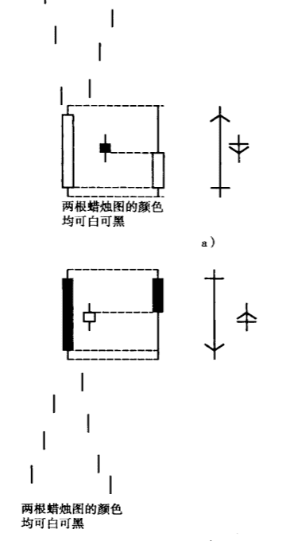
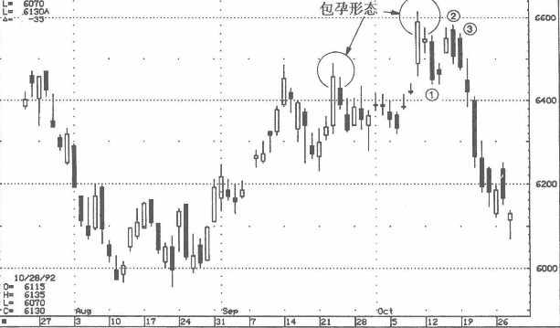
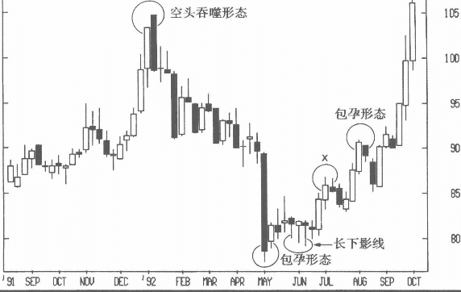
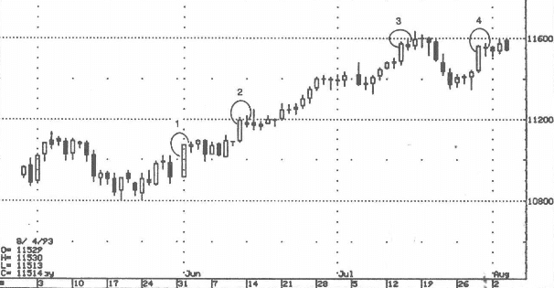

## 包孕
包孕形态称为市场的过渡期。
* 在上升趋势中，如果行情走到了包孕形态上面，则这个包孕形态是多头中继信号。
* 同理，在下降趋势中，包孕形态的低点被跌破，那么就可能出现更多的卖压。

包孕形态由一根长实体蜡烛线和一根小实体蜡烛线构成，而且小实体完全处在大实体之内。这两根蜡烛线的先后顺序与吞噬形态相反。吞噬形态中第二根蜡烛线的长实体包裹前一根蜡烛线的小实体，包孕形态中，长实体蜡烛线在前，小实体蜡烛线在后。 
* 在下跌趋势中出现包孕形态，代表“下跌的动能正趋于衰竭”。
* 在上升趋势后出现的包孕形态，则代表行情没能守住高位。 

如图3-39a所示，包孕形态不讲究两根蜻烛线的颜色，可以都黑都白，也可以-黑一白。 
但是，在一段下行后，先白后黑（第一根蜡烛线为长白实体，第二根蜡烛线为小黑线）或白白组合这两种形态的走牛概率强于先黑后白或黑黑组合这两种形态。这是因为长白实体本身便有多头的意义，所以包孕形态中如果有长白实体，那么市场跌勢即将见底的概率就更大了。

同样的道理也适用于上升走势后的包孕形态。如图3-39b所示，在上升趋势中，包孕形态组合的第一根蜡烛线如果是长黑实体，则空头信号较强，超过了同一位置由长白实体所形成的包孕形态。因为长黑实体本身便是看空形态，当它出现在包孕形态中时，看空的理由就更充分了。

在包孕形态中，如果出现以下情况，则这个形态的意义就更重要了：
* 如果第二个小实体位在第一个长实体的中点，行情可能出现反转。
在一段上升后，如果第二个小实体靠近第一个长实体的上端，随后可能产生横向而非下跌的走势。我称这种组合为高价包孕形态，因为第二个交易时段的价格变化范围处于前一个交易时段的高位区。同理，在下降趋势中，如果第二个小实体靠近第一个长实体的低点，此后很有可能产生横盘而非返身上涨的走势。我称这种组合为“低价包孕形态”。
* 如果第二根蜡烛线的价格范围（开盘价、收盘价、最高价、最低价）完全处在第一根蜡烛线的实体范围内，价格反转的概率比较大。
* 第二根蜡烛线的影线愈短，实体愈小，形态的信号愈明确。如果第二根蜡烛线是十字星而没有实体，发生反转的概率更大。这种长实体后面紧跟一个十字星的包孕形态，称为“包孕十字”。

### 例子
图3-42中的两个包孕形态有一点很相似，第二根蜡烛线的开盘价、收盘价、最高价、最低价全都位于前一个长白实体内。10月的包孕形态尤其重要，因为第二根蜡烛线的实体极小，几乎为十字星，所以这个形态可视为包孕十字星。此后的①D、②、③三根长黑实体，凸显市场的内在弱势状态。

在图3-41中，空头吞噬所引发的跌势，在5月的包孕形态中见底。在该包孕形态中，第二根蜡烛线的实体位于前一个实体的底部，预示先前的跌势将转变为横向走势，价格波动范围靠近长黑实体的下方。请注意，在包孕形态之后出现的多根长下影线，代表80 美元附近买盘积极。图中标示X的组合并非包孕形态，因为第一根蜡烛线的白实体不够长。包孕形态中，第一根蜡烛线相比之前的蜡烛线必须有很长的实体。8月上旬又形成另一个包孕形态，似乎行情即将反转，但只是稍稍下挫后，行情就攀高到包孕形态上方，上涨趋势恢复，并向更高点攀升。

### 例子2
如前所述，一个理想的包孕形态中，第二根蜡烛线的实体位于第一根蜡烛线实体的中点。对于上升走势中的包孕形态，如果第二个小实体位于前一个长实体的上端（即高价包孕形态），行情转为橫向整固的可能性较大，反转下跌的可能性较小。以图3-44为例，在6月上旬到7月下旬之前，陆续出现三个高价包孕形态（分别标示为1~3）。每个包孕形态之后，行情都至少出现一个星期时间的盘整，然后摆脱这个整固区间。这个图形又反映出高价包孕形态（或下降趋势中的低价包孕形态）的另一个妙用：期权交易者可以考虑见此而卖空波动率，因为这种形态出现以后，行情经常会由明确的上升或下降走势转为横盘，也就是说，可能意味着波动率的降低。
