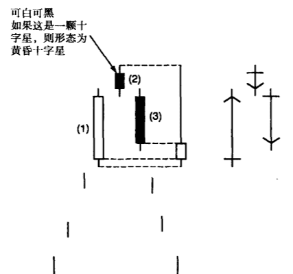
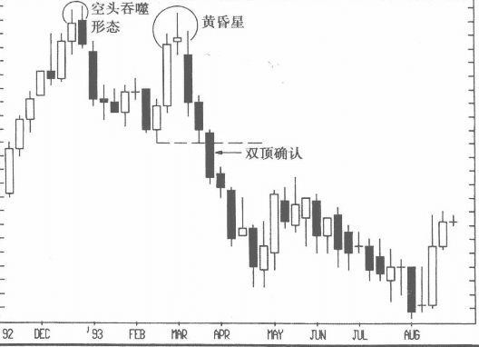
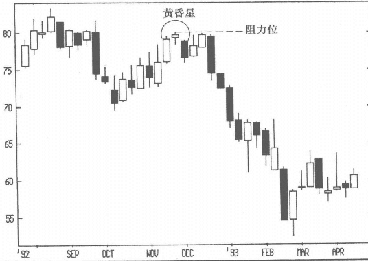
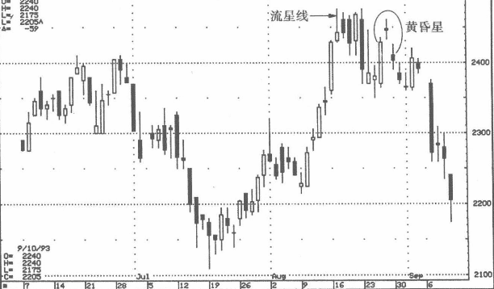

## 黄昏星
如图3-63所示，黄昏星由三根蜡烛线构成。这个形态的判断标准是：

上升趋势中，一个长白实体（图中标示为（1）后面有一根小实体蜡烛线（2），颜色可黑可白，但不能触及蜡烛线（1）的实体，再后面是黑实体（3），这个实体一般不能触及蜡烛线（2）的实体，收盘价又要深度切入蜡烛线（1）。如果第二根蜡烛线是十字星（而没有小实体），这个形态便是黄昏十字星。 

### 只有在第三个长黑实体切人第一根蜡烛线的长白实体之后，空头已经掌握大局
在这个形态中，务必等待第三个长黑实体的出现再来确认市场转熊。因为单就前两根蜡烛线而言，我们只能说市场由上行进入了牛熊僵持（体现为第二根蜡烛线的小实体）状态。只有在第三个长黑实体切人第一根蜡烛线的长白实体之后，我们才有理由相信空头已经掌握大局。

在图3-64中，黄昏星形态确认了空头吞噬形态所构成的阻力。由于这个空头吞噬形态与黄昏星都发生在同一区域，从而在45 美元附近有形成双重顶的可能。在西方技术分析术语中，所谓双重顶有两个高点，如果价格进入这两个高峰之间的低点的下方，则认为双重顶获得确认。

在图3-64中，低点是2月创下的，为40.50美元。双重顶的高点到低点之间构成一个价格区间，这个区间幅度也是下跌确认后再下跌的跌幅（所谓量度跌幅），在本图中约为5美元，40.50美元减去5美元，就可得到本次下跌的一个目标价位，大约在35.50美元。如果有交易者喜欢在价格超跌时买进，可以在35.50美元附近寻找机会。从这个例子可以看出，蜡烛图理论能够很容易地与西方经典技术分析融合在一起使用。 

### 例子
下面以图3-65说明黄香星可能构成阻力位。在图中，11月的黄昏星让12月的上行戛然而止。以整个黄昏星形态中三根蜡烛线的高点为阻力位，如果你能承受风险在此位置做空，我建议在收盘价上穿这个高点时，做止损操作。在本例中，就是要等待周收盘价达到这个高点以上时，才做头入止损（即图中的虚线标示处），因为一旦价格上穿这条虚线，可以认为市场确认突破了这条黄昏星所构成的阻力线。 
如前所述，在股票市场中使用蜡烛图形态帮助判断决策应该有一定的灵活性（相比于期货市场）。图3-63显示的是典型的黄昏星形态，三根蜡烛线中，前面两根的实体相互都不触及，后面两根也是如此，开盘都出现了跳空。但是，由于股票市场的开盘价经常就是前一天的收盘价，所以实体之间可能相互触及。在图3-66 的黄昏星形态中，第二根蜡烛线的开盘价，大约等于前一根蜡烛线的收盘价与后一根蜡烛线的开盘价。蜡烛图形态中的实体之间的相对位置在股市中允许有某种程度的弹性，但应该记住，形态越接近标准，头部形成的可能性越大。

### 变体
在图3-67中，8月下旬出现的黄昏星和传统的黄昏星不同，第三根黑线是个小实体而不是长实体，但是我仍然认为它是黄昏星的一个变体，并与传统黄昏星一样为空头信号，理由如下：
* 第三根蜡烛线虽然不是长黑实体，但仍反映空头气势很盛，因为它有能耐将价格拖到第一个长白实体的深处。
* 这个黄昏星变体出现在阻力区。在8月中旬有过一系列的空头蜡烛线信号，包括流星线、流星线后的三个长黑实体和8月24日上影线很长的蜡烛线。请注意这些空头信号都出现在2.50美元附近，正是在这个水平线上出现了黄昏星变体。 
