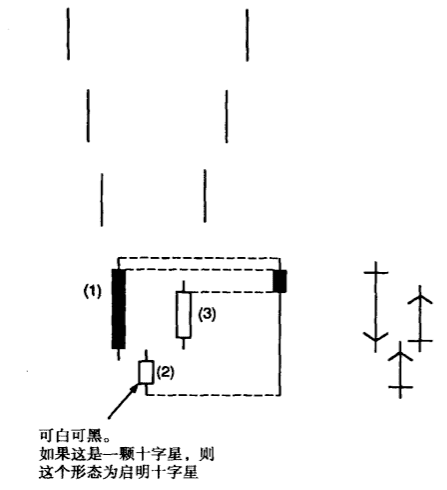
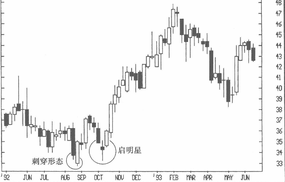
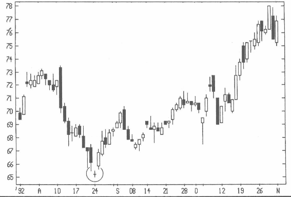
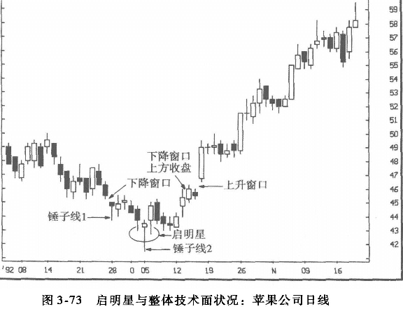
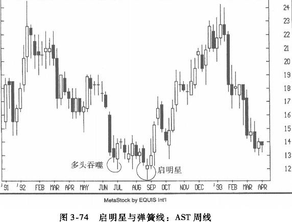

## 启明星
图3-70 是典型的启明星形态，构成这种形态的三根蜡烛线的实体不相互触及。将它们组成合成蜡烛线来考察，可以发现：第三根蜡烛线的收盘价上插第一根黑线实体越高，合成蜡烛线的下影线便愈长，因此，形态的多头气势也显得越强。

图3-71中，8月底形成刺穿的区域构成了支撑，10月的走势在此获得支撑，形成经典的启明星形态。请留意，这个启明星形态中，第二根蜡烛线也是高浪线。

在图3-72中，8月低点位置所标示的三根蜡烛线构成启明星。这个形态中间的星形部分是十字星，所以又称为启明星十字。在启明星十字中，如果十字星与前后两根蜡烛线之间存在跳空缺口，则称为弃婴形态（abandoned baby）。在 JC Penney 股价走势图中，第二、第三根蜡烛线之间存在缺口，而在第一、第二根蜡烛线之间差点也形成了缺口。因此，它们几乎构成了非常少见的弃婴形态。在西方的条形图中，弃婴形态底部也是一种十字形岛状底部。你可以想象这种组合形态的罕见程度。

### 例子
图中9月的锤子线1是一个可能的多头信号，但这个信号又被当天向下的跳空窗口所减弱，该窗口后来又构成一个阻力位。几天以后，又出现锤子线2，它与前后两根蜡烛线构成启明星形态。因此，尽管在这个走势图中有两根锤子线，但相比锤子线1，锤子线2显然比较有“连续性”——下影线比较长，而且是启明星形态的一部分。因此，考虑买人的交易者，应该在这个启明星形态完成后进行观察。如果交易者希望得到进一步的多头确认信号，可以等待10月中旬收盘价高于下降窗口阻力位之后，而在10月中旬出现的一个上升窗口，则给出了更强烈的多头信号。

如图3-74所示，1992年6月的多头吞噬形态暗示12 美元附近可能形成底部。7月下旬，这个形态所构成的支撑位（12美元，即多头吞噬形态的低点）被成功守住。8月，这个支撑位被暂时突破，但多方成功地将周收盘价拉回12美元这个前低点（即支撑位）以上，主控了行情。 
如此一来，图中形成了一个启明星形态和一根弹簧线。

